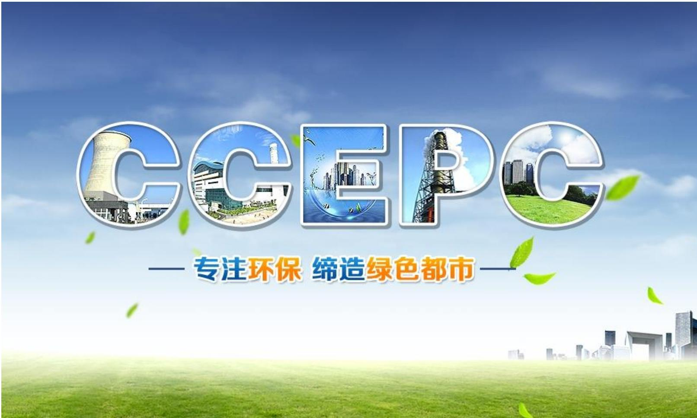

# WUHAN CITY ENVIRONMENT PROTECTION ENGINEERING LIMITED COMPANY中冶南方都市环保工程技术股份有限公司

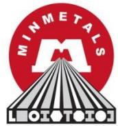

# 中国五矿集团公司 (CMC)

·Ranks 58th of the Global Fortune 500 Companies.  ·2022年《财富》世界500强第58位

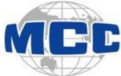

# 中国冶金科工集团有限公司 (MCC)

·Ranks 290th of the Global Fortune 500 Companies.  ·2016年《财富》世界500强第290位

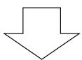

# 中冶南方 (WISDRI)

WISDRI 中冶南方

·Top 10 of National Survey & Design Enterprises 中国勘察设计院排名前10  ·Founded in 1955 成立于1955年  ·More than 5000 employees 正式员工超5000人

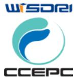

# 都市环保 (CCEPC)

·Founded in 2000 成立于2000年  ·Registered capital: CNY 920 million 注册资本9.2亿元人民币  ·Annual Turnover Approx. CNY 15 Billion 年新签合同额150亿元

# Engineering Qualification for EPC Project (Environment Projection)—Class A

环境工程（水污染防治、大气污染防治、固体废物处理处置）——专项甲级资质

Engineering Qualification for EPC Project (Power construction, municipal, building)—Class A- 火力发电（含核电站常规岛设计）——专业甲级资质

Environmental Protection Project Contracting — Class A- 环保工程专业承包——壹级施工资质

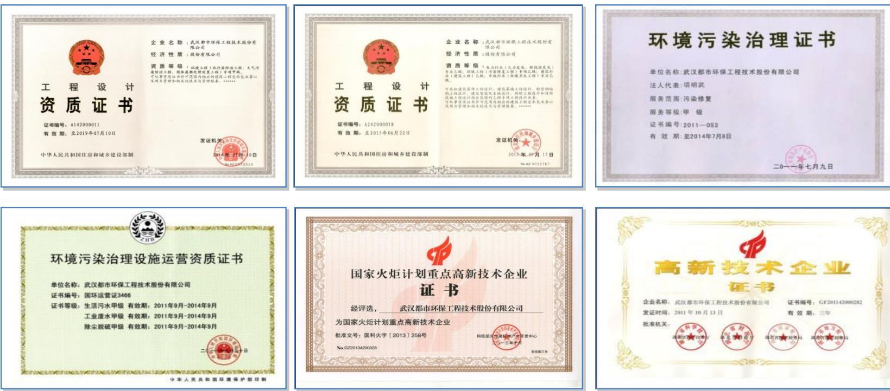

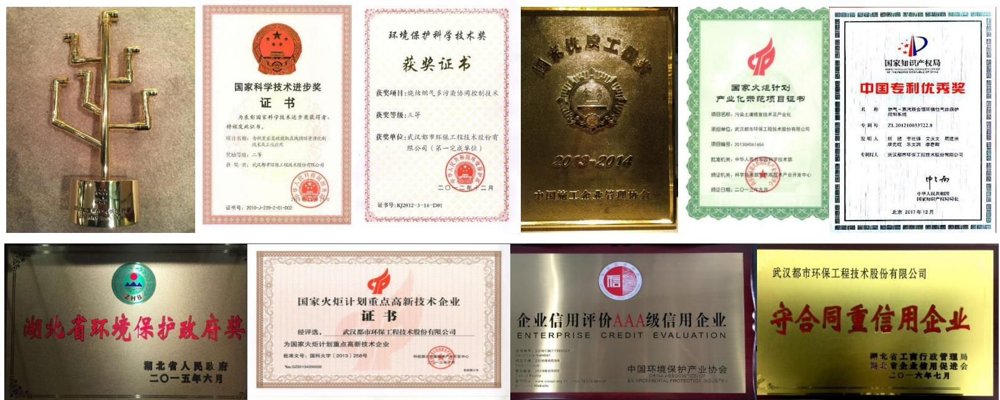

- Vice-Chairman of China Environmental Protection Industry Association- 中国环境保护产业协会副会长单位- China Top 10 Waste to Energy Design Institute- 中国十大垃圾焚烧发电设计院- National Torch Program Hi-tech Enterprise- 国家火炬计划高新技术企业- National Prize for Progress in Science and Technology- 国家科学进步奖

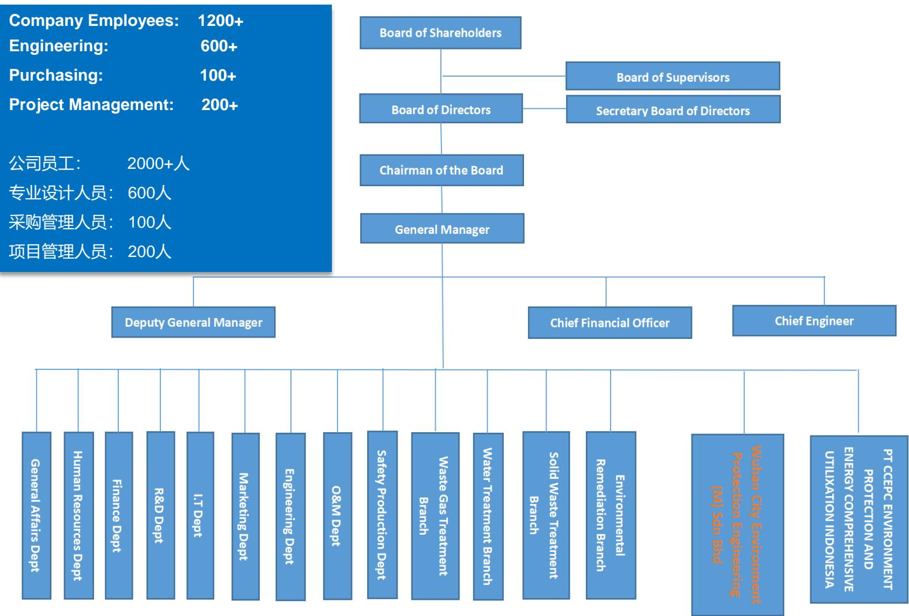

Integrated service provider: Consultation, Investment, design, complete equipment supply, construction, O&M, etc.

提供能源和环保项目的综合解决方案——咨询、投资、设计、成套供货、施工建设、运维管理等全流程服务。

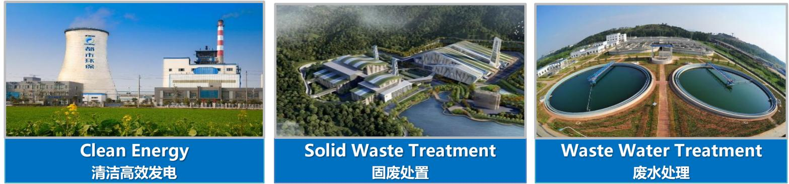

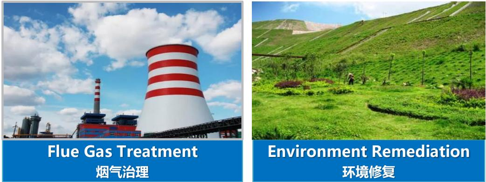

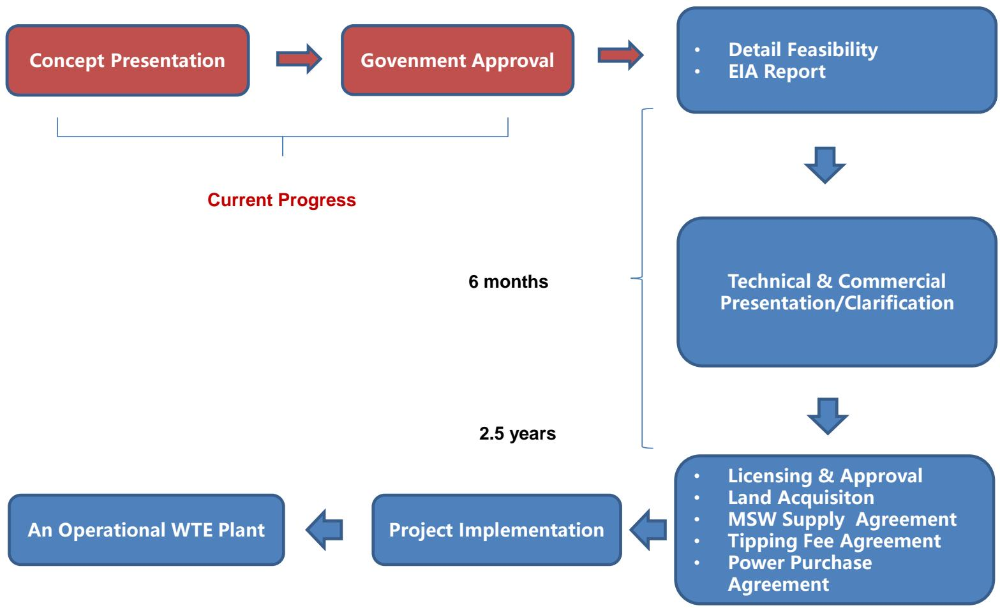  
Implementation Plan

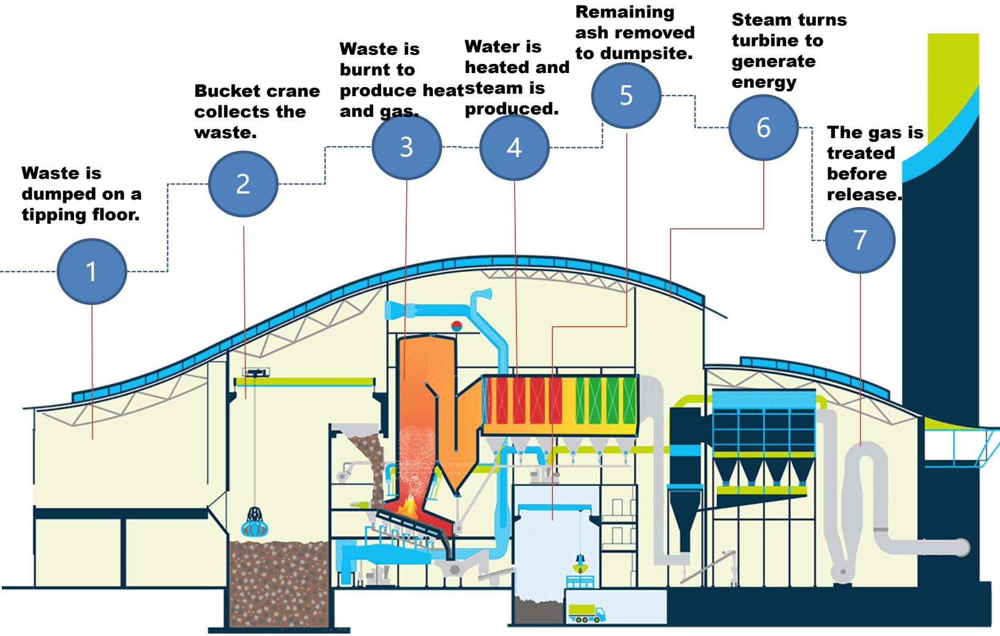  
Waste to Energy Process

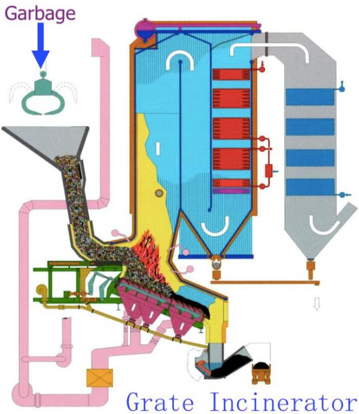

# Grate Incinerator Features

- No need prior MSW sorting or shredding.- Accommodate large quantities and variations of composition and calorific value, especially for high moisture and low calorific value waste.- Single unit capacity of 100~900t/d MSW.- Over 30 years of life as a whole with running time > 8000 hours/year- Stable incineration with temperature \(850^{\circ}\)C~1200^{\circ}\)C.- Proven technology applied in more than 40 countries.

# High Efficiency Power Generation System

CCEPC utilizes a variety of technologies that maximize generating efficiency, for example by enabling waste heat boilers to generate higher- temperature, higher- pressure steam and by optimizing the design of steam turbines, to make possible highly efficient waste power generation.

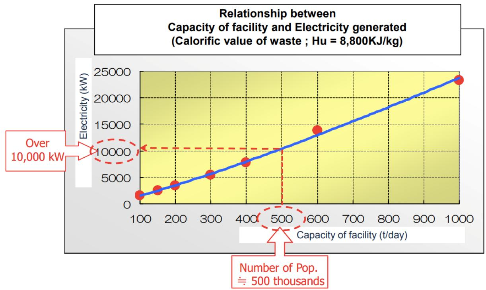

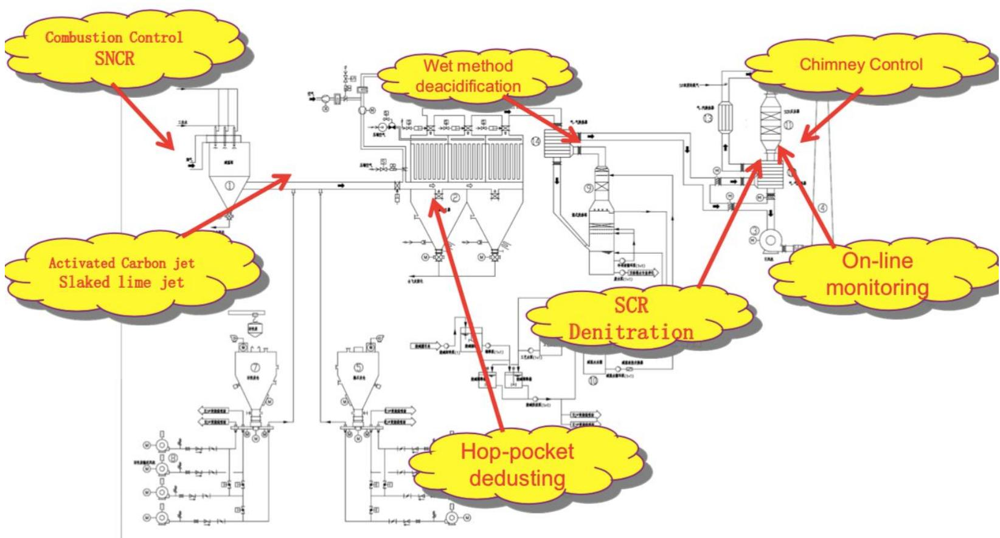  
Flue Gas Treatment System

# Comparison with EU Emission Requirements

<table><tr><td>No.</td><td>Pollutant</td><td>Unit</td><td>China Emission Limit GB 18485-2014</td><td>EU Emission Limit 2010/75/EU</td><td>Average Value of WTE plant we built</td></tr><tr><td>1</td><td>Dust</td><td>mg/Nm³</td><td>20</td><td>10</td><td>5</td></tr><tr><td>2</td><td>HCL</td><td>mg/Nm³</td><td>50</td><td>10</td><td>8</td></tr><tr><td>3</td><td>HF</td><td>mg/Nm³</td><td>-</td><td>1</td><td>0.5</td></tr><tr><td>4</td><td>SO2</td><td>mg/Nm³</td><td>80</td><td>50</td><td>20</td></tr><tr><td>5</td><td>NOX</td><td>mg/Nm³</td><td>250</td><td>200</td><td>80</td></tr><tr><td>6</td><td>CO</td><td>mg/Nm³</td><td>80</td><td>50</td><td>20</td></tr><tr><td>7</td><td>TOC</td><td>mg/Nm³</td><td>-</td><td>10</td><td>5</td></tr><tr><td>8</td><td>Hg</td><td>mg/Nm³</td><td>0.05</td><td>0.05</td><td>0.02</td></tr><tr><td>9</td><td>Cd+T1</td><td>mg/Nm³</td><td>0.1</td><td>0.05</td><td>0.04</td></tr><tr><td>10</td><td>Pb, Cr and other heavy metal</td><td>mg/Nm³</td><td>1</td><td>0.5</td><td>0.3</td></tr><tr><td>11</td><td>Dioxin</td><td>ngTEQ/Nm³</td><td>0.1</td><td>0.1</td><td>0.05</td></tr></table>

# Our Performance

Single Unit - 300~1000t/d Capacity

Plant Capacity - 600~4250t/d

Thermal Parameters

Medium Temperature & Pressure (4.0MPa,  $400^{\circ}\mathrm{C}$ )  Medium Temperature & Sub- high pressure (6.5MPa,  $450^{\circ}\mathrm{C}$ )

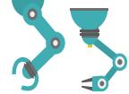

Grate Type

Keppel Seghers- KSBE  Mitsubishi- Martin  Denmark- Volund

Hitachi- Vonroll  Sanfeng- Sity2000  Japan- Ebara  Germany- Steinmueller Babcock

Business Mode

Design EPC Consulting Project Management

Industry Status

- Awarded "China Top10 Waste to Energy Designing Institute"- - 《Municipal Solid Waste Treatment Engineering》-Chief Editorial Unit

# Our Performance

Single Unit - 300~1000t/d Capacity

Plant Capacity - 600~4250t/d

Thermal Parameters

Medium Temperature & Pressure (4.0MPa,  $400^{\circ}\mathrm{C}$ )  Medium Temperature & Sub- high pressure (6.5MPa,  $450^{\circ}\mathrm{C}$ )

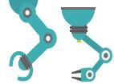

Grate Type

Keppel Seghers- KSBE  Mitsubishi- Martin  Denmark- Volund

Hitachi- Vonroll  Sanfeng- Sity2000  Japan- Ebara  Germany- Steinmueller Babcock

Business Mode

Design EPC Consulting Project Management

Industry Status

- Awarded "China Top10 Waste to Energy Designing Institute"- - 《Municipal Solid Waste Treatment Engineering》-Chief Editorial Unit

# Likeng WTE Plant, Guangzhou, China

(Municipal Solid Waste, 1000t/d+22MW)

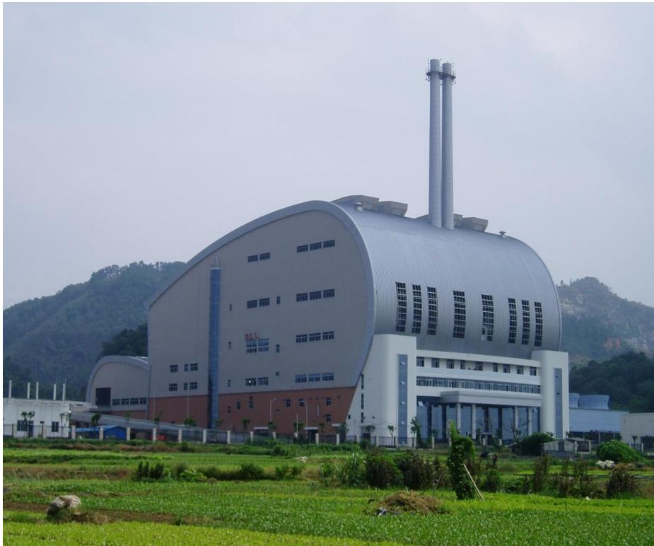

$2\times 500t / d$  Grate Incinerator  $+22\mathrm{MW}$  Power Generator

Steam Parameter: 6.5MPa,  $450^{\circ}C$

Flue Gas Pollutants Control:

Combustion Control(3T+E) + SNCR + Semi- dry Scrubbing Tower + Acative Carbon Absorption + Bag house Filter + Online Monitor

Awarded:   $>2007$  National Key Environment Protection Demonstrative   $>$  Project2009 Excellent Engineering & Design First Prize   $>$  National AAA Engineering Prize

# Baoan WTE Plant, 2nd Phase, Shenzhen, China, 3000TPD

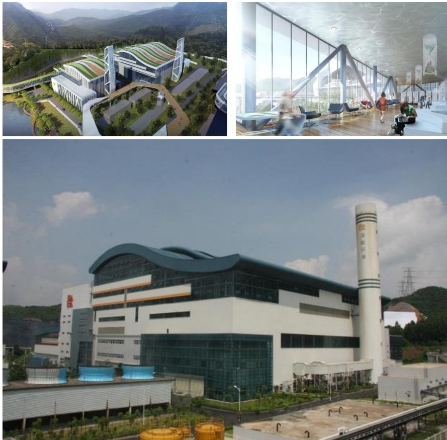

$4\times 750t / d$  Grate Incinerator  $+2\times 30M$  W Power Generator. 4.0MPa,  $400^{\circ}C$

Flue Gas Pollutants Control:

Combustion Control(3T+E) + SNCR + Semi- dry Scrubbing Tower + Acative Carbon Absorption + Bag house Filter + Online Monitor

# Awarded:

National High Quality Project Golden Prize (Only one in WTE Industry) Power Construction Excellent Engineering First Prize National Project Construction Excellent Design First Prize

# Our Performance

# Baoan WTE Plant, 3rd Phase, Shenzhen, China. 4250TPD

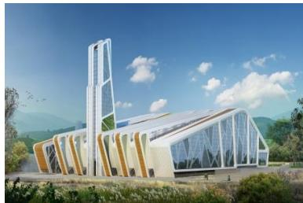

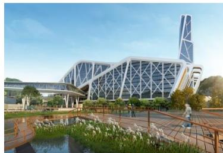

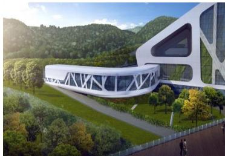

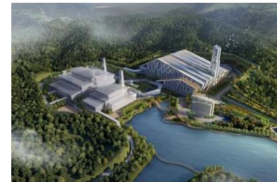

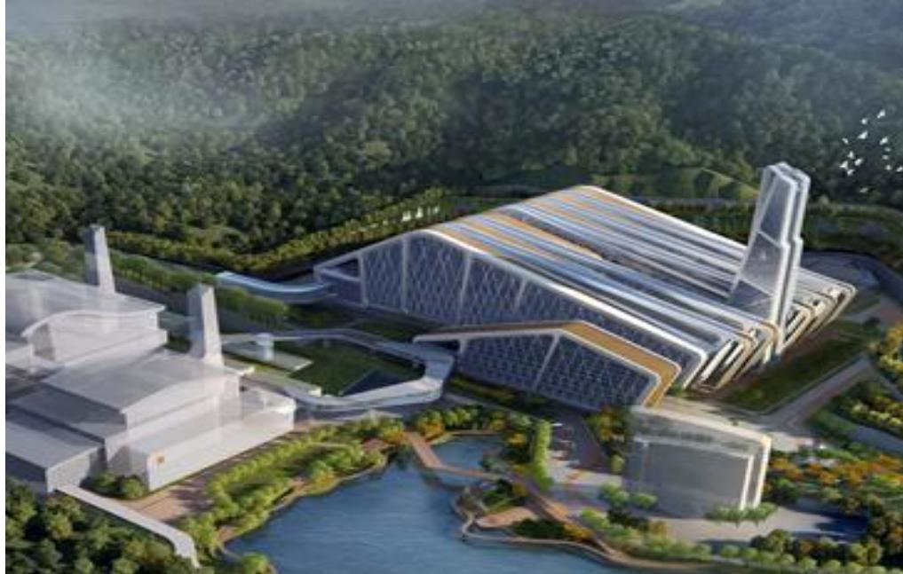

$5 \times 850t / d$  Grate Incinerator  $+3 \times 45\mathrm{MW}$  Power Generator.

Flue gas Control: Combustion Control(3T+E) +SNCR+Semi- dry Tower+Acative Carbon Absorption+Bag house Filter+Online Monitor.

Biggest WTE Plant in Asia

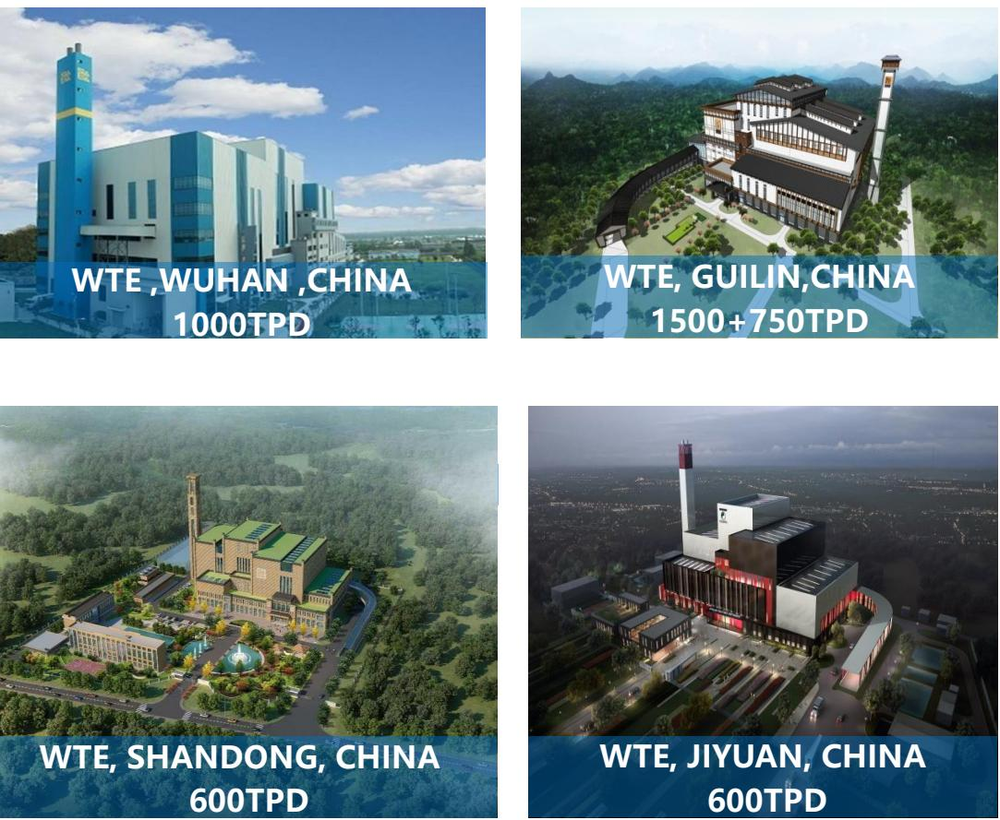

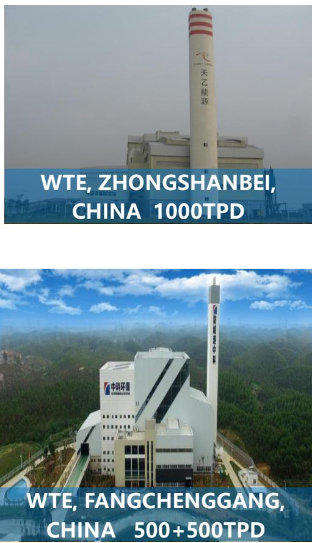

# Our Ability

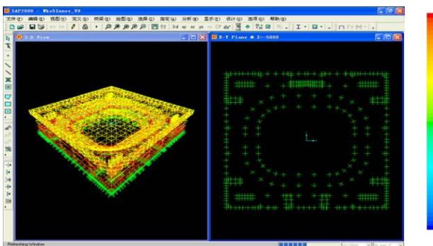

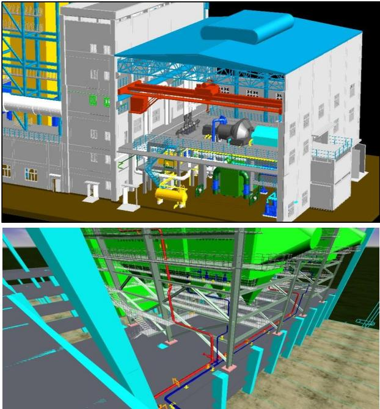

# PDMS (3D Plant Design)

Bentley AutoPipe (Piping stress analysis)  Caesar Ⅱ (Piping stress analysis)

ANSYS- Fluent (Flow Field Analysis and Design)

SAP 2000 (Structure Analysis and Design)

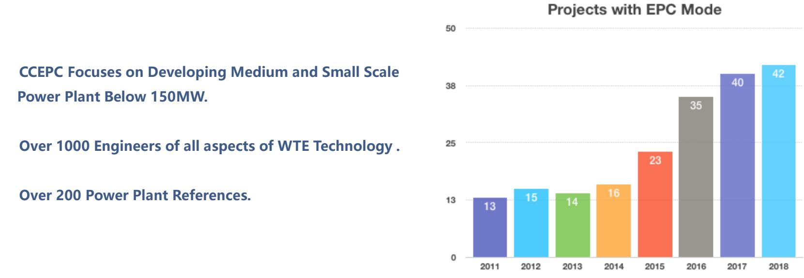

# Wuhan City Environment Protection Engineering(M) Sdn Bhd

In January 2017, CCEPC officially established a Malaysian company. with Malaysia as the regional center, and at the same time radiating business to Indonesia, Vietnam, the Philippines and other Southeast Asian markets . At present, a number of power generation, environmental protection and infrastructure supporting facilities projects have been built in Pahang, Kedah, Selangor and other places in Malaysia.

在国家“一带一路”和鼓励企业“走出去”发展战略引导下，2017年1月，公司正式挂牌成立马来西亚公司，以马来西亚为区域中心，同时将业务辐射至印尼、越南、菲律宾等整个东南亚市场。目前已在马来西亚建设彭亨、吉打、雪州等地建设多个发电、环保及基础配套设施项目。

都市环保（马来西亚）工程技术有限公司

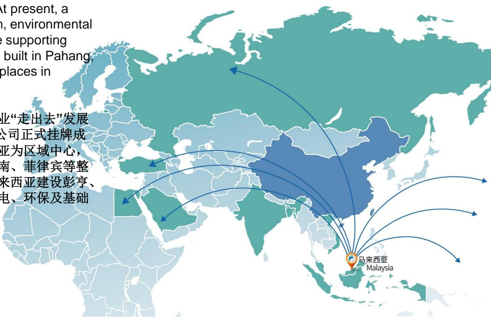

# Registration and CIDB Certificate (G7)公司注册及CIDB证书 (G7)

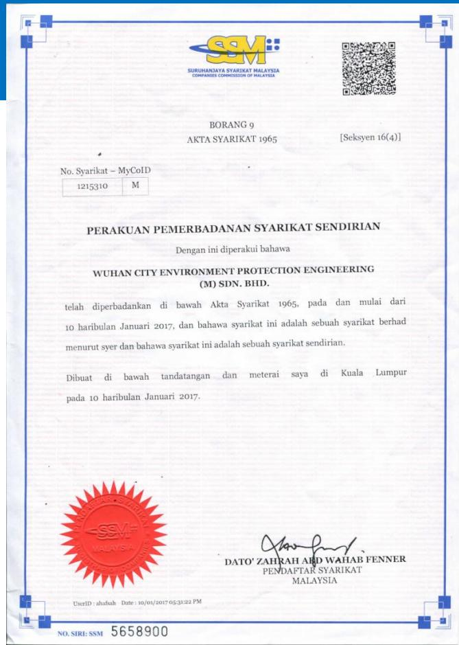

# CIDB PERAKUAN PENDAFTARAN

# PERAKUAN PENDAFTARAN

Adalah dengan ini diperakai bahwa kontraktor Asing yang dirnyatakan di bawah ini telah berdaftar dengan Lembaga mengikut Bahagian Vi Akta Lembaga Pembangunan Industri Pembinaan Malaysia 1994. Pendaftaran ini adalah tertakluk kepada ayarat- syarat yang telah difetapkan bersama perahuan ini.

0320230417- CN000004 WUHAN CITY ENVIRONMENT PROTECTION ENGINEERING (M) SON. BHD. 14A JALAN TUN MOHD FUADTAAN TUN DR ISMAIL 60000 WLAYAH PERSEKTUAN KUALA LUMPUR KUALA LUMPUR 15/02/2017

GRED KATEGORI PENGKHUSUSAN G7 B B04 G7 CE21 G7 ME M15

Tarikh Mula Berkatkuasa : 17/04/2023 Tarikh Habis Tempoh Perakuan : 16/04/2025 STATUS: BARU

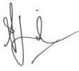

Ketua Eksekutuf Lembaga Pembangunan Industri Pembinaan Malaysia Tarikh:17/04/2023

# Alliance Steel Power Generation System Full Process Service (Conlsuting +EPC+ O&M)

# 马来西亚联合钢铁全厂发电系统全流程管家服务

（咨询+EPC+运营）

# 全厂余热余能回收（209MW）

废气再利用电厂 Waste Gas Reuse 2X80MW  干熄焦余热发电 CDQ Waste Heat Recovery 25MW  烧结余热发电 Sinter Waste Heat Recovery 15MW  炼钢饱和蒸汽发电 Saturated Steam Recycle 9MW

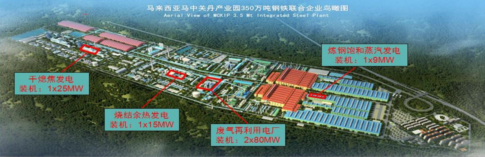

# Malaysia MCKIP Waste Gas Reuse Power Plant EPCC Project马来西亚马中关丹产业园废气再利用电厂EPC总承包工程

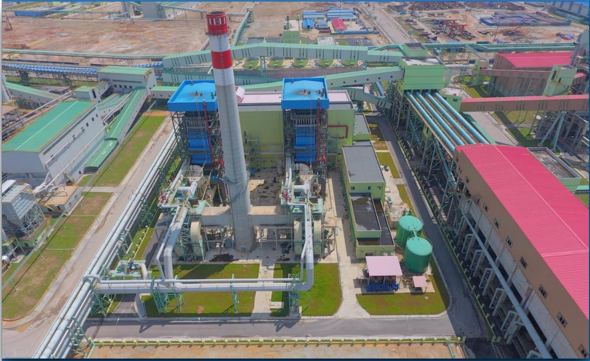

Scale: 2x80MW

Location: Kulim, Kedah, Malaysia

# Selangor Waste to Engery EPCC Project

雪兰莪州垃圾焚烧发电EPCC工程

Scale: 2X700tpd+2X750tpd, 30MW+35MWLocation: Jeram, Selangor, Malaysia

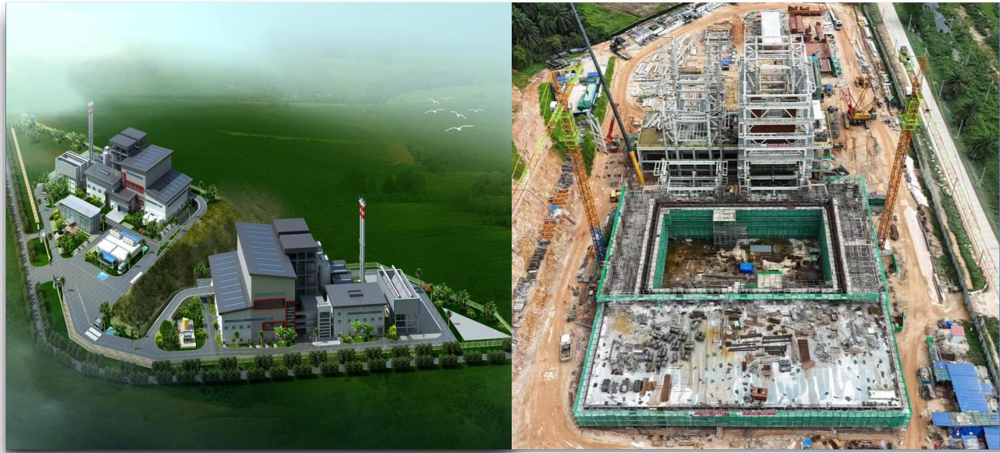

# Glass Kiln Waste Heat Recovery Power Plant in Kulim Kedah, Malaysia  金晶科技玻璃窑余热发电工程

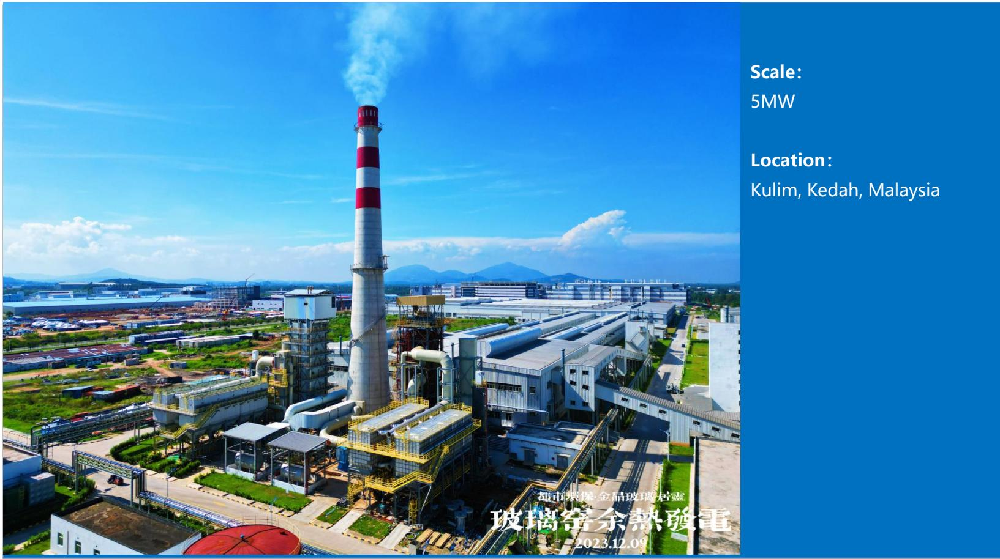

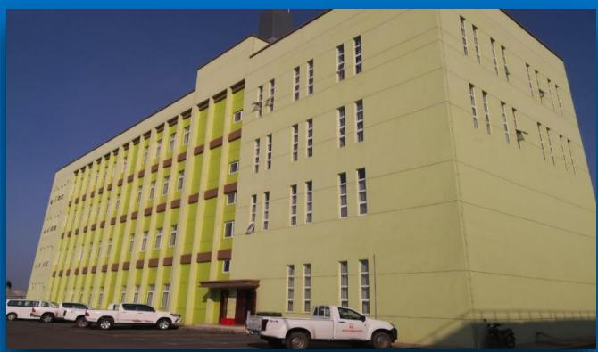

联合钢铁（大马）集团公司生产调度大楼  地点：关丹，彭亨州  Alliance Steel Production Command Center  Location: Kuantan, Pahang

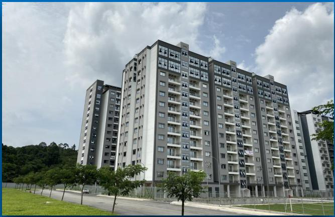

联合钢铁（大马）集团公司员工宿舍楼  地点：关丹，彭亨州  Alliance Steel Staff Dormitory Building  Location: Kuantan, Pahang

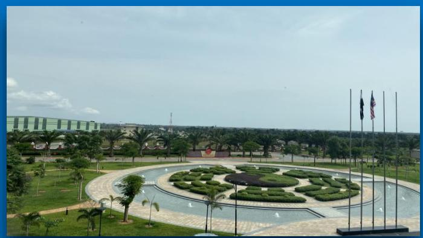

联合钢铁（大马）集团公司园林景观工程  地点：关丹，彭亨州  Alliance Steel Landscape project  Location: Kuantan, Pahang

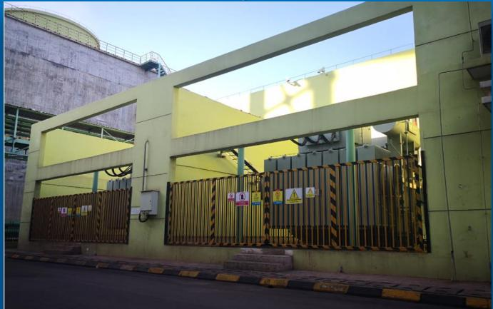

联合钢铁（大马）集团公司35KV变电站项目  地点：关丹，彭亨州  Alliance Steel 35kv Substation  Location: Kuantan, Pahang

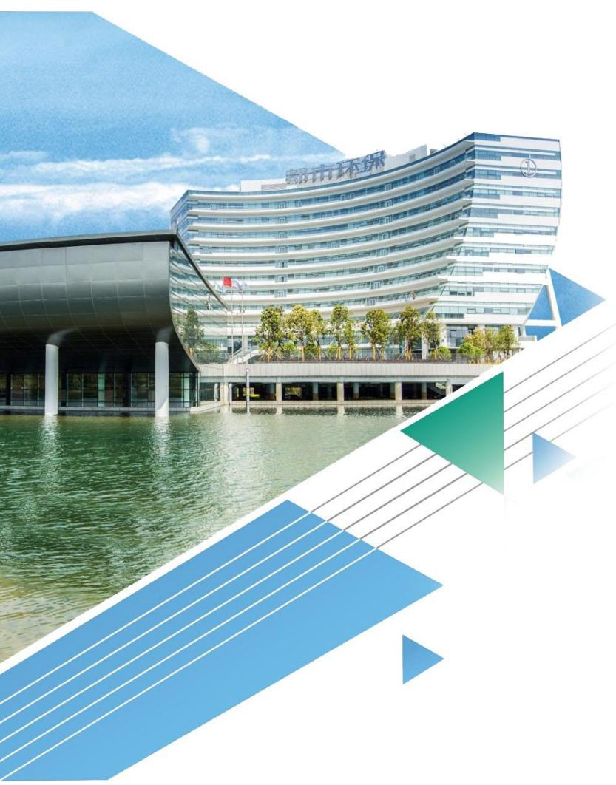

# THANK YOU

领先技术 创造优美环境

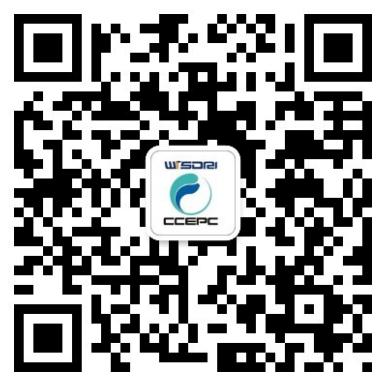