# COMPANY PROFILE

# JAK MAX (M) SDN BHD

(689532- U)

# ISO 9001:2015

CERT NO. ASCB 4148360

NO. 19, JALAN EKOPERNIAGAAN 2/7, TAMAN EKOPERNIAGAAN, 81100 JOHOR BAHRU, JOHOR.

TEL : 07- 3644756  EMAIL : jak_corp@yahoo.com

# TABLE OF CONTENTS

COMPANYINTRODUCTION 3

INTRODUCTION 4  VISION DAN MISSION 6  COMPANY INFORMATION 7  ORGANIZATION CHART 8  OFFICE LOCATION & STORE 9  LICENCE & CERTIFICATION 12  MAJLIS BANDARAYA JOHOR BAHRU 45  TENAGA NASIONAL BERHAD WORKS 51  TNB SESALUR ATAS VOLTAN RENDAH (SAVR) 52  TNB ENERGY SERVICES HDD & UNDERGROUND CABLE 11KV 55  TNB HORIZONTAL DIRECTIONAL DRILLING (HDD) 66  TNB SIVIL 70  TNB SMART METER 81  TELEKOM MALAYSIA TT 85  TM CERTIFIED NETWORK CONTRACTOR (CNC) – CNC LITE 86  TM CERTIFIED BROADBAND CONTRACTOR (CBC) 90  TM HOUSEKEEPING 98  FGV 126  MONOPOLE TOWER 133

# COMPANYINTRODUCTION

# INTRODUCTION

JAK MAX (M) SDN BHD established on 27 April 2005 currently operating and situated at No.19, Jalan Ekoperniagaan 2/7, Taman Ekoperniagaan 81100 Johor Bahru. Tuan Haji Jasman Bin Amat Kaironi as the Managing Director founded Jak Max (M) Sdn Bhd. The company as the legitimate company registered with Kementerian Kewangan Malaysia, CIDB, TNB, TM, and PKK as a Bumiputera Contractor also dealing with Civil Engineering and Telecommunication works.

JAK MAX (M) SDN BHD is a one- stop management system which have all the expertise in managing the administration, finance, marketing and operation works. JAK MAX (M) SDN BHD ventures into and leads various fields of work in various sectors to create a work group of various expertise and skills as well as administrative personnel of the organization under one roof.

JAK MAX (M) SDN BHD provides employment opportunities as a skilled or semi- skilled workforce who are professional and responsible in producing quality products and subsequently improving the quality of management. JAK MAX (M) SDN BHD has a professional workforce capable of providing high quality and best services.

JAK MAX (M) SDN BHD attaches great importance to the quality of work in the service provided to customers. In addition, after- sales service is provided and follow- up actions will be given attention to ensure work ethics are followed to meet customer satisfaction.

# MOTTO AND SPECIALIZATION

MOTTO

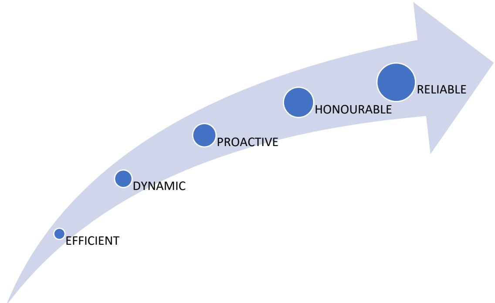

# SPECIALIZATION

JAK MAX (M) SDN BHD provide qualified management team, semi- skilled and skilled workers involved in the following:

- Building construction.- Civil engineering.- Telecommunication works.- Cold water reticulation.- Housekeeping works.- Site clearing.- Plantation.- Road works.- Infrastructure works.- CCTV and barrier gate.

# VISION DAN MISSION

# VISION

"To be the leading company in Malaysia, meeting customer needs through innovation and excellence in execution"

# MISSION

To achieve the vision, we are determined to do the following: -

Striving for excellence in customer service and operational efficiency. Improve performance by providing higher value services. Be a private limited company between the governments. Getting new customers over time while maintaining existing customers. Being a native of Merced to come competitive in the challenging world of business.

# COMPANY INFORMATION

Company name : JAK MAX (M) SDN BHD  Registration no. : 689532 – U  Registration date : 27th April 2005  Address company : No 19, Jalan Ekoperniagaan 2/7, Taman Ekoperniagaan, 81100 Johor Bahru, Johor.  Registered address: No 46 A Jalan Ara Satu, Taman Rinting, 81750 Masai Johor  No. Tel : 07- 3644756  Shareholder : Jasman bin Amat Kaironi  Jasree Arafat bin Jasman  Equity : 100% Bumiputra  Authorised capital : RM 5,000,000.00  Paid up capital : RM 5,000,000.00  E- mail : jak_corp@yahoo.com  Bank name : Malayan Banking Berhad  No 85- 87 Jalan Dedap 6 Taman Johor Jaya  81100 Johor Bahru  Bank account no. : MAYBANK 501217831691  Business fields : Engaged in telecommunication infrastructure and services maintenance for the Telekom Malaysia (TM) project as well as repair work and upgrade the Tenaga National Berhad (TNB)

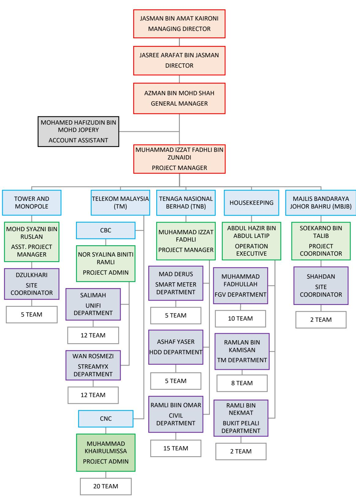

# OFFICE LOCATION & STORE

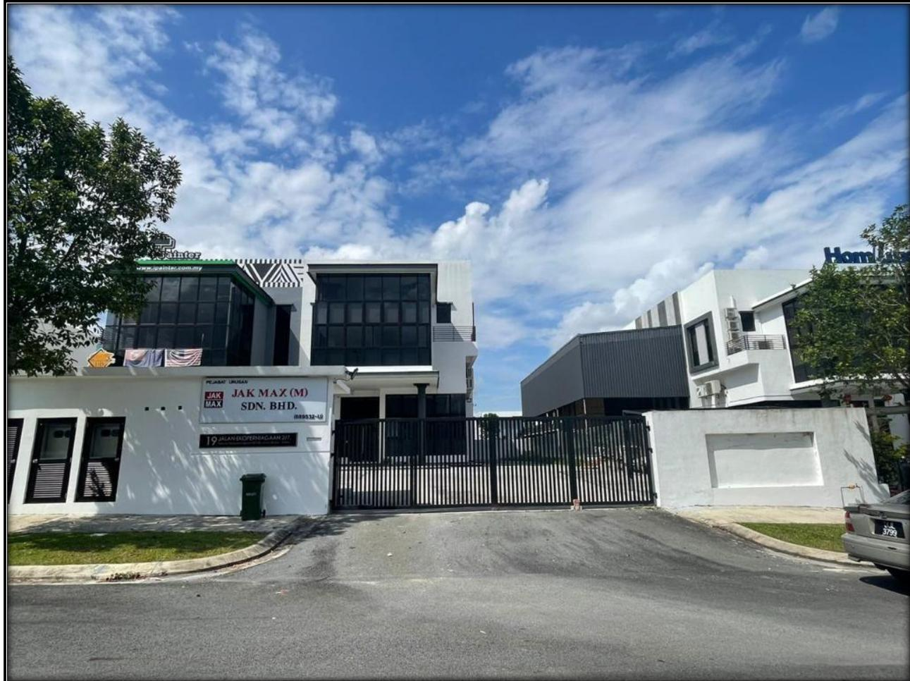

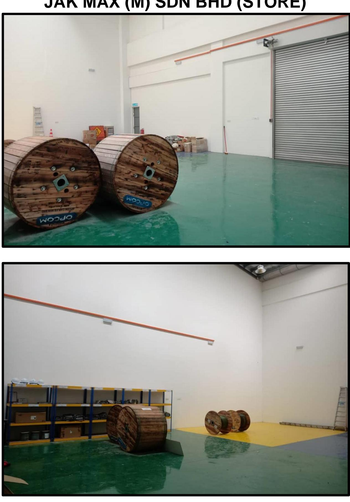

# LICENCE & CERTIFICATION

# COMPANIES COMMISSION OF MALAYSIA(SSM)

Although all efforts have been carried out to ensure that the information provided is accurate and up to date, the Registrar of Companies will not be liable for any losses arising from any inaccurate or omitted information.

# CORPORATE INFORMATION

Name :JAK MAX (M) SDN. BHD.  Last Old Name :Nil  Date Of Change :Nil  Registration No. :200501012484 (689532- U)  Incorporation Date :27- 04- 2005  Type :LIMITED BY SHARES  PRIVATE LIMITED  Status :EXISTING  Registered Address :46 JALAN ARA 1, TAMAN RINTING, MASAI  JOHOR  Postcode :81750  Origin :MALAYSIA  Business Address :NO. 01- 31, JALAN AUSTIN PERDANA 2/22  TAMAN AUSTIN PERDANA  JOHOR BAHRU  JOHOR  Postcode :81100  Nature Of Business :ADVERTISING AGENCY, DEBT COLLECTOR AGENT AND GENERAL CONTRACTOR.

# SUMMARY OF SHARE CAPITAL

Name : JAK MAX (M) SDN. BHD.  Registration No. : 200501012484 (689532- U)

TOTAL  ISSUED (RM) 5,000,000.0000

CASH OTHERWISE THAN CASH ORDINARY 2,991,600 2,008,400 0 0 0 OTHERS 0 0

# DIRECTORS/OFFICERS

Name : JAK MAX (M) SDN. BHD.  Registration No. : 200501012484 (609532- Y)

<table><tr><td>Name/Address</td><td>IC/Passport</td><td>Designation</td><td>Date Of Appointment</td></tr><tr><td>JASMAN BIN AMFT KAIRONI
NO. 2, JALAN AUSTIN PERDANA 2/10
TAMAN AUSTIN PERDANA
81100 JOHOR BAHRU
JOHOR</td><td>590116-01-5945</td><td>DIRECTOR</td><td>27-04-2005</td></tr><tr><td>JASREE ARAFAT BIN JASMAN
NO. 2, JALAN AUSTIN PERDANA 2/10
TAMAN AUSTIN PERDANA
81100 JOHOR BAHRU
JOHOR</td><td>901123-01-5455</td><td>DIRECTOR</td><td>20-04-2011</td></tr><tr><td>MOHD SHAFIE BIN SIAN
NO. 1, JALAN TEMBUNI 22,
TAMAN BUKIT RISTING
81750 MASAI
JOHOR</td><td>620105-01-6541</td><td>SECRETARY</td><td>03-11-2020</td></tr><tr><td>FAZITA BINTI A, HAMID @ MUSTHAPA
NO. 1, JALAN KIMAJUAN,
DESA RAHMAT,
TAMPOI,
81200 JOHOR BAHRU
JOHOR</td><td>661204-01-5190</td><td>SECRETARY</td><td>03-11-2020</td></tr></table>

# SHAREHOLDERS/MEMBERS

NameRegistration No.

: JAK MAX (M) SDN.BHD. :200501.01.2104 (169050- 1)

IC/Passport/ Registration No Name/Company Name Total of share 901123- 01- 5455 JASREE ARAFAT BIN JASMAN 500,000.00 590116- 01- 5945 JASMAN BIN AMAT KAIRONI 4,500,000.00

# COMPANY CHARGES

Name

Registration No.

: JAK MAX (M) SDN.BHD. : 2005010121044. (698532- 1)

1. Charge Number Total Of Charge Date Of Creation Name Of Chargee Charge Status

: 001 : OPEN CHARGE : 19- 05- 2015 : OCBC AL- AMIN BANK BERHAD : UNSATISFIED

2. Charge Number Total Of Charge Date Of Creation Name Of Chargee Charge Status

: 002 : OPEN CHARGE : 08- 08- 2016 : OCBC AL- AMIN BANK BERHAD : UNSATISFIED

# SUMMARY OF FINANCIAL INFORMATION

Name : JAK MAX (M) SDN.BHD. Registration No. :200501012484689532- U Auditor :AZIYAH &CO.AF1381 Auditor Address :NO.57 &57A,JALAN SERI IMPIAN 1 TAMAN IMPIAN EMAS 81300, SKUDAI JOHOR Exempt Private Company :N/A Financial Year End :31- 12- 2020 Unqualified Reports (Y/N) :Y Consolidated Accounts (Y/N) :N Date of Tabling :15- 12- 2021

# BALANCE SHEET ITEMS

Non- Current Assets 1,350,062.00 Current Assets 3,253,617.00 Non- Current Liabilities 228,114.00 Current Liabilities 634,075.00 Share Capital 5,000,000.00 Reserve 0.00 Retain Earning - 1,358,510.00 Minority Interest 0.00

# INCOME STATEMENT ITEMS

Revenue 3,459,141.00 Profit/(loss) before tax - 848,463.00 Profit/(loss) after tax - 880,878.00 Net dividend 0.00 Minority Interest 0.00

# \*\*END OF REPORT \*\*

This information are from the company's document registered as at 18- 05- 2022

Registrar of Companies Dated:24- 08- 2022

This information is computer generated. No signature is required.

# DIGITALLY CERTIFIED TRUE COPY

This document has been digitally certified true copy by POS DIGICERT SDN BHD (457608- K), the company which has been granted license as a "Certification Authority" in Malaysia under Section 8, of the Digital Signature Act 1997 and Digital Signature Regulation 1998.

To verify the authenticity of the digitally certified true copy document, follow the following steps:

# Type of verification

# Steps for verification

# Softcopy Verification

1. Open the softcopy of digitally true copy using Adobe Reader version 10 or above.  
2. Validate the document as per the information shown at the top panel of the Adobe Reader.

# Hardcopy Verification

SSM DCTC Web Checker

1. Open internet browser and type https://ssm4u.com.my.  
2. Click "REGISTER" to register user ID.  
3. Click "SIGN IN" and key in user ID and password if user already register in SSM4U.  
4. Click icon "DCTC READER & CHECKER".  
5. Key in Serial No, complete reCAPTCHA and click "SEARCH" button.  
6. Ensure the copy viewed in internet browser matches the printed copy.

SSM DCTC QR Code Reader

1. Install "SSM DCTC QR READER" from Google Play (Android) or App Store (iOS) on smartphone.  
2. Run the application.  
3. Press "TAP SCREEN TO SCAN" and point your smartphone camera to the QR Code that can be found at the bottom of digital certified true copy document.  
4. The smartphone will display the original copy of the document store SSM Database that has been digitally certified by appointed Certified Authority.  
5. Ensure the copy appeared in the smartphone matches the printed copy.

# Construction Industry Development Board (CIDB)

# PERAKUAN PENDAFTARAN

Adalah dengan ini diperakui bahwa kontraktor yang dinyatakan di bawah ini telah berdaftar dengan Lembaga mengikut Bahagian VI Akta Lembaga Pembangunan Industri Pembinaan Malaysia 1994. Pendaftaran ini adalah tertukluk kepada syarat- syarat yang telah ditetapkan bersama perakuan ini.

No. Pendaftaran 0120090128- JH121789  Nama Kontraktor 0 JAK MAX (M) SDN. BHD.  Alamat Berdaftar 0 46 JALAN ARA 1, TAMAN RINTING, 81750 JOHOR BAHRU  JOHOR  Daerah 0 JOHOR BAHRU  Tarikh Mula Berdaftar 0 28/01/2009  GRED KATEGORI PENGKHUSUSAN  G7 B B03 B04 B07  G7 CE CE01 CE02 CE10 CE14 CE21 CE24 CE31 CE42  G7 ME E01 E02 E03 E04 E05 E06 E07 E08 E09 E10 E11 E12 E16 E17 E18 E19 E21  E22 E24 E32 E33 M15

Tarikh Mula Berkuatkuasa 03/10/2022  Tarikh Habis Tempoh Perakuan 29/09/2025

STATUS: AKTI

Ketua Eksekutif

Lembaga Pembangunan Industri Pembinaan Malaysia

Tarikh: 03/10/2022

# SIIIL,PEROLEHANKERJAKERAJAAN

Adalah disahkan syarikat/Firma ini adalah berdaftar dengan Lembaga Pembangunan Industri Pembinaan Malaysia dan tertakluk kepada syarat- syarat termaktub bersama sijii ini.

No.Pendaftaran 0120090128- JH121789 Nama Kontraktor 1 JAK MAX (M) SDN.BHD. Alamat Berdaftar 46JALANARA1,TAMAN RINTING, 81750JOHORBAHRU JOHOR Daerah JOHORBAHRU Tarikh Mula Berdaftar 28/01/2009

# GRED KATEGORI

G7 B (Pembinaan Bangunan)  G7 CE (Pembinaan Kejuruteraan Awam)  G7 MB (Mekanikal dan Elektrikal)

# PEGAWAISYARIBATYANGDITAULIAHKAN

# NO.K.P

JASREE ARAFAT BIN JASMAN  JASMAN BIN AMAT KAIRONI

901123015455 590116015945

Tarikh Mula Berduatkuasa : 03/10/2022  Tarikh Habis Tempoh Perakuan : 29/09/2025

Ketua Eksekutif  Lembaga Pembangunan Industri Pembinaan Malaysia  Tarikh: 03/10/2022

# INTERNATIONAL ORGANIZATION FOR STANDARDIZATION (ISO)

# Certification

Awarded to

# JAK MAX (M) SDN BHD

NO.01- 31,JALAN AUSTIN PERDANA 2/22,TAMAN AUSTIN PERDANA,81100 JOHORBAHRU,JOHORDARUL TAKZIM,MALAYSIA.

Platinum Shauffmanz Veritas certify that the above organization has been audited against the requirements of:

# ISO 9001:2015

"Quality Management System"

And is registered for the following scope of activities:

# PROVISION OF SUPPLY, INSTALLATION, MAINTENANCE AND CLEANING SERVICES

Reg.No.:MAS 101424

Initial Certificate Date:26APRIL2019 Previous Expiry Date:25APRIL2022 Certificate Date:25APRIL2022 Expiry Date:25APRIL2025 Reassessment Date:20APRIL2022 2nd Year Audit:26APRIL2023 3rd Year Audit:26APRIL2024

This is an accredited certificate authorsed for issue by Accreditation Service for Certifying Bodies (ASCB) who have assessed Platform Shauffmontz Verfos against defined criteria and in cognisance of ISO 17021:2015 Conformity Assessment - Requirements for bodies providing draft and certification of management systems:Note:Conformity Assessment 2.1 on 2.4 of ISO 17000- 2004 Conformity Assessment - Vocabulary and General Principles.

SCOPE:35(81.21)

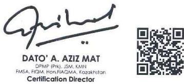

In the issuance of this certificate, PSV assumes no liability to any part other than to the Client, and then only in accordance with the agreed upon Certification Agreement. This certificate's validity is subject to the organisation maintaining their system in accordance with PSV requirement.

# Certificate of Achievement

This is to Certify that

JAK MAX (M) SDN. BHD. 0120090128- JH121789 Grade Registered : G7

has been evaluated according to the SCORE criterias set by the Board and has achieved the rating of

(3 Star)

for the year

2022

(Valid until 26/06/2024)

Good management and technical capabilities, compliance to best practices and good project management.

Ketua Eksekutif  Lembaga Pembangunan Industri Pembinaan Malaysia 27/06/2022

# MINISTRY OF ENTREPRENEUR DEVELOPMENT AND COOPERATIVES (MEDAC)

# PUSAT KHIDMAT KONTRAKTOR

KEMENTERIAN PEMBANGUNAN USAHAWAN DAN KOPERASISJILB TARAF BUMIPUTERSKONTRAKTOR KERJA

Adalah dengan ini syarikat tuan seperti tercatit di dalam Sijil ini diiktiraf sebagai kontraktor kerja bertaraf Bumiputera. Pemberian pengiktirafan ini adalah tertakluk kepada syarat- syarat kermaktub di belakang sijil.

NO.SJILPENDAFTARAN GRED PENDAFTARAN KATEGORI TEMPOH SAH LAKU 0120090128- JH121789 G7 B DARI :11/10/2022 G7 CE HINGGA:29/09/2025 G7 ME

# NAMA DAN ALAMAT BERDAFTAR

JAK MAX (M) SDN.BHD. 46 JALAN ARA 1 TAMAN RINTING, 81750 JOHOR BAHRU JOHOR JOHOR BAHRU

PEGAWAL SYARIFAT YANG DITAULIAHKAN

JASREE ARAFAT BIN JASMAN JASMAN BIN AMAT KAIRONI

NO.K/P

901123015455 590116015945

# (DR.NORIMAN BIN ROJULAI)

PengarahPusat Khidmat KontraktorKementerian Pembangnakan Usahawan dan KoperasiTarikh:11/10/2022

# MINISTRY OF FINANCE (MOF)

# KEMENTERIAN KEWANGAN MALAYSIA

# SIJIL AKUAN PENDAFTARAN SYARIKAT BUMIPUTERA

NO. SIJIL : BP60944709013428310  NO. RUJUKAN PENDAFTARAN : 357- 02092911  TEMPOH SAH LAKU : 18/01/2023 - 17/01/2026

Bahawa dengan ini diperakui syarikat :

JAK MAX (M) SDN. BHD. (689532- U)  NO. 01- 31, JALAN AUSTIN PERDANA 2/22  TAMAN AUSTIN PERDANA  JOHOR BAHRU  81100 MUKIM TEBRAU  JOHOR, MALAYSIA

Telah diklittaf sebagai Syarikat Bumiputera oleh Kementerian Kewangan Malaysia. Taraf Bumiputera bukannya hak dan boleh ditarik balik sekirang syarikat gagal mematuhi syarat/kriteria yang ditetapkan. Kebalusan ini adalah tertakluk kepada syarat- syarat seperti yang dinyatakan di Sijii Akuan Pendaftaran Syarikat Bumiputera (Lampiran C).

t.t AB RAHIM BIN AB RAHMAN Perbendaharaan Malaysia Semenanjung b.p. Ketua Setiausaha Perbendaharaan Kementerian Kewangan Malaysia

Tarikh Berdaftar Dengan Kementerian Kewangan Malaysia : 18/01/2023

(Sijii ini adalah cetakan komputer dan tidak memerlukan tandatangari)

# KEMENTERIAN KEWANGAN MALAYSIASULIL AKUAN PENDAFTARAN SYARIKAT

NO. SUIL : K60944709013428310 NO. RULUKAN PENDAFTARAN : 357- 02092911 TEMPOH SAH LAKU : 18/01/2023 - 17/01/2026

Bahawa dengan ini diperakui syarikat : JAK MAX (M) SDN. BHD. (689532- U) NO. 01- 31, JALAN AUSTIN PERDANA 2/22 TAMAN AUSTIN PERDANA JOHOR BAHRU 81100 MUKIM TEBRAU JOHOR, MALAYSIA

Telah berdaftar dengan Kementerian Kewangan Malaysia dalam bidang bekalan/perkhidmatan di bawah sektor, bidang dan sub- bidang seperti di Lampiran A. Kelulusan ini adalah tertakluk kepada syarat- syarat seperti yang dinyatakan di Lampiran B. Individu yang diberi kuala oleh syarikat bagi urusan perolehan Kerajaan adalah seperti berikut :

ENCIK JASREE ARAFAT BIN JASMAN 901123015455 PENGARAH ENCIK JASMAN BIN AMAT KAIRONI 590116015945 JAK MAX (M) SDN BHD

t.t

# AB RAHIM BIN AB RAHMAN

Bahagian Perolehan Kerajaan b.p. Ketua Setiausaha Perbandaharaan Kementerian Kewangan Malaysia

Tarikh Berdaftar Dengan Kementerian Kewangan Malaysia : 18/01/2023

(Siji ini adalah cetakan komputer dan tidak memerlukan tandatangari)

NO SIJIL : K60944709013428310 NO RUJUKAN PENDAFTARAN : 357- 02092911 TEMPOH SAH LAKU : 18/01/2023 - 17/01/2026

<table><tr><td>BIL</td><td>TARIKH DAFTAR BIDANG</td><td>KOD BIDANG</td><td>KETERANGAN</td><td>STATUS</td></tr><tr><td>1</td><td>18/01/2023</td><td>020301</td><td>PERABOT, PERALATAN PEJABAT, HIASAN DALAMAN DAN DOMESTIK/PERKAKAS ELEKTRIK DAN ELEKTRONK/PERKAKAS ELEKTRIK DAN AKSESORI</td><td>Aktif</td></tr><tr><td>2</td><td>18/01/2023</td><td>020802</td><td>PERABOT, PERALATAN PEJABAT, HIASAN DALAMAN DAN DOMESTIK/PAKAIAN DAN KELENGKAPAN/ KELENGKAPAN PAKIAN</td><td>Aktif</td></tr><tr><td>3</td><td>18/01/2023</td><td>030101</td><td>SUKAN, REKREASI DAN ALAT MUZIK (PERALATAN, BEKALAN DAN AKSESORI SUKAN DAN REKREASI)/PAKAIAN SUKAN DAN AKSESORI/PAKAIAN SUKAN DAN AKSESORI</td><td>Aktif</td></tr><tr><td>4</td><td>18/01/2023</td><td>030201</td><td>SUKAN, REKREASI DAN ALAT MUZIK (PERALATAN, BEKALAN DAN AKSESORI SUKAN DAN REKREASI)/CENDERAMATA DAN HADIAH/ CENDERAMATA DAN HADIAH</td><td>Aktif</td></tr><tr><td>5</td><td>18/01/2023</td><td>030501</td><td>SUKAN, REKREASI DAN ALAT MUZIK (PERALATAN, BEKALAN DAN AKSESORI SUKAN DAN REKREASI)/PERALATAN SUKAN PADANG, GELANGGANG, REKREASI, TAMAN PERMAINAN, KICERGASAN DAN SUKAN AIR/PERALATAN SUKAN</td><td>Aktif</td></tr><tr><td>6</td><td>18/01/2023</td><td>040101</td><td>MAKANAN, MINUMAN DAN BAHAN MENTAH/MAKANAN, MINUMAN DAN BAHAN MENTAH KERING/BASAH/MAKANAN DAN BAHAN MENTAH KERING/BASAH</td><td>Aktif</td></tr><tr><td>7</td><td>18/01/2023</td><td>040103</td><td>MAKANAN, MINUMAN DAN BAHAN MENTAH/MAKANAN, MINUMAN DAN BAHAN MENTAH KERING/BASAH/MAKANAN BERMASAK ISLAM</td><td>Aktif</td></tr><tr><td>8</td><td>18/01/2023</td><td>060401</td><td>KIMIA, BAHAN KIMIA DAN PERALATAN MAKMAL/CAT, ANTI KAKIS DAN BAHAN TAMBAH/CAT</td><td>Aktif</td></tr><tr><td>9</td><td>18/01/2023</td><td>060501</td><td>KIMIA, BAHAN KIMIA DAN PERALATAN MAKMAL/PERALATAN MAKMAL/PERALATAN MAKMAL SERTA AKSESORI</td><td>Aktif</td></tr><tr><td>10</td><td>18/01/2023</td><td>070101</td><td>PERTANIAN, PERHUTANAN DAN TERNAKAN/BAJA DAN RACUN/BAJA DAN NUTRIEN</td><td>Aktif</td></tr><tr><td>11</td><td>18/01/2023</td><td>070102</td><td>PERTANIAN, PERHUTANAN DAN TERNAKAN/BAJA DAN RACUN/RACUN SERANGGA/PEROSAKRUMPAI/TUMBUHAN</td><td>Aktif</td></tr><tr><td>12</td><td>18/01/2023</td><td>070303</td><td>PERTANIAN, PERHUTANAN DAN TERNAKAN/UBAT, MAKANAN TERNAKAN/TUMBUHAN, PERALATAN DAN AKSESORI/PERALATAN DAN KELENGKAPAN PERTANIAN/TERNAKAN/AKUATIK</td><td>Aktif</td></tr><tr><td>13</td><td>18/01/2023</td><td>080101</td><td>KEJURUTERAAN AWAM, BINAAN DAN KELENGKAPAN KEMUDAHAN AWAM/ KEMUDAHAN AWAM/ KEMUDAHAN AWAM</td><td>Aktif</td></tr><tr><td>14</td><td>18/01/2023</td><td>090101</td><td>BAHAN BINAAN DAN PERALATAN KESELAMATAN JALAN RAYA/BAHAN BINAAN/BAHAN BINAAN</td><td>Aktif</td></tr><tr><td>15</td><td>18/01/2023</td><td>090201</td><td>BAHAN BINAAN DAN PERALATAN KESELAMATAN JALAN RAYA/PERALATAN KESELAMATAN JALAN RAYA/PERABOT JALAN RAYA</td><td>Aktif</td></tr><tr><td>16</td><td>18/01/2023</td><td>110201</td><td>PENGANGKUTAN, KOMPONEN DAN AKSESORI/JENTERA BERAT/JENTERA BERAT</td><td>Aktif</td></tr><tr><td>17</td><td>18/01/2023</td><td>130101</td><td>PERALATAN KEHUTUTERAAN DAN MESIN PENGELUARAN/MESIN, KELENGKAPAN BENGKEL DAN MESIN PENGELUARAN/MESIN DAN</td><td>Aktif</td></tr></table>

<table><tr><td></td><td></td><td></td><td>KELENGKAPAN BENGKEL</td><td></td></tr><tr><td>18</td><td>18/01/2023</td><td>130202</td><td>PERALATAN KEJURUTERAAN DAN MESIN PENGELUARAN/ JANAKUASA ELEKTRIK DAN PERALATAN GENERATOR/ALAT GANTI DAN BATERI/MESIN DAN KELENGKAPAN KHUSUS</td><td></td></tr><tr><td>19</td><td>18/01/2023</td><td>140101</td><td>PERALATAN KEJURUTERAAN ELEKTRIK DAN ELEKTRONIK/MESIN DAN ENTERA PENJANAAN DAN PENGAGIHAN TENAGA ELEKTRIK SERTA AKSESORI/MOTOR DAN ALATUBAH/ALATGANTI</td><td></td></tr><tr><td>20</td><td>18/01/2023</td><td>140301</td><td>PERALATAN KEJURUTERAAN ELEKTRIK DAN ELEKTRONIK/ KABEL, WAYAR ELEKTRIK DAN AKSESORI/ KABEL ELEKTRIK DAN AKSESORI</td><td></td></tr><tr><td>21</td><td>18/01/2023</td><td>140302</td><td>PERALATAN KEJURUTERAAN ELEKTRIK DAN ELEKTRONIK/ KABEL, WAYAR ELEKTRIK DAN AKSESORI/ WAYAR ELEKTRIK DAN AKSESORI</td><td></td></tr><tr><td>22</td><td>18/01/2023</td><td>140503</td><td>PERALATAN KEJURUTERAAN ELEKTRIK DAN ELEKTRONIK/ SISTEM, KOMPONEN ELEKTRIK, ELEKTRONIK, LAMPU DAN AKSESORI/ LAMPU,KOMPONEN LAMPU DAN AKSESORI</td><td></td></tr><tr><td>23</td><td>18/01/2023</td><td>221001</td><td>PERKHIDMATAN/ KHDMAT KEBERSIHAN DAN RAWATAN/ PEMBERSIHAN BANGUNAN DAN PEJABAT</td><td></td></tr><tr><td>24</td><td>18/01/2023</td><td>221002</td><td>PERKHIDMATAN/ KHDMAT KEBERSIHAN DAN RAWATAN/ MEMBERSIH KAWASAN</td><td></td></tr><tr><td>25</td><td>18/01/2023</td><td>221003</td><td>PERKHIDMATAN/ KHDMAT KEBERSIHAN DAN RAWATAN/ MENGANGKAT SAMPAH</td><td></td></tr><tr><td>26</td><td>18/01/2023</td><td>221006</td><td>PERKHIDMATAN/ KHDMAT KEBERSIHAN DAN RAWATAN/ MEMBERSIH PANTAI/SUNGAI/TERUSAN/EMPANGAR/TASIK</td><td></td></tr><tr><td>27</td><td>18/01/2023</td><td>221104</td><td>PERKHIDMATAN/ GUNA TENAGA/ TENAGA BURUH</td><td></td></tr><tr><td>28</td><td>18/01/2023</td><td>221402</td><td>PERKHIDMATAN/ PENGINDAHAN/ HIASAN JALAN/KAWASAN</td><td></td></tr><tr><td>29</td><td>18/01/2023</td><td>221503</td><td>PERKHIDMATAN/ PENYEWAAAN DAN PENGURUSAN/ KENDERAAAN/JENTERA/KENDERAAAN REKREASI</td><td></td></tr></table>

# ENERGY COMMISSION

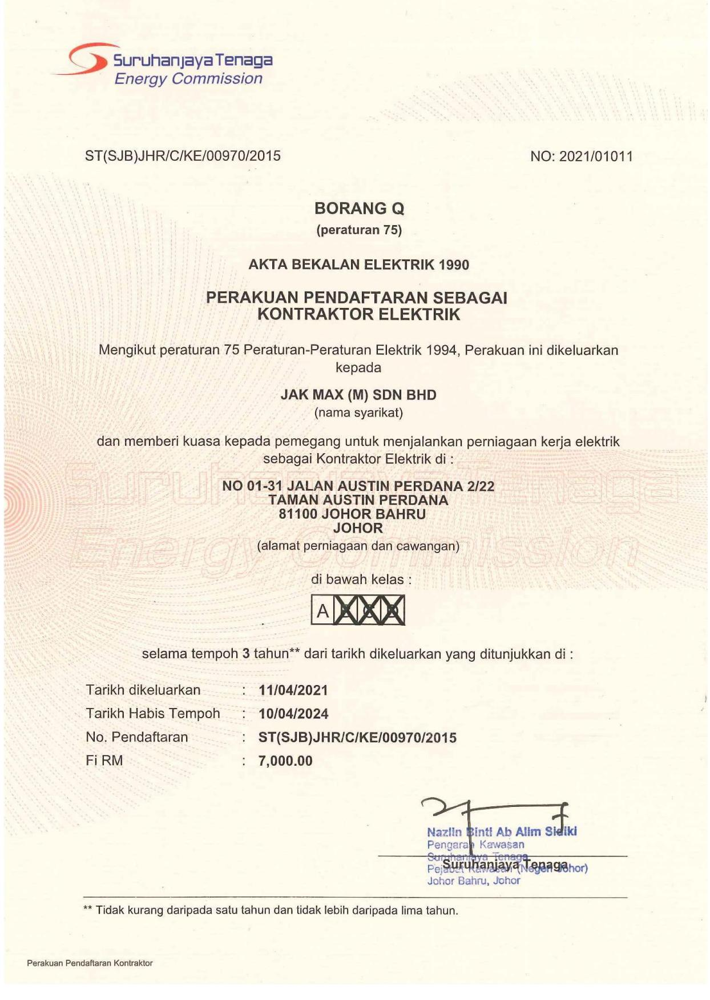

# TENAGA NASIONAL BERHAD (TNB)

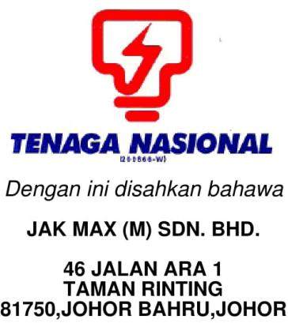

Telah berdaftar dengan Tenaga Nasional Berhad sebagai Kontraktor Kerja

di bawah kategori yang tercatat dalam sijil ini

<table><tr><td>GRED</td><td>KATEGORI</td><td>PENGKHUSUSAN</td></tr><tr><td rowspan="3">G7</td><td>B</td><td>B03, B04, B07****</td></tr><tr><td>CE</td><td>CE01, CE02, CE10, CE14, CE21, CE24, CE31, CE42****</td></tr><tr><td>ME</td><td>E01, E02, E03, E04, E05, E06, E07, E08, E09, E10, E11, E15, E16, E17, E18, E19, E21, E22, E24, E32, E33, M15****</td></tr></table>

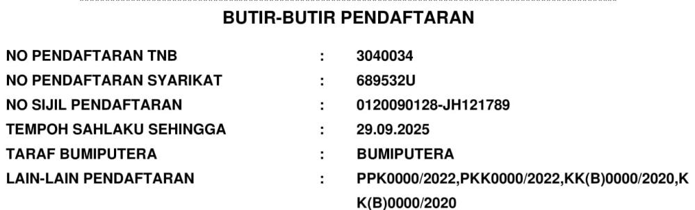

Tarikh tempoh sahluku pendaftaran ini adalah tertakluk kepada tempoh sahluku Pendaftaran sijil- sijil Kementerian Kewanggan(KC), Lembaga Pembangunan Industri Pembinaan Malaysia (CIDB) dan sijil- sijil professional yang berkaitan.

Amir Mahmod bin Abdullah Ketua Pegawai Pendarahan Bahagian Procurement & Supply Chain Tenaga Nasional Berhad

Tarikh kelulusan 25.10.2022

ini adalah cetakan komputer dan tidak memerlukan tandatangan.

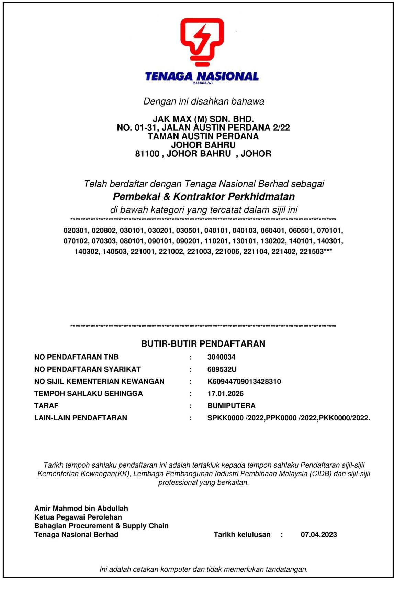

# JOHOR CENTRE FOR CONSTRUCTION (JCCD)

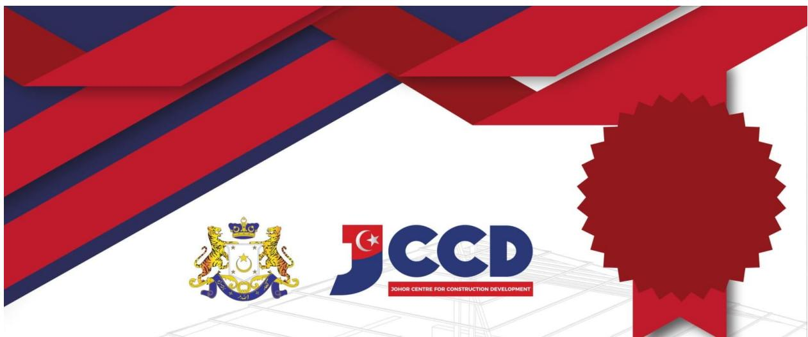

# SIJIL KONTRAKTOR JOHOR

Adalah dengan ini diperaikui bahwa kontraktor yang dinyatakan di bawah ini telah berdaftar dengan Johor Centre for Construction Development [JCCD]. Pendaftaran ini adalah tertakluk kepada syarat- syarat am yang telah ditetapkan di belakang perakuan ini.

No. Pendaftaran : JCCD/SRA/20/02/01970  Nama Kontraktor : JALM MAX MSDN BHD  Alamat Berdaftar : NO 01- 31, JALAN AUSTIN PERDANA 2/22, TAMAN AUSTIN PERDANA  81100 JOHOR BAHRU, JOHOR

Gred, kategori dan pengxhususan berdaftar

67 B 803,804,807 67 CE CE14,CE21,CE31 67 FM F01 67 ME E01, E02, E03, E04, E05, E06, E07, E08, E09, E10, E11, E15, E16, E17, E18, E19, E21, E22, E24, E32, E33, M15

Tarikh Mula Berkuatkuasa : 01JULAI2021  Tarikh Tamat Tempoh Perakuan : 31DISEMBER 2023  * Perakuan ini hendaklah diperbaharui setiap tahun, selewat- lewatnya 30 hari sebelum tarikh tamat tempoh.

# FELDA GLOBAL VENTURESHOLDING BERHAD(FGV)

#

# FGV HOLDINGS BERHAD800165-P

(Farmerly known as Felda Global Ventures Holdings Berhail)

# VENDOR REGISTRATION DECLARATION

REGISTRATION REFERENCE NO. B- 010818000054- 01  VALIDITY PERIOD 26/08/2021 - 26/08/2024

It is hereby acknowledged that the vendors set out below have been registered with FGV HOLDINGS BERHAD and are eligible to participate in quotation / tender offers at FGV Group Companies.

NAME AND REGISTERED ADDRESS

JAK MAX (M) SDN. BHD. 46 JALAN ARA 1, TAMAN RINTING,

(Company No.: 689532- U)

CATEGORY CODE IS AS FOLLOW :

CATEGORY CODE DESCRIPTION 04 - Perkhidratan 04 - Mencuci & Membersih

Important: Application for renewal of certificate shall be made at least 30 days before the expiry date of the certificate.

# CERT

Issued Date: 26/08/2021

# UNIVERSITI TEKNOLOGIMALAYSIA(UTM)

# SIJIL PENDAFTARAN SYARIKAT

No. Sijil Pendaftaran : BP201211001707

Tempoh : 16/01/2022 - 16/01/2024

Bahawa dengan ini diperakui syarikat

# JAK MAX (M) SDN BHD

Telah berdaftar dengan Universiti Teknologi Malaysia dalam bidang bekalan / perkhidmatan di bawah kepada dan sub- kepada berikut :

\*\*\*\*\*\*\*\*\*\*\*\*\*\*\*\*\*\*\*\*\*\*\*\*\*\*\*\*\*\*\*\*\*\*\*\*\*\*\*\*\*\*\*\*\*\*\*\*\*\*\*\*\*\*\*\*\*\*\*\*\*\*\*\*\*\*\*\*\*\*\*\*\*\*\*\*\*\*\*\*\*\*\*\*\*\*\*\*\*\*\*\*\*\*\*\*\*\*\*\*\*

221402,010102,030101,030201,040101,040103,070101,070102,070303,080101,090101, 130101,140101,030501,140301,140302,140503,060501,110301,221001,221002,221003, 221006,221104,221105,090201,222003,130202,020802

\*\*\*\*\*\*\*\*\*\*\*\*\*\*\*\*\*\*\*\*\*\*\*\*\*\*\*\*\*\*\*\*\*\*\*\*\*\*\*\*\*\*\*\*\*\*\*\*\*\*\*\*\*\*\*\*\*\*\*\*\*\*\*\*\*\*\*\*\*\*\*\*\*\*\*\*\*\*\*\*\*\*\*\*\*\*\*\*\*\*\*\*\*\*

t.t

NASIMIN BIN NGADI b/p Bendahari UNIVERSITI TEKNOLOGI MALAYSIA Tarikh : 16/01/2022

(Sijil ini adalah cetakan komputer dan tidak memerlukan tandatangan)

# MAJLIS BANDARAYA JOHOR BAHRU

TETUAN ALS AVENUE SISKHBD NO.59- 01,JALAN CANTIK3 TAMANPELANGIINDAH,TEBRAU, 81800JOHORBAHRU, JOHOR.

Ruj.Tuan : Ruj.Kami :MBJB/U/2020/47/SWN/1 Tarikh :G6 April 2022 01 Ramadan 1443H

Tuan,

# MBJB/SH/137/2021 (SEBUTHARGA SEMULA)

# SEWAAN JENTERA KREN/ SKYLIFT/ MESIN UNTUK KEGUNAAN UNIT TINDAKAN CEPAT,BAHAGIAN BENGKEL KEJURUTERAAN,JABATAN KEJURUTERAAN,MAJLIS BANDARAYAJOHORBAHRUBAGI TEMPOH24BULAN

Sukacita dimaklumkan bahawa Mesyuarat Jawatankuasa Sebutharga Majlis Bil.3/2022 bertariikh 05 April 2022 telah memutuskan bahawa Tuan/Syarikat tuan dipilih untuk melaksanakan projek di atas.

2. Namun begitu Surat Setuju Terima Sebutharga akan dikeluarkan kepada uan tertakluk kepada perkara-perkara beriku :

i. Tiada perubahan dasar di pihak MBJB untuk melaksanakan projek tersebut. ii. MBJB menparolehi peruntukan yang mencukupi untuk menampung kos projek.

iii. Pendaftaran tuan dengan CIDB, Pusat Khidmat Kontraktor atau Kementerian Kewangan Malaysia sebagai Kontraktor Kerja/Penyelenggaraan/Bekalan masih lagi berkuatkuasa dan bebas daripada tindakan tataretib.

3. Surat ini hanyalah satu pemberitahuan sahaja mengenai keputusan yang telah dibuat oleh Lembaga Jawatankuasa Sebutharga. Pihak tuan tidak boleh memulakan sebagai kerja atau pun memasuki tapak projekt sehingga Surat Setuju Terima Sebutharga dikeluarkan kepada tuan oleh DATUK BANDAR, MAJLIS BANDARAYA JOHOR BAHRU. Sekiranya pihak tuan menambil tindakan yang melibatkan kos perbealanjaan sebelum Surat Setuju Terima Sebutharga dikeluarkan, pihak MBJB tidak akan bertangungjawab ke atas perbealanjaan tersebut.

Sekian, terima kasih.

# "BERKHIDMAT UNTUK NEGARA"

AUSMENARATANJIMINTEOKE

# JOHOR BAHRU BANDARAYA BERTARAF ANTARABANGSA, BERBUDAYA DAN LESTARI

MENARA MAJLIS BANDARAYA JOHOR BAHRU NO.1,JALAN LINGKRARAN DALAM, BUKIT SENYUM, 80300 JOHOR BAHRU, JOHOR.

Tel :+607- 2198000 Faks :+607- 2230619 Email :info@mbjb.gov.my Laman Web :www.mbjb.gov.my

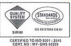

No. Kontrak: MBJB/SH/137/2021 (SEBUTHARGA SEMULA)

# MAJLIS BANDARAYA JOHOR BAHRU

SURAT SETUJU TERIMA (Sebut Harga Perkhidmatan)

Rujukan Kami: MBJB/L/2020/47/SWN/1 Tarikh : 06 April 2022 04 Ramadan 1443H

TETUAN ALS AVENUE SDN BHD NO.59- 01,JALAN CANTIK3, TAMAN PELANGINDAH,TEBRAU, 81800 JOHOR BAHRU, JOHOR.

Tuan,

Tuan,Sebut harga : SEWAAN JENTERA KREN/ SKYLIFT/ MESIN UNTUK untuk KEGUNAAN UNIT TINDAKAN CEPAT,BAHAGIAN BENGKEL KEJURUTERAAN, JABATAN KEJURUTERAAN, MAJLIS BANDARAYA JOHOR BAHRU BAGI TEMPOH 24 BULAN

No. Kontrak : MBJB/SH/137/2021 (SEBUTHARGA SEMULA)

Dengan ini dinaklumkan bahwa Mesyuarat Jawatankuasa Sebutharga Bil.3/2022 yang telah bersidang pada 05 APRIL 2022 telah bersetuju menerima tawaran sebut harga syarikat tuan dengan harga sebanyak Ringgit DUA RATUS LAPAN PULUH EMPAT RIBU DUA RATUS SAHAJA (RM284,200.00) yang merupakan harga sebut harga bagi tempok kontrak selama 24 BULAN tertakluk kepada dokument sebut harga menjadi sebahagian daripada perolehan ini dan Surat Setuju Terima ini berserta dengan Lampiran A kepada Surat Setuju Terima iaitu maklumat terperin ci kontrak (selepas ini disebut sebagai "Surat ini").

2. Dengan pengakuan penerimaan Surat ini, suatu kontrak yang mengikat terbentuk antara Kerajaan dengan syarikat tuan. Satu dokumen kontrak hendaklah ditandatangani dalam kadar segera dengan memasukkan semua terma dalam Lampiran A. Sehingga dokumen kontrak tersebut ditandatangani, Surat ini hendaklah terus mengikat kedua-dua pihak.

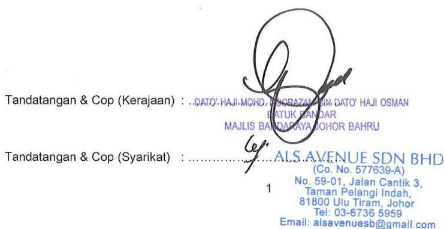

No. Kontrak: MBJJB/SH/137/2021 (SEBUTHARGA SEMULA)

3. Bersama surat ini dikembarkan pelarasan harga dan kadar harga dalam *Jadual Kadar Harga Pelarasan dan/atau Ringkasan Sebut harga aku Senarai Kuantiti, mengikut yang mana berkenaan, setelah diteliti dan diakesanakan oleh Kerajaan tentang kemunasabahannya yang mana akan menjadi sebahagian daripada terma-terma kontrak. Untuk makluman tuan, Jumlah Harga Kontrak seperti di atas adalah keral dan tidak berubah.

4. Tarikh miliik tapak seperti yang disebutkan dalam Syarat-syuat Kontrak ialah pada 19 APRIL 2022. Adalah dimaklumkan bahwa tiada perkhidmatan boleh dibuat melainkan jika syarikat tuan telah mengemukakan kepada Kerajaan dokumen-dokumen berikut:

(a) Suaju Bon Pelaksanaan yang tidak boleh dibatalkan yang berjumlah Ringgit TIGA RIBU LIMA RATUS LIMA PULUH DUA DAN SEN LIMA PULUH SAHAJA sebanyak (RM3,552.50) nilai setahun;

(b) Suaju Polisi Insurans Tanggungan Awam yang tidak boleh dibatalkan yang berjumlah Ringgit SATU RATUS RIBU SAHAJA (RM100,000.00);

(c) Suaju Polisi Insurans Kerja yang tidak boleh dibatalkan yang berjumlah Ringgit DUA RATUS LAPAN PULUH EMPAT RIBU DUA RATUS SAHAJA (RM284,200.00);

(d) Nombor-nombor pendaftaran di bawah Skim Keselamatan Sosial Pekerja (PERKESO) dan/atau;

(e) Suaju Polisi Pampasan Pekerja yang tidak boleh dibatalkan yang berjumlah Ringgit LIMA PULUH ENAM RIBU LAPAN RATUS EMPAT PULUH SAHAJA (RM56,840.00);

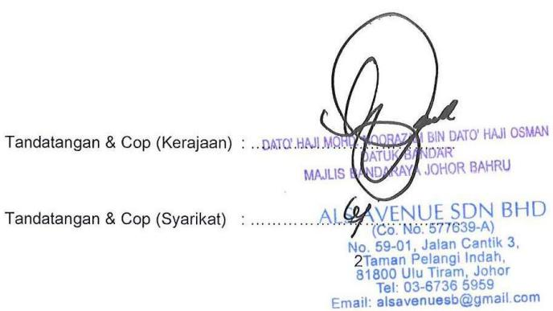

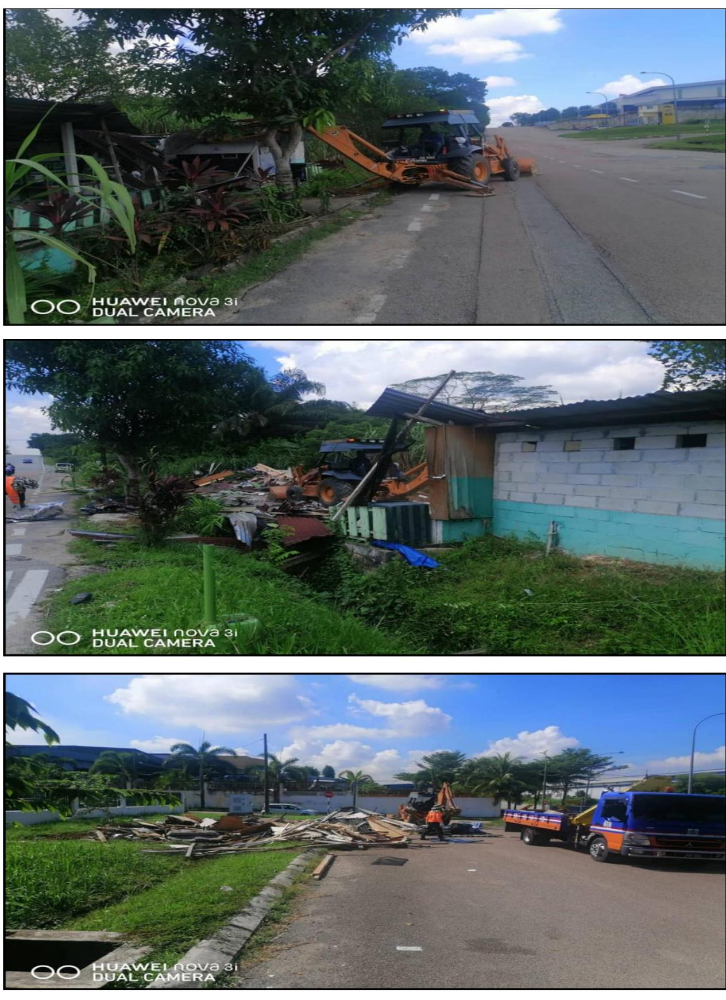

# TENAGA NASIONALBERHAD WORKS

# TNB SESALUR ATAS VOLTAN RENDAH (SAVR)

No. Kontrak : TNB1446/2019 Tarikh : Qo.MAC 2019

JAK MAX (M) SDN BHD (3040034)

Tuan,

# PELANTIKAN SYARIKAT SEBAGAI KONTRAKTOR KERJA BUMIPUTERA TNB SKOR KERJA SESALUR ATAS VOLTAN RENDAH BAGI JOHOR

Tenaga Nasional Berhad (selepas ini dirujuk sebagai "TNB") bersetuju untuk melantik syarikat tuan sebagai Kontraktor Kerja Bumiputera (KKB) bagi kategori kerja SESALUR ATAS VOLTAN RENDAH untuk Tenaga Nasional Berhad. Adakah dimaklumkan, tawaran di atas adalah tertakluk kepada pematuhan tuan terhadap syarat- syarat berikut :-

1) Pelantikan sebagai Kontraktor Kerja Bumiputera bermula dari 27 MAC 2019 SEHINGGA 31 JULAI 2019 . TNB berhak untuk melanujukan tempoh perjanjan kontrak ini tertakluk kepada prestasi yang memuaskan. Pihak KKB bersetuju menerima lanjutan perjanjan tersebut (sekiranya ada) dengan terma-terma dan syarat kontrak sedia ada.

2) Penerimaan Kabar Jadual Harga yang ditawarkan oleh TNB kepada pihak tuan.

3) Persetujuan tuan untuk menandatangani satu kontrak dengan TNB dan mematuhi terma-terma dan syarat kontrak TNB untuk kerja-kerja di atas.

4) Di masa akan datang TNB tidak tertakluk untuk menysembung kontrak ini dan mungkin akan melaksanakan tender terbuka.

5) Mempunyai Kad Kelayakan Teknikal (KKT) untuk melaksanakan kerja mengikut skop yang dianugerahkan.

6) Memastikan syarat-syarat mandatori pelantikan sentiasa dipatuki.

7) Pelantikan ini adalah BERSYARAT di mana pihak tuan perlu mempunyai mesin dan peralatan yang lengkap seperti senarai semak ketika pangaudian dibuat. Mesin dan peralatan perlu disediakan dalam tempoh 30 hari dari surat lantikan ini.

Sehubungan dengan itu, pihak tuan dikehendaki untuk menandatangani Surat Jawapan Tawaran yang dilampirkan bersama surat ini.

Sekian, terima kasih.

Ir. KAMALIAH BINTI ABDUL KADIR Program Director (Procurement & Supply Chain - Group Wide Function) Bahagian Procurement & Supply Chain, TNB

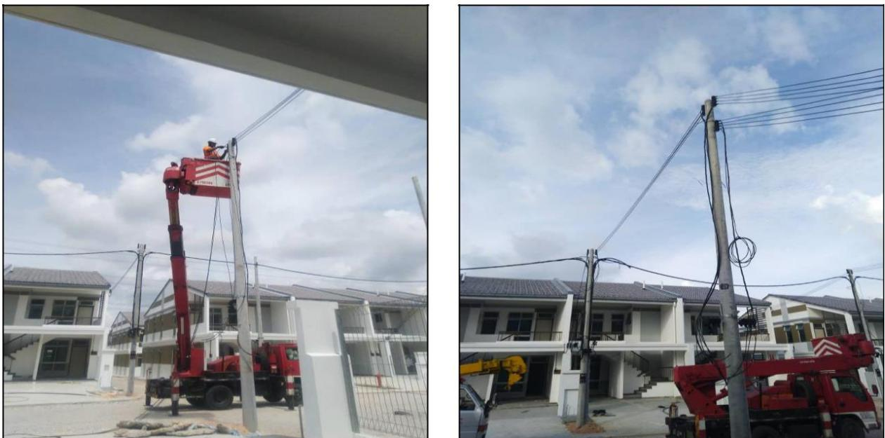  
KERJA – KERJA MEMASANG SERBIS KE PREMIS PENGGUNA MENGGUNKAN TOWER WAGON.

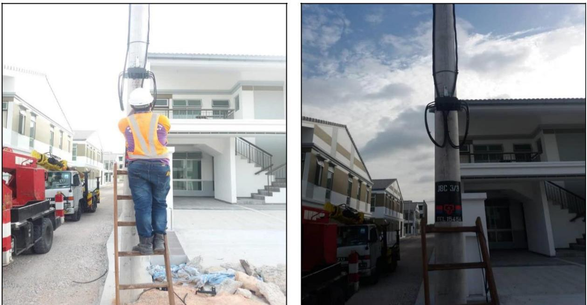

KERJA – KERJA MEMASANG NORMAL OFF POINT (BLACK BOX) DI KAWASAN PERUMAHAN TOWN HOUSE BANDAR CEMERLANG, JOHOR.

# TNB ENERGY SERVICES HDD & UNDERGROUND CABLE 11KV

CONTRACT TNBES NO. C0013/J2021

Date : 7 February 2020

# JAK MAX (M) SDN BHD

No 01- 31, Jalan Austin Perdana 7/22, 81100 Johor Bahru, Johor.

Dear Sir,

# LETTER OF ACCEPTANCE

SUPPLIER : JAK MAX (M) SDN BHD  CONTRACT NO : C0013/2021  CONTRACT TITLE : CONTRACT OF "MSVT- MENUKAR SISTEM SEDIADA 6.6KV KEPADA 11KV BAGI 5 BUAH PENCAWANG 1 ELEKTRIK DI KAWASAN MAJIDEE, JOHOR BAHRU (FASA 1) IAITU: 1)PE KG SETANGGI, 2)PE PM K.HJH HASNAH (SPUR) 3)PE HUMAH MURAH MAJIDEE, 4)PE TOK SIAK NO.2 (SPUR), 5)PE PANGSAPURI KAKITANGAN MBJB (D- IMU- STB- 1603)".

With reference to minutes of meeting dated  $7^{\text{th}}$  November 2019 and your revised quotation dated  $13^{\text{th}}$  December 2019 respectively, TNB ENERGY SERVICES SDN. BHD. (hereinafter referred to as "TNBES") has the pleasure to inform you that we accept your offer for the above purchase based on the following terms and conditions:

# 1. CONTRACT PRICE

The total Contract Price for the above purchase is RM1,716,066.40 (RINGGIT MALAYSIA ONE MILLION SEVEN HUNDRED SIXTEEN THOUSAND AND SIXTY- SIX AND FOURTY CENTS ONLY)

In the event any sales and services taxes (SST) are imposed by the relevant authorities, the contract price shall be adjusted to include the SST. You shall include the SST in the invoices upon such SST being enforced by the relevant authorities provided you are being a registered person under the relevant SST Legislation.

For the purpose of Clause 1 (i) above, SST Legislation shall mean the Service Tax Act 2018 and/or the Sales Tax Act 2018 including its rules, regulations or guidelines issued by the relevant authorities in charge of such taxes.

All payment shall be made in accordance with this Contract and the same shall be made in Ringgit Malaysia.

# 2. REFERENCE

A formal contract document will be prepared in due course for execution by the Service provider and Purchaser. Pending completion of the formal contract document, minutes of meeting dated  $7^{\text{th}}$  November 2019 and you revised quotation dated  $13^{\text{th}}$  December 2019, and this Letter of Acceptance

Tingkat 3, Blok A, Menara PKNS- PJ, No.17, Jalan Yong Shook Lin, 46050 Petaling Jaya, Selangor Page Tel: 603- 7662 5111 (General Line) Fax: 603- 7662 5112 / 5113 Web: www.tnbes.com.my

CONTRACT TNBES NO. CO014/2021

Date: 7 February 2020

JAK MAX (M) SDN BHD No 01- 31, Jalan Austin Perdana 2/22, 81100 Johor Bahru, Johor.

Dear Sir,

LETTER OF ACCEPTANCE SUPPLIER JAK MAX (M) SDN BHD

CONTRACT NO 3 C0014/2021 CONTRACT TITLE 3 CONTRACT OF "MSVT- MENUKAR SISTEM SEDIADA 6.6KV KEPADA 11KV YANG MELIBATKAN 4 BUAHI PENCAWANG ELEKTRIK DI KAWASAN MAJIDEE, JOHOR BAHRU (FASA 3) IAITU: 1)PE FOON YEW NO.1, 2)PE MAJIDEE PARK, 3)PE NAJTEX HOLDING, 4)PE KEBUN TEH JALAIJ PEDANA (D- MU- S18- 1604)".

With reference to minutes of meeting dated 7th November 2019 and your revised quotation dated 13th December 2019 respectively, TNB ENERGY SERVICES SDN. BHD., (hereinafter referred to as "TNBES") has the pleasure to inform you that we accept your offer for the above purchase based on the following terms and conditions:

# 1. CONTRACT PRICE

The total Contract Price for the above purchase is RM917,227.00 (RINGGIT MALAYSIA NINE HUNDRED SEVENTEEN THOUSAND TWO HUNDRED TWENTY- SEVEN ONLY)

(i) In the event any sales and services taxes (SST) are imposed by the relevant authorities, the contract price shall be adjusted to include the SST. You shall include the SST in the invoices upon such SST being enforced by the relevant authorities provided you are being a registered person under the relevant SST Legislation.

(ii) For the purpose of Clause 1 (i) above, SST Legislation shall mean the Service Tax Act 2018 and/or the Sales Tax Act 2018 including its rules, regulations or guidelines issued by the relevant authorities in charge of such taxes.

(iii) All payment shall be made in accordance with this Contract and the same shall be made in Ringgit Malaysia.

# 2. REFERENCE

(i) A formal contract document will be prepared in due course for execution by the Service provider and Purchaser. Pending completion of the form contract document, minutes of meeting dated 7th November 2019 and your revised quotation dated 13th December 2019, and this Letter of Acceptanc

Tingkat 3, Blok A, Menara PKNS- PJ, No.17, Jalan Yong Shook Lin, 46050 Petaling Jaya, Selangor Page Tel: 603- 7662 5111 (General Line) Fax: 603- 7662 5112 / 5113 Web: www.tnbes.com.my

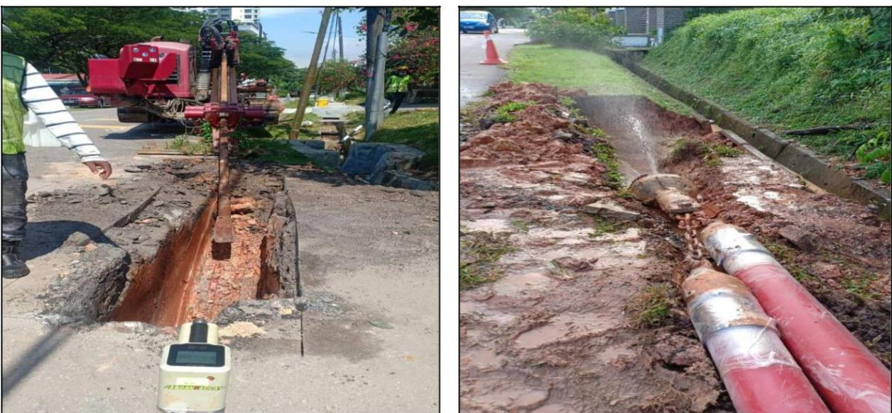

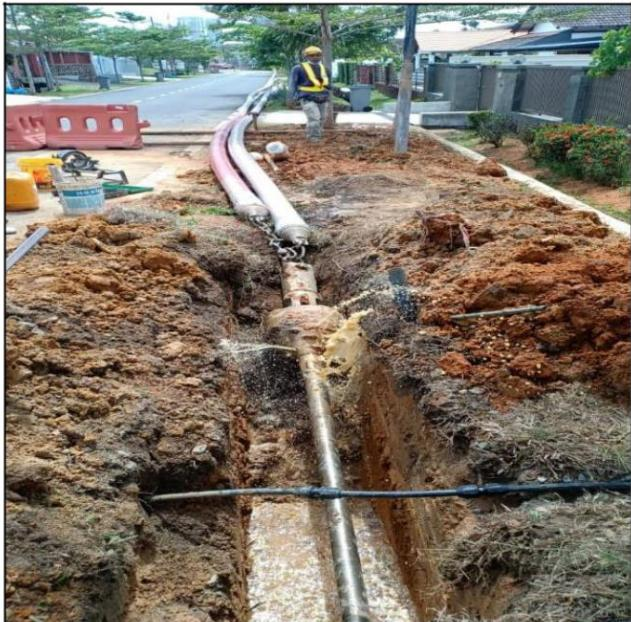

GAMBAR SEMASA KERJA ROD PILOT DAN TARIK PAIP HDPE 6 INCH DI KG SETANGGI, JOHOR BAHRU.

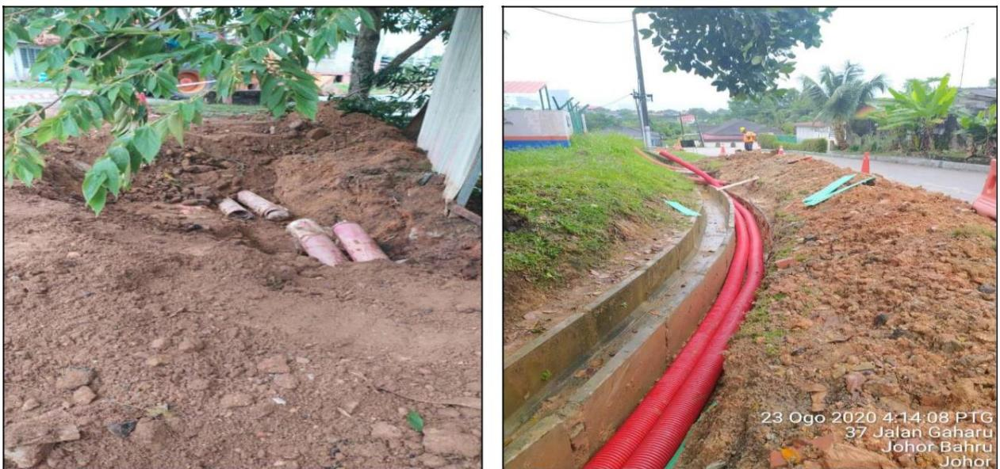

JOINT PIT DISEDIAKAN BAGI  KERJA JOINTING KABEL

KABEL HDPE 6 INCH  DIRENTANG

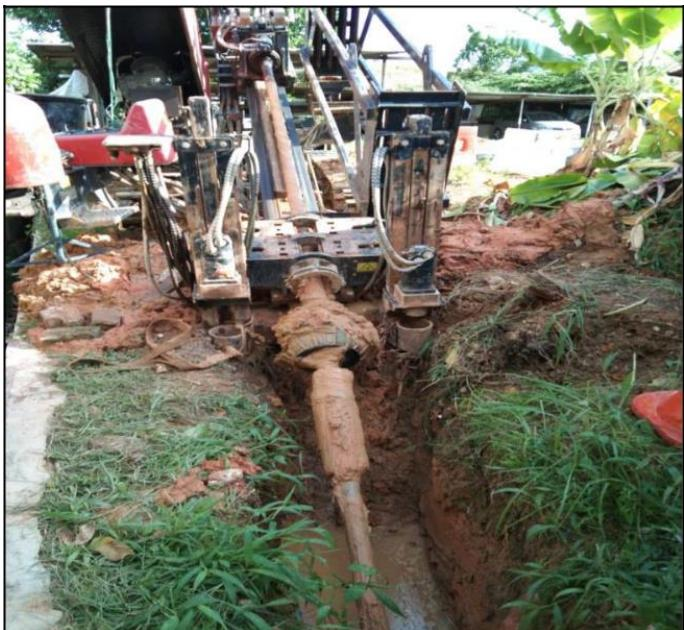

MESIN HDO GOODENG 32T DIGUNAKAN SEMASA KERJA DRILLING PAIP.

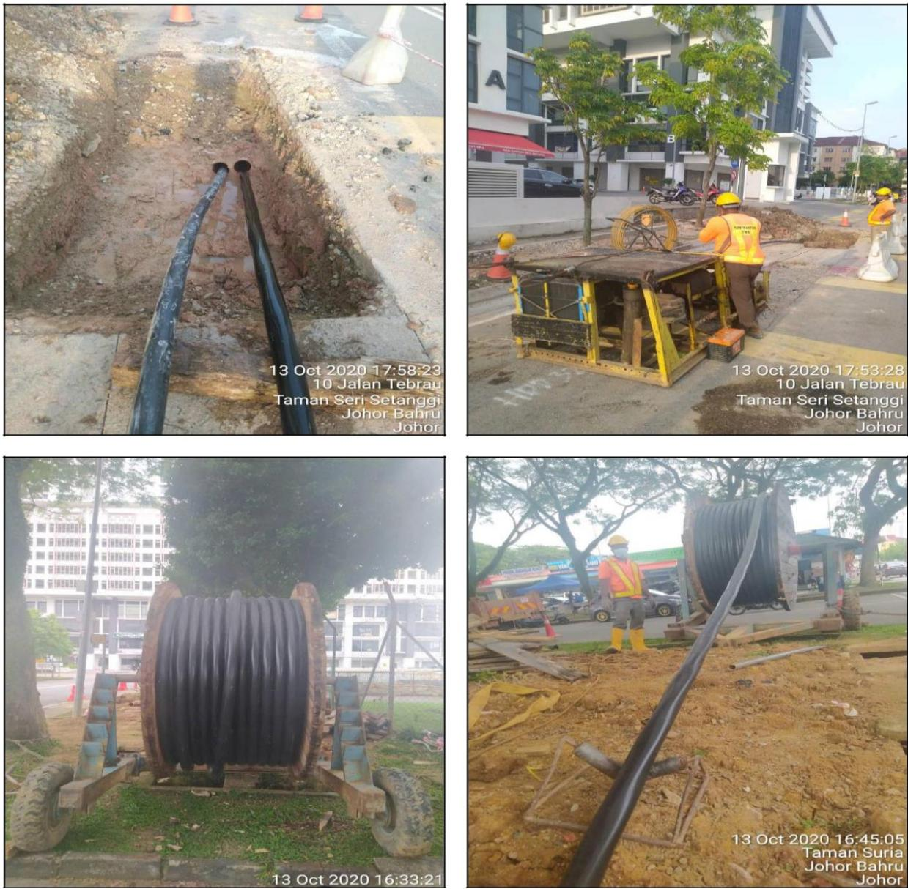

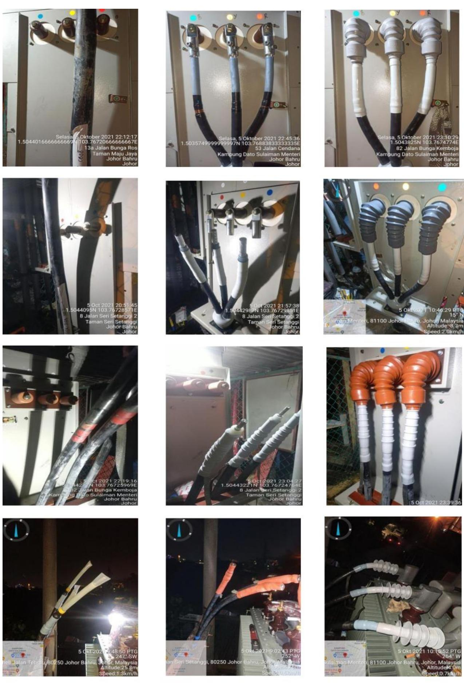

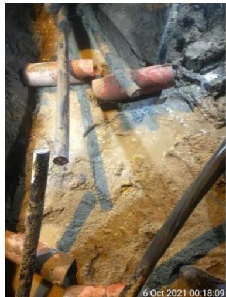

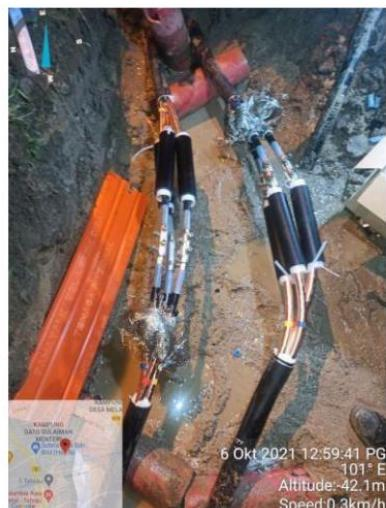

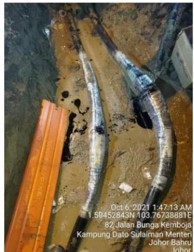

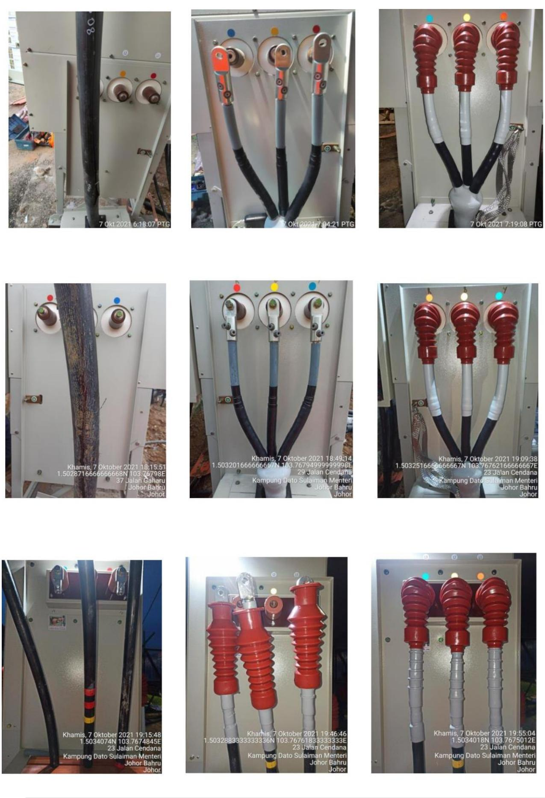

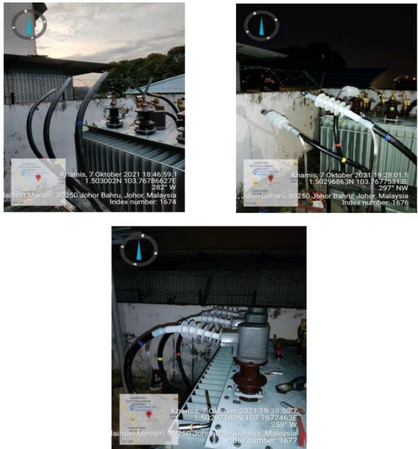

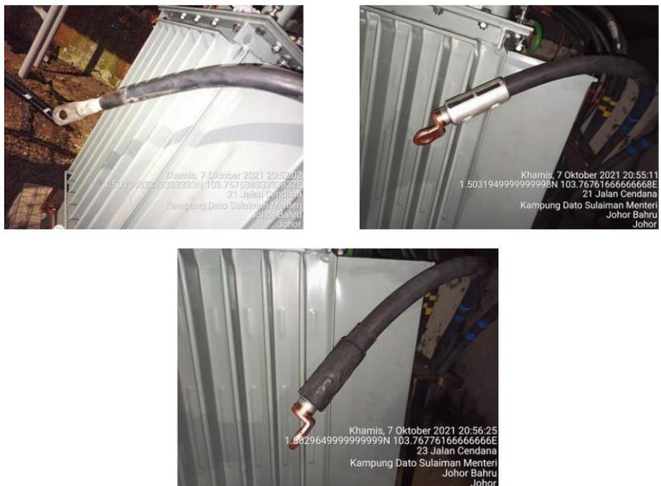

# SHUTDOWN PROJEK PAKEJ 3 (IMJ-1603) - PPU SOUTHKEY (TERMINATION GIS)

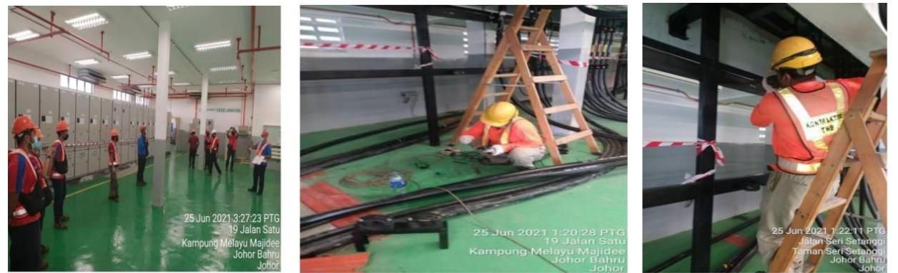

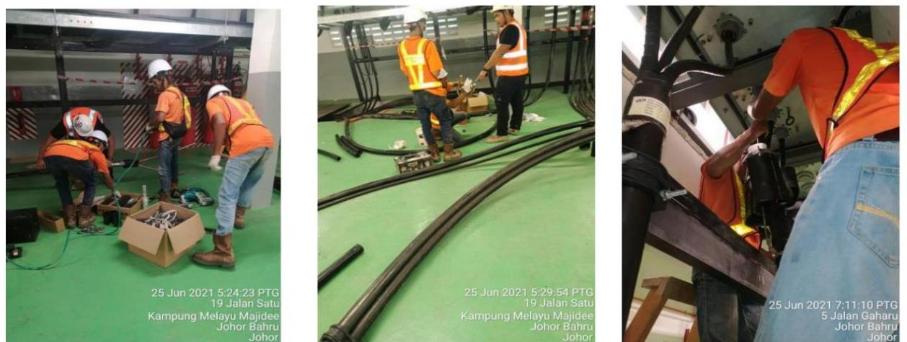

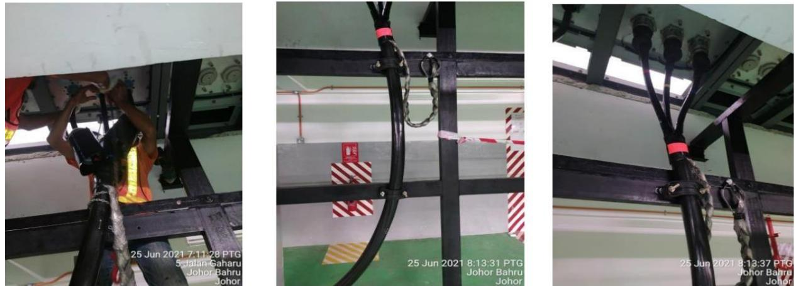

# TNB HORIZONTAL DIRECTIONAL DRILLING (HDD)

No. Kontrak : TNB 408/2023  Tarikh : 20 Disember 2022

PENGARAH SYARIKAT  JAK MAX (M) SDN. BHD.  3040034

Y. Bhg. Datuk/Dato/ /Tuan/Puan

PELANTIKAN SYARIKAT SEBAGAI KONTRAKTOR KERJA/PERKIHDMATAN BUMIPUTERA TNB BAGI SKOP KERJA KPB HDD JOHOR, MELAKA, NEGERI SEMBILAN, PAHANG

Dengan segala hormonalnya perkara di atas adalah dirujuk.

2. Tenaga Nasional Berhad (selepas ini dirujuk sebagai "TNB") telah persentuju untuk melantik syarikat Y. Bhg. Datuk/Dato/ /Tuan/Puan sebagai Kontraktor Kerja/Perkhidatan Bumiputera TNB bagi skop kerja KPB HDD JOHOR, MELAKA, NEGERI SEMBILAN, PAHANG.

3. Pelantikan sebagai Kontraktor Kerja/Perkhidatan Bumiputera TNB serta penawaran kontrak ini sehingga 31/12/2025 berdasarkan terma-terma dan syarat kontrak yang akar ditandatangani oleh pihak Y. Bhg. Datuk/Dato/ /Tuan/Puan bagi skop kerja di atas.

4. TNB berhal untuk melanjutkan tempoh pelantikan dan kontrak ini berdasarkan terma-terma dan syarat kontrak seda ada tertakluk kepada prestasi 4 & 5 bintang serta isu-lain.

5. Pihak Y. Bhg. Datuk/Dato/ /Tuan/Puan perlu memastikan syarat-syarat mandatori pelantikan sentiasa dipatuhi sopanjang tempoh kontrak ini. Syarat-syarat pelantikan adalah seperti berikut:-

i. Pendaftarah sebagai vendor TNB mengikut kod bidang pelantikan mestilah masih sah laku dan bertarafbumiputera.  ii. Orang Kompeten mestilah mempunyai pendaftarah yang sah dengan Suruhanjaya Tenaga untuk syarikat Y. Bhg. Datuk/Dato/ /Tuan/Puan.  iii. Mempunyai peralatan kerja yang telah ditetapkan bagi skop kerja yang dilantik.  iv. Mempunyai Kad Kelayakan Teknikal yang ditetapkan.  v. Mestilah menggekalkan markah prestasi CASE 4 dan 5 Bintang untuk syarikat sedia ada.

6. Nilai kerja yang ditawarkan tertakluk kepada keperluan TNB dan akan dibayar mengikut kadar harga Senarai Jadual Harga Tetap (SJHT) yang boleh dirujuk dalam Portal Vendor TNB dengan melayari https://pvt.tnb.com.my.

7. Pihak Y. Bhg. Datuk/Dato/ /Tuan/Puan dikehendaki untuk menandalatangani Surat Jawapan Tawaran dan Integrity Pact yang dilampirkan bersama surat ini.

Sekian, terima kasih.

"BETTER. BRIGHTER"

Head (Cost & Supply Market Intelligence) Bahagian Procurement & Supply Chain, Tenaga Nasional Berhad

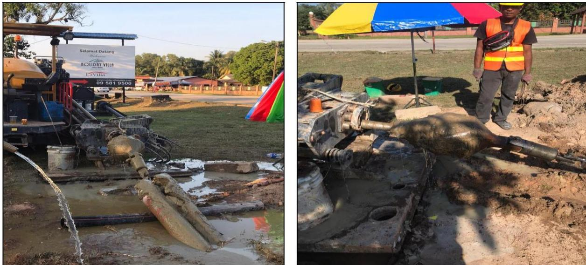

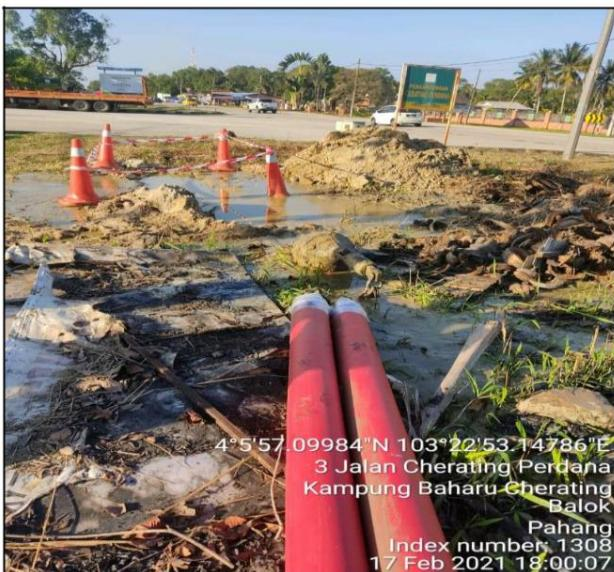

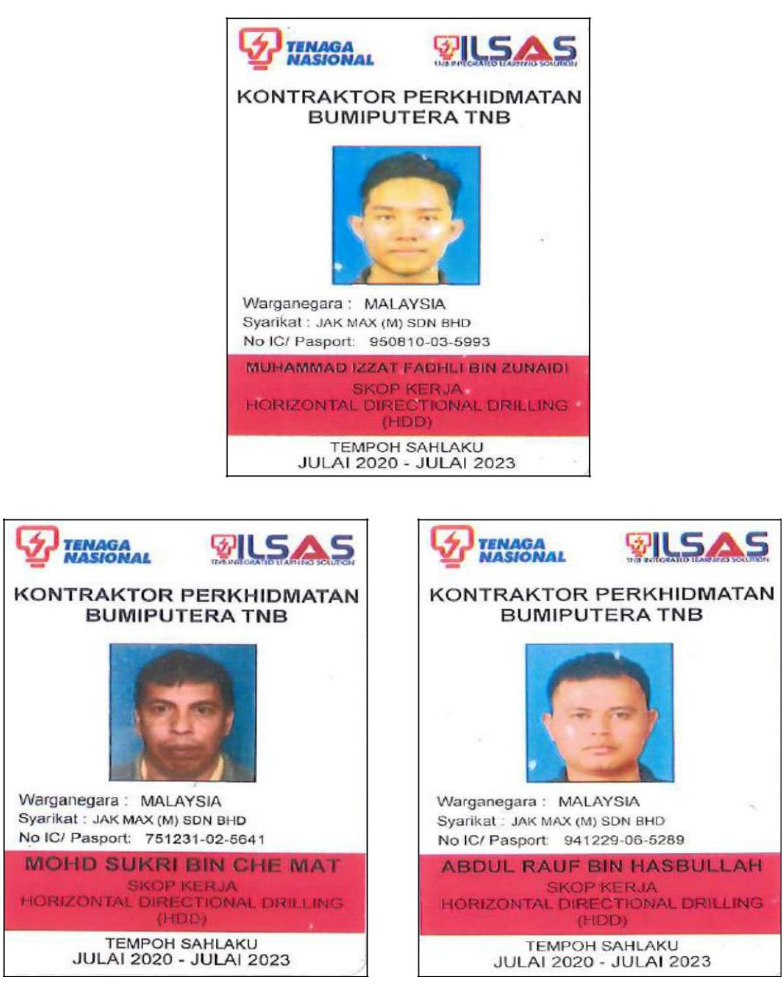

# TNB SIVIL

No.Kontrak :TNB 1077/2023 Tarikh : 26 Januari 2023

PENGARAH SYARIKAT JAK MAX (M) SDN.BHD. 3040034

Y.Bhg.Datuk/Dato/Tuan/Puan

PELANTIKAN SYARIKAT SEBAGAI KONTRAKTOR KERJA/PERKHIDMATAN BUMIPUTERA TNB BAGI SKOP KERJA KKB SIVIL JOHOR

Dengan segala horndinya perkara di atas adalah dirujuk.

2. Tenaga Nasional Berhad (selepas ini dirujuk sebagai "TNB") telah bersetuju untuk melantik syarikat Y. Bhg. Datuk/Dato/Tuan/Puan sebagai Kontraktor Kerja/Perkhidmatan Bumiputera TNB bagi skop kerja KKB SIVIL JOHOR.

3. Pelantikan sebagai Kontraktor Kerja/Perkhidmatan Bumiputera TNB serta penawaran kontrak ini sehingga 31/12/2015 berdasarkan terma-terma dan syarat kontrak yang akan ditandatangani oleh pihak Y. Bhg. Datuk/Dato/Tuan/Puan bagi skop kerja di atas.

4. TNB berhak untuk melanjutkan tempoh pelantikan dan kontrak ini berdasarkan terma-terma dan syarat kontrak sedia ada tertakluk kepada prestasi 4 & 5 bintang serta tida isu isu lain.

5. Pihak Y. Bhg. Datuk/Dato/Tuan/Puan perlu memastikan syarat-syarat mandatori pelantikan sentiasa dipatuhi sepanjang tempoh kontrak ini. Syarat-syarat pelantikan adalah seperti berikut:-

i. Pendaftaran sebagai vendor TNB mengikut kod bidang pelantikan mestilah masih sah laku dan bertaraf buiniputera.

ii. Orang Kompaten mestilah mempunyai pendaftaran yang sah dengan Surubariaya Tenaga untuk syarikat Y. Bhg. Datuk/Dato/Tuan/Puan.

iii. Mempunyan peralatan kerja yang telah ditetapkan bagi skop kerja yang dilantik.

iv. Mempunyan Kad Kelayakan Teknikal yang ditetapkan.

v. Mestilah mengelalkan markah prestasi CASE 4 dan 5 Bintang untuk syarikat sedia ada.

6. Nilai kerja yang ditawarkan tertakluk kepada keperluan TNB dan akas dibayar mengikut kadar harga Senarai Jadual Harga Tetap (SJHT) yang boleh dirujuk dalam Portal Vendor TNB dengan melayari https://pvt.tnb.com.my.

7. Pihak Y. Bhg. Datuk/Dato/Tuan/Puan dikehendaki untuk menandatangani Surat Jawapan Tawaran dan Integrity Pact yang dilampirkan bersama surat ini.

Sekian, terima kasih:

"BETTER. BRIGHTER"

Shahzely Zainal Abidin Head (Cost & Supply Market Intelligence) Bahagian Procurement & Supply Chain, Tenaga Nasional Berhad

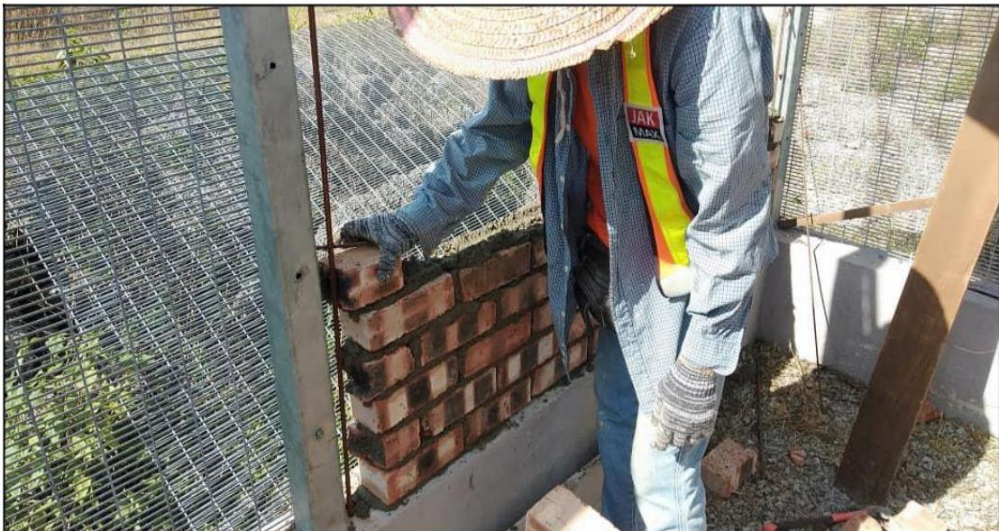  
KERJA MENGIKAT BATA BURNT CLAY DI PE LORONG FAIZAL, PEKAN NENAS

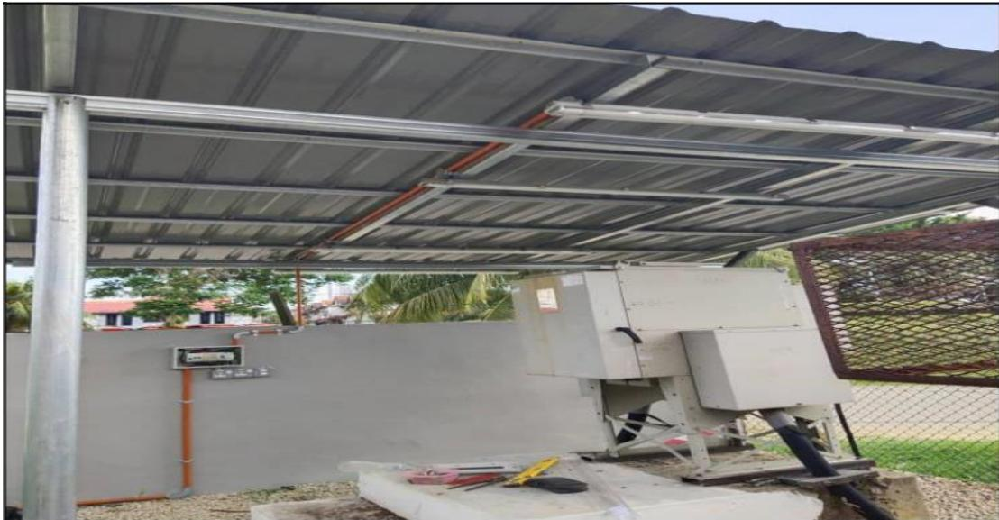

METAL DECK 0.48MM THICKNESS TELAH SIAP DI PASANG PE MELODIES, JOHOR BAHRU

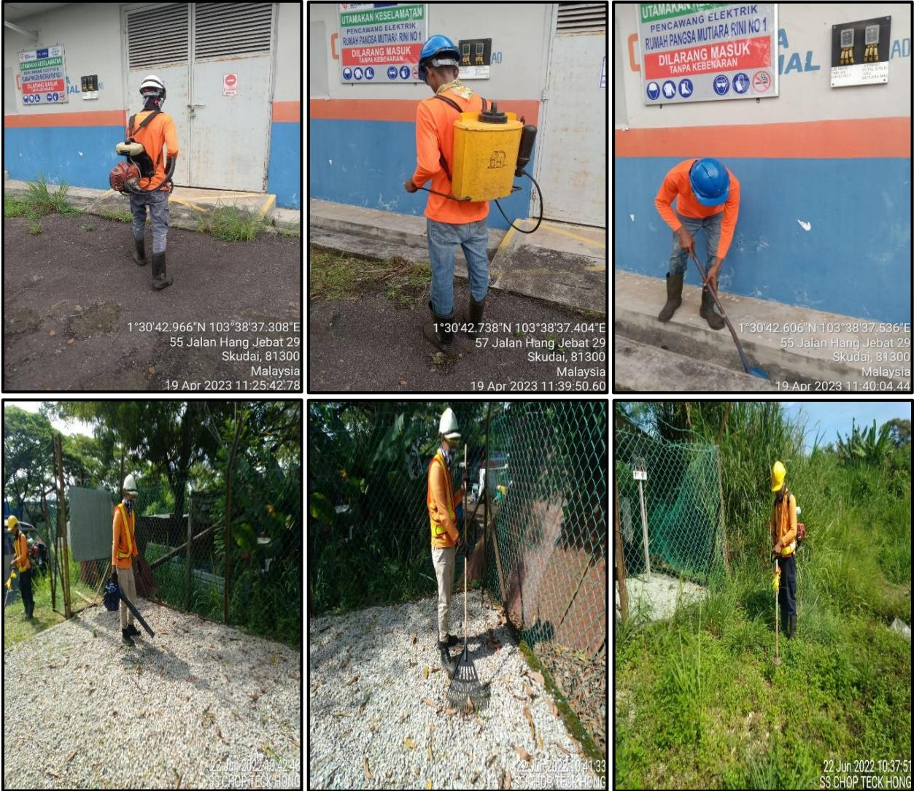  
KERJA MENUKAR PINTU PE JENIS MILD STEEL DALAM PENCAWANG TNB DI BANDAR TENGGARA, JOHOR.

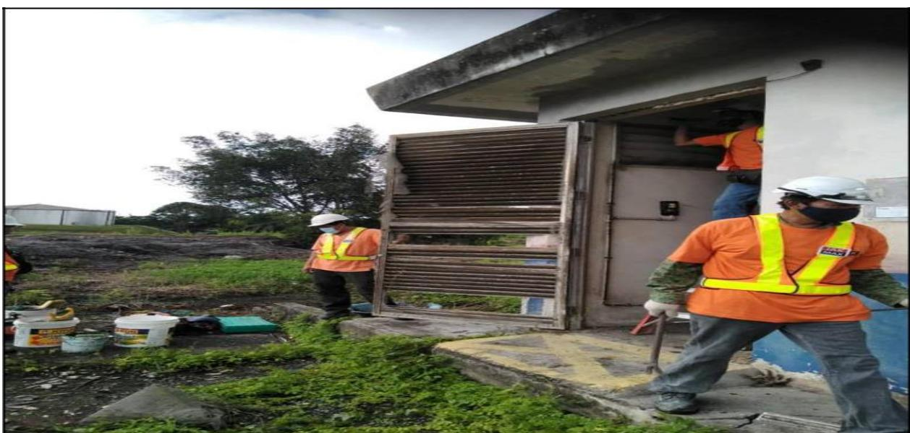

# KERJA - KERJA SIVIL PAT LAPIS TAMPOK BENUT

Membekal, Menurap Dan Memadatkan Permukaan Jalan Dengan Premix beserta lapisan tack coat, prime coat dan cat garisan jalan (Siang)

Sebelum

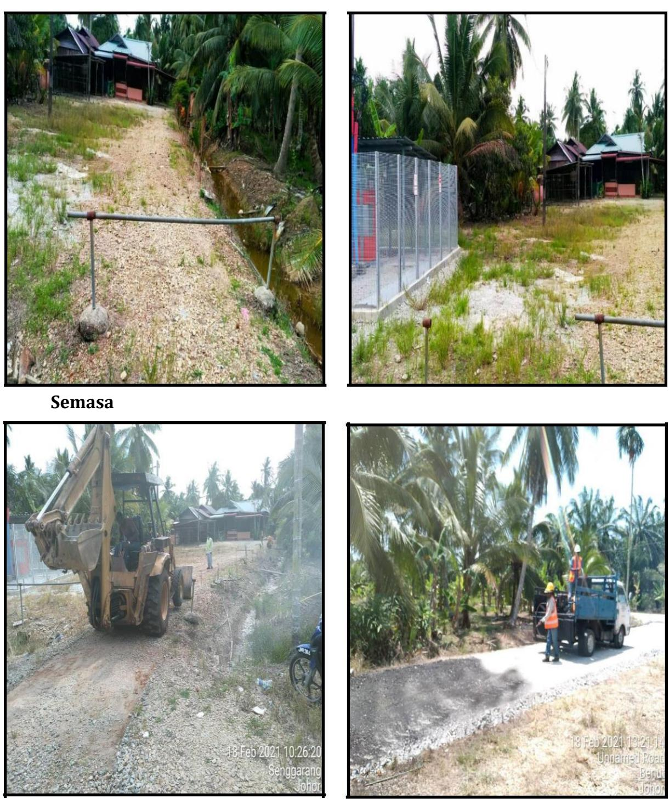

# Selepas

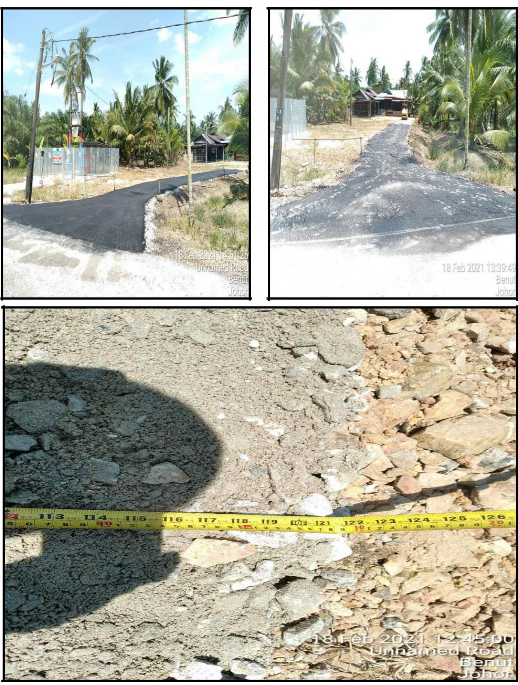  
3 Meter = lebar Premix

Membekal, meratakan & memadatkan permukaan tanah dengan 50mm sand blanket dan #crusher run# setebal 200mm (Siang)

Sebelum

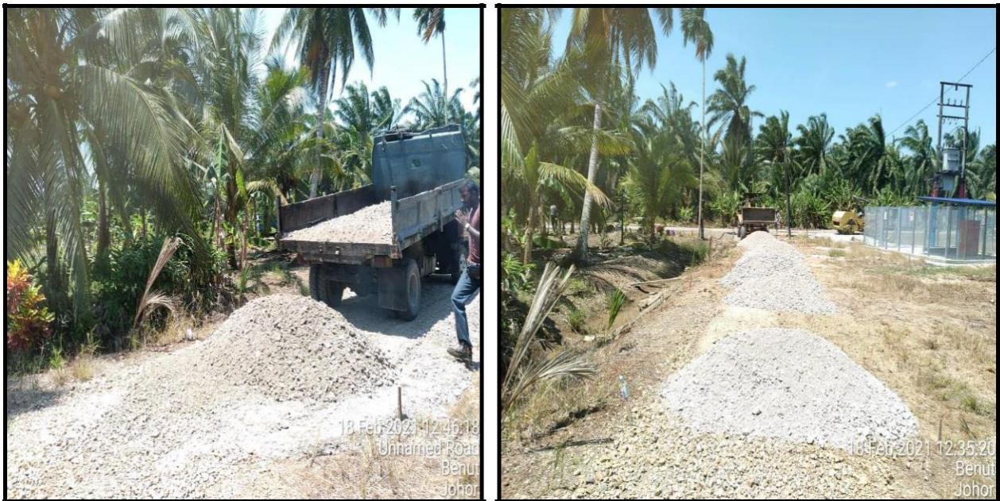

Semasa

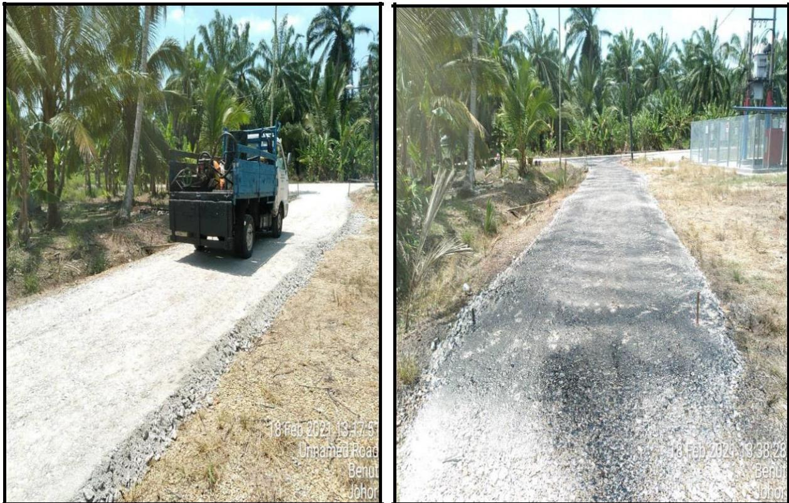

# Selepas

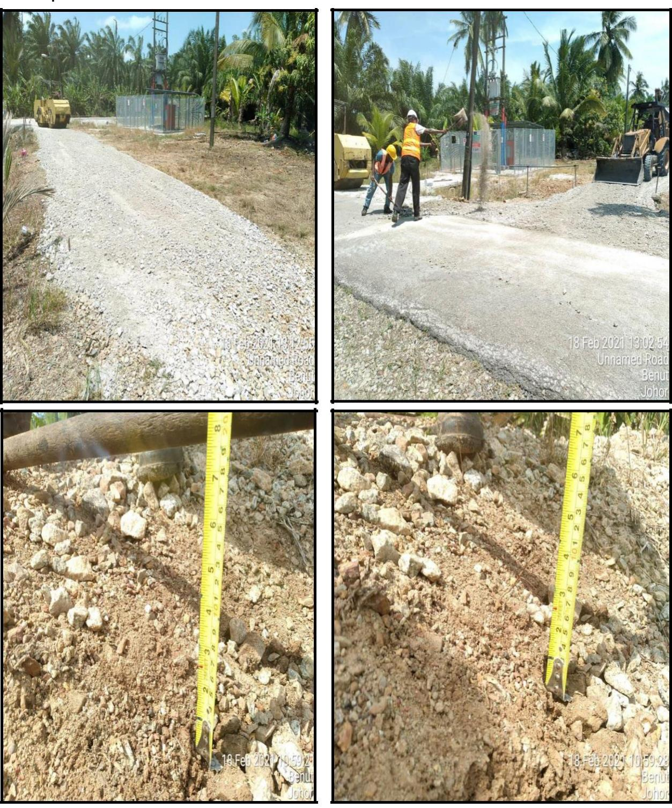

# Merombak, Membekal Dan Memasang Penghawa Dingin Wall Mounted Type termasuk akesorsi (non inverter). a) penghawa Dingin 2.5 HP.

Sebelum

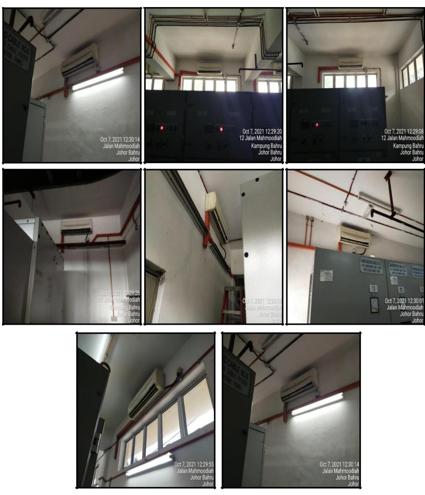

# Selepas

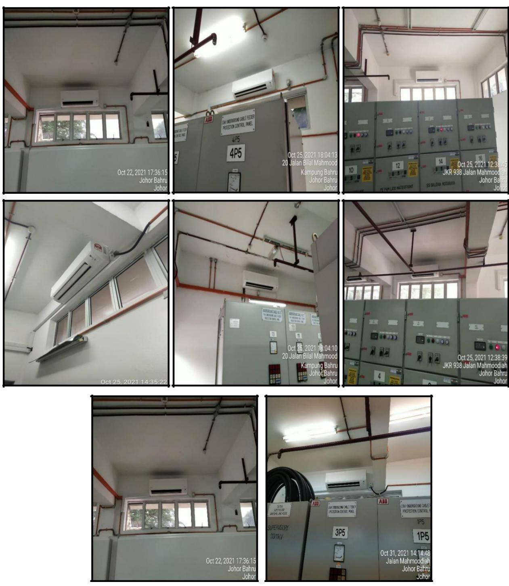

# Merombak Pagar Rosak, Membekal  $< (>\& < )>$  Memasang ""PVC Coated G.I. Chain-Linked Fencing Setting 1830mm Dan ""50mm x 50mm x 6mm L Angled Mild Steel Post ""

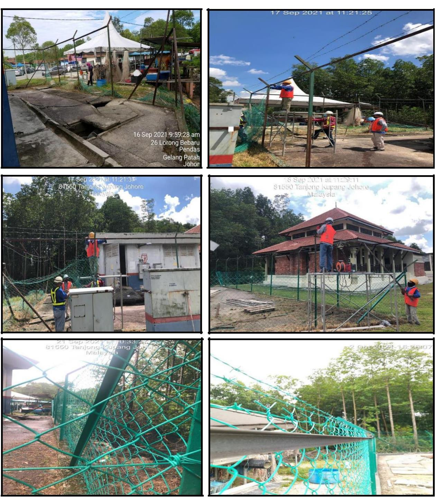

# TNB SMART METER

No.Kontrak :TNB 119/2023 Tarikh :7 Disember 2022

PENGARAH SYARIMAT JAK MAX (M) SDN, BHD, 3040034

Y.Bhg.Datuk/Dato/Tuan/Puan

PELANTIKAN SYARIKAT SEBAGAI KONTRaktOR KERJA/PERKHIDMATAN BUMIPUTERA TNB BAGI SKOP KERJA KKB SMART METER JOHOR

Dengan segala hommatnya perkara di atas adalah dirujuk.

2. Tenaga Nasional Berhad (selepas ini dirujuk sebagai "TNB") telah bersetuju untuk melantik syarikat Y. Bhg. Datuk/Dato/Tuan/Puan sebagai Kontraktor Kerja/Perkhidmatan Bumiputera TNB bagi skop kerja KKB SMART METER JOHOR.

3. Pelantikan sebagai Kontraktor Kerja/Perkhidmatan Bumiputera TNB serta penawaran kontrak ini sehingga 31/12/2025 berdasarkan terma-terma dan syarat kontrak yang akari ditandatangani oleh pihak Y. Bhg. Datuk/Dato/Tuan/Puan bagi skop kerja di atas.

4. TNB berhad untuk melanjutkan tempoh pelantikan dan kontrak ini berdasarkan terma-terma dan syarat kontrak seda ada tertakluk kepada prestasi 4 & 5 bintang serta tiada isu-isu lain.

5. Pihak Y. Bhg. Datuk/Dato/Tuan/Puan perlu memastikan syarat-syarat mandatori pelantikan sentiasa dipatuhi sepanjang tempoh kontrak ini. Syarat-syarat pelantikan adalah seperti berikut:-

i. Pendaftaran sebagai vendor TNB mengikut kod bidang pelantikan mestilah masih sah laku dan bertaraf bemiputera. ii. Orang Kompeten nestilah mempunyai pendaftaran yang sah dengan Suruhanjaya Tenaga untuk syarikat Y. Bhg. Datuk/Dato/Tuan/Puan. iii. Mempunyai peralatan kerja yang telah ditetapkan bagi skop kerja yang dilantik. iv. Mempunyai Kad Kelayakan Teknikal yang ditetapkan. v. Mestilah mengekalkan markah prestasi CASE 4 dan 5 Bintang untuk syarikat sedia ada. vi. Mestilah menyediakan minima dua (2) pasukan kerja sepanjang tempoh kontrak bagi penganugdrahan Outline Agreement Number (OAN) Asset Development, Maintenance dan Kecemasan. Kegagalan mematuhi syarat minima tersebut memberi hak kepada TNB untuk mengulangkaji skop tawaran sedia ada. Sebarang ketidakpatuhan kepada terma dan syarat kontrak, TNB berhad untuk mengambil tidakan berdasarkan terma dan syarat kontrak.

6. Nilai kerja yang ditawarkan tertakluk kepada keperluan TNB dan akan dibayar mengikut kadar harga Senarai Jadah Harga Tetap (SJHT) yang boleh dirujuk dalam Portal Vendor TNB dengan melayari https://pvt.tnb.com.my.

7. Pihak Y. Bhg. Datuk/Dato/Tuan/Puan dikehendaki untuk menandatangani Surat Jawapan Tawaran dan Integrity Pact yang dilampirkan bersama surat ini.

Sekian, terima kasih.

"BETTER. BRIGHTER"

Shahzel/Vainal Alaidin Head (Cost & Supply Market Intelligence) Bahagian Procurement & Supply Chain, Tenaga Nasional Berhad

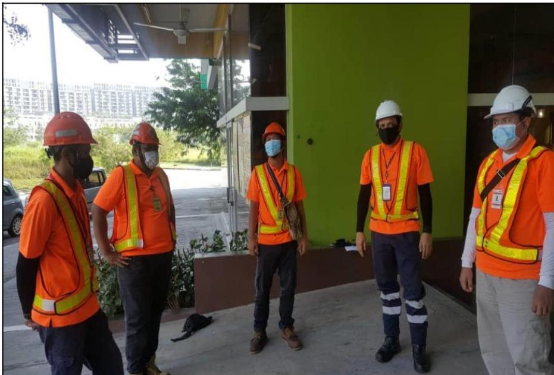

GAMBAR 'TOOL BOX TALK' SEBELUM MEMULAKAN KERJA MENUKAR SMART METER DI KLANG VALLEY.

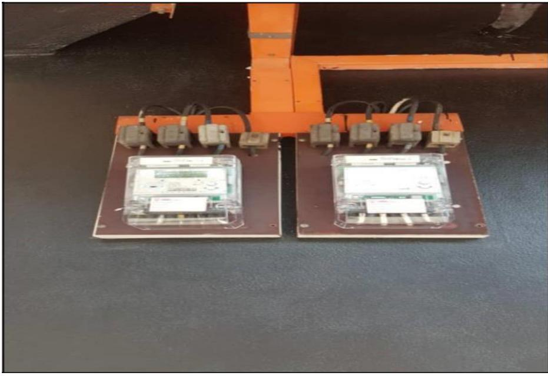

GAMBAR MENUNJUKKAN SMART METER TIGA FASA TELAH SIAP DIPASANG

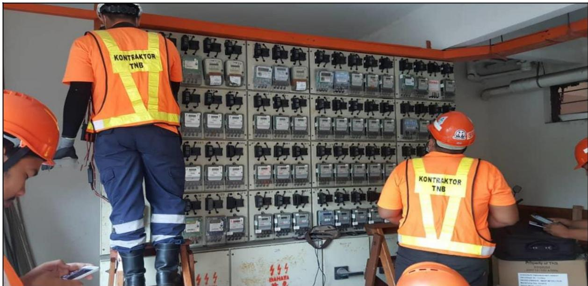

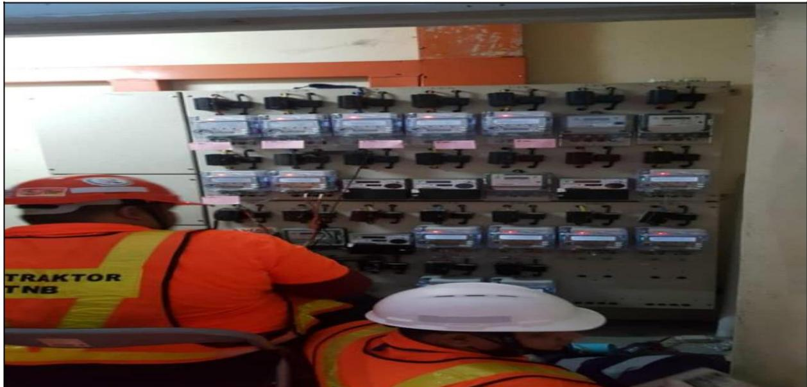

KERJA – KERJA MENUKAR METER DIGITAL KEPADA SMART METER DI KLANG VALLEY.

# TELEKOMMALAYSIA TM

# TM CERTIFIED NETWORKCONTRACTOR (CNC) –CNC LITE

# TM Group

Our Ref.: (11) CR 24_2022/ADD BACTH 4/LOA CNC LITE

# LETTER OF AWARD

JAK MAX (M) SDN. BHD. NO. 01- 31, JALAN AUSTIN PERDANA 2/22, TAMAN AUSTIN PERDANA, 81100 JOHOR BAHRU

Tel: 07- 351 8611 Fax: 09- 296 7979 Email: jak_corp@yahoo.com

Attn: EN JASMAN AMAT KAIRONI

BY TMODS/EMAIL

CONTRACT NO.: K1350694/22 CONTRACT TITLE: CONTRACT FOR CERTIFIED NETWORK CONTRACTOR (CNC) TURNKEY FOR DEVELOPMENT & MAINTENANCE FOR TELEKOM MALAYSIA BERHAD (TM) - CNC LITE (Southern) (the "Contract")

1. We, Telekom Malaysia Berhad ("TM", "we" or "our"), are pleased to inform that JAK MAX (M) SDN. BHD. ("CNC Lite", "you", "yourselves" or "your") is hereby appointed for the provision of works/services as abovementioned subject to the terms and conditions herein provided, the Attachments herein, the Terms and Conditions of Contract, Specifications, Price Schedule and other contract documents of the above Contract.

2. The Contract Value and Contract Period of this Contract shall be as stated in the Schedule to the Letter of Award.

3. For the avoidance of doubt, TM is not obliged to extend the Contract Period upon its expiry or increase the Contract Value should the Contract Value is fully utilized.

4. You are required to execute and sign the formal Contract between TM and yourselves within two (2) months from the date of the Letter of Award. Pending the execution of the formal Contract, your Proposal submission as clarified and amended in the Schedule to the Letter of Award, the Terms and Conditions of Contract as attached in the RFP Documents and this Letter of Award shall constitute a binding agreement between yourselves and TM.

5. You are required to submit the documents as provided in Item 1-3 of the Schedule to the Letter of Award within fourteen (14) working days from the date of this Letter of Award. We acknowledge that you have executed the documents in Item 4-6 of the Schedule to the Letter of Award, which shall form an integral part of this Letter of Award. Unless stated otherwise, the documents and/or requirements stated under this paragraph 5 shall be a condition precedent to the validity of this Letter of Award.

6. If you fail to comply with the provisions of paragraph 4 above within two (2) months from the date of this Letter of Award, TM reserves any or all of the following rights until the formal Contract is signed by you –

(a) Withhold the issuance of any new purchase order/work order,  
(b) Withhold the payment for any work/service rendered, and/or  
(c) Terminate this Letter of Award by written notice.

7. We reserve our right to impose consequence action against you via suspension or blacklisting and you may also be liable to pay for all costs that TM and/or respective subsidiaries will incur as a result of your breach to this Letter of Award without prejudice to TM and/or the respective subsidiaries' right to pursue all remedies available to it under the law against you.

8. Subject to paragraph 4 above, your Proposal submitted from 15th June 2022 in connection with this Contract shall be deemed FINAL and constitute an integral part of the Contract. TM reserves the discretion to revoke this Letter of Award if there is any change(s) made to the Proposal after the date of this Letter of Award, without TM's prior written consent.

Kindly signify your acceptance of this Contract by signing the Acknowledgement of Acceptance appended herein and return the same within fourteen (14) working days of the date of this Letter of Award. In the event we do not receive the same within the time stipulated, we shall treat that you are no longer interested in pursuing the transaction and unless TM states otherwise, this Letter of Award shall cease to have effect.

Notwithstanding the above, please take note that TM has an absolute discretion to revoke this Letter of Award at any time before your acceptance without any liability against any losses, costs, expenses or damages that may be incurred by you pursuant to the revocation of this Letter of Award by TM.

Thank you.

Yours sincerely,

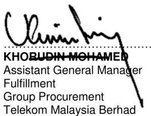

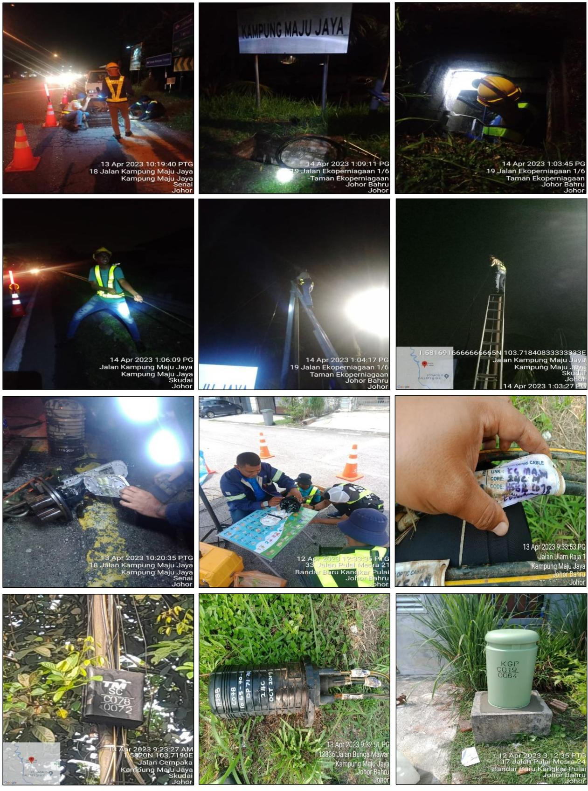

# TM CERTIFIEDBROADBANDCONTRACTOR (CBC)

JAK MAX (M) SDN BHD (200501012784 (689532- U)) NO.01- 31, JALAN AUSTIN PERDANA 2/22 TAMAN AUSTIN PERDANA 81100 JOHOR BAHRU JOHOR

CONTRACT NO.: K1330581/20 CONTRACT TITLE: CONTRACT FOR CERTIFIED BROADBAND CONTRACTOR FOR BROADBAND INSTALLATION AND RESTORATION FOR TELEKOM MALAYSIA BERHAD ("TM") (the "Contract")

# REGION: SOUTHERN

1. We, Telekom Malaysia Berhad ("TM"), are pleased to inform you that JAK MAX (M) SDN BHD are hereby appointed for the provision of works/services as abovementioned subject to the terms and conditions herein provided, the Attachments herein, the Terms and Conditions of Contract, Specifications, Price Schedule and other contract documents of the above Contract.

2. The Contract Value and Extended Contract Period of this Contract shall be as stated in the Schedule to the Letter of Award.

3. For the avoidance of doubt, TM is not obliged to extend the Contract Period upon its expiry or to increase the Contract Value should the Contract Value is fully utilized.

4. You are required to execute and sign the formal Contract between TM and yourselves within two (2) months from the date of the Letter of Award. Pending the execution of the formal Contract, your Proposal submission as clarified and amended in the Schedule to the Letter of Award and this Letter of Award shall constitute a binding agreement between yourselves and TM.

5. You are required to submit the documents as provided in the Schedule to the Letter of Award within fourteen (14) working days from the date of this Letter of Award. Unless stated otherwise, the documents and/or requirements stated under this paragraph 5 shall be a condition precedent to the validity of this Letter of Award.

6. If you fail to comply with the provisions of paragraph 4 above stated within two (2) months from the date of this Letter of Award, TM reserves any or all of the following rights until the formal Contract is signed by you:

(a) Withhold the issuance of any new purchase order/work order.  
(b) Withhold the payment for any work/service rendered, and/or  
(c) Terminate this Letter of Award by written notice.

7. We reserve our right to impose a consequence action against you via suspension or blacklisting and you may also be liable to pay for all costs that TM and/or respective subsidiaries will incur as a result of your breach to this Letter of Award without prejudice to TM and/or the respective subsidiaries' right to pursue all remedies available to it at law against you.

8. Subject to paragraph 4 above, your Proposal submitted on 16 October 2020 in connection with this Contract shall be deemed FINAL and constitute the integral parts of the Contract. TM reserves the discretion to revoke this Letter of Award if there is any change(s) made to the Proposal after the date of this Letter of Award without TM's prior written consent.

This Letter of Award is sent to you in duplicate. Kindly signify your acceptance of this letter by signing the Acknowledgement of Acceptance appended herein and return the same within fourteen (14) working days of the date of this Letter of Award. In the event we do not receive the same within the time stipulated, we shall treat that you are no longer interested in pursuing the transaction and unless TM state otherwise, this Letter of Award shall cease to have effect.

Notwithstanding the above, please take note that TM has an absolute discretion to revoke this Letter of Award at any time before your acceptance without any liability against any losses, costs, expenses or damages that may be incurred by you pursuant to the revocation of this Letter of Award by TM.

Thank you.

Yours sincerely,

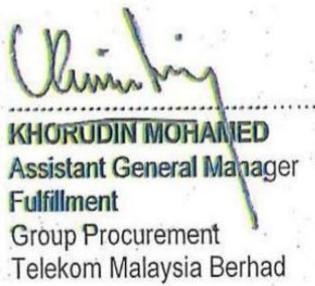

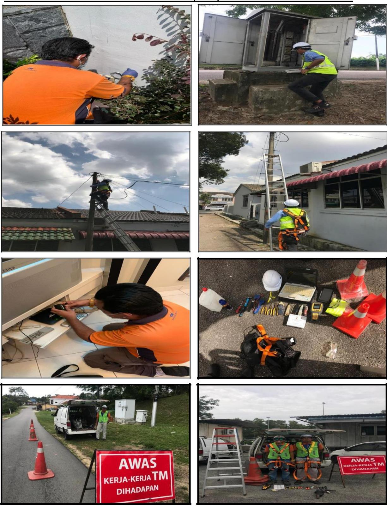

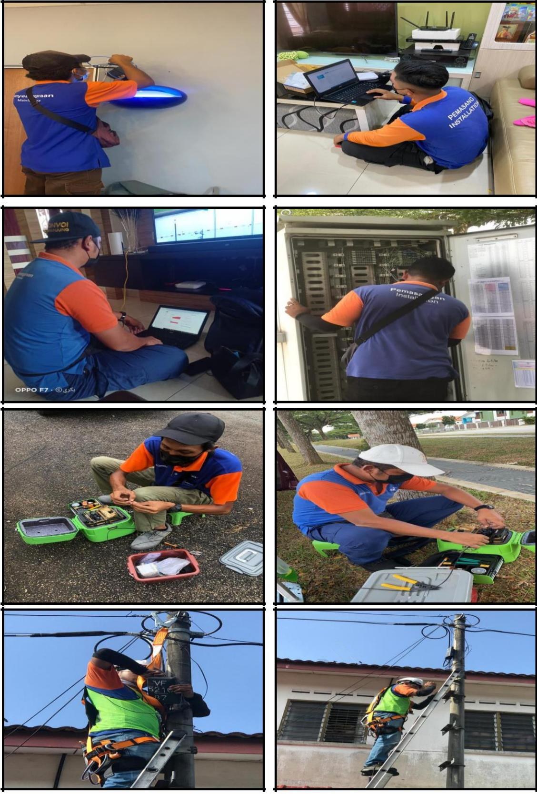

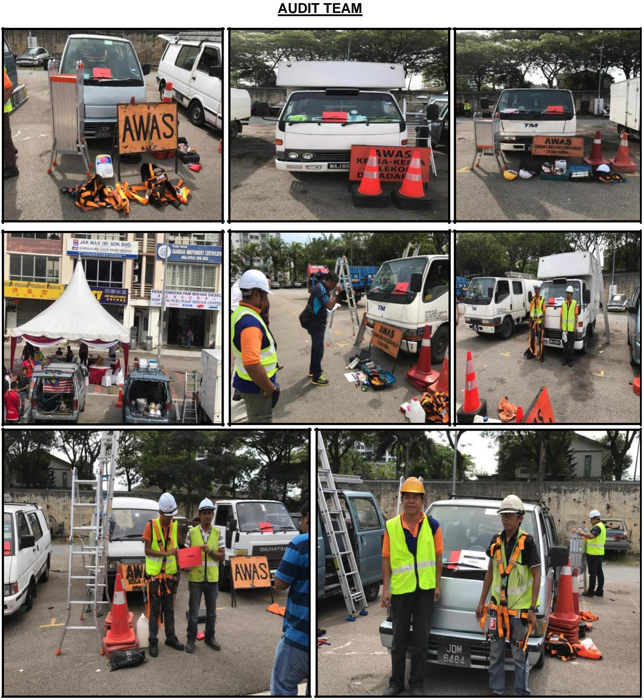

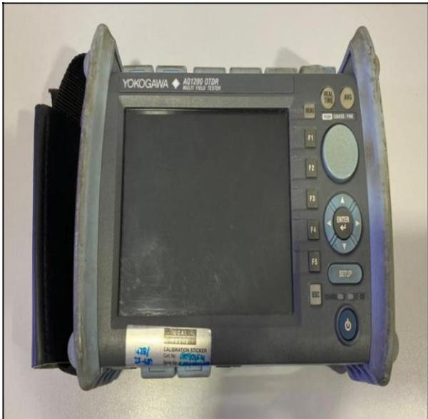  
OTDR MULTI FIELD TESTER

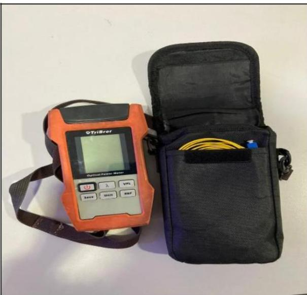  
OPTICAL POWER METER

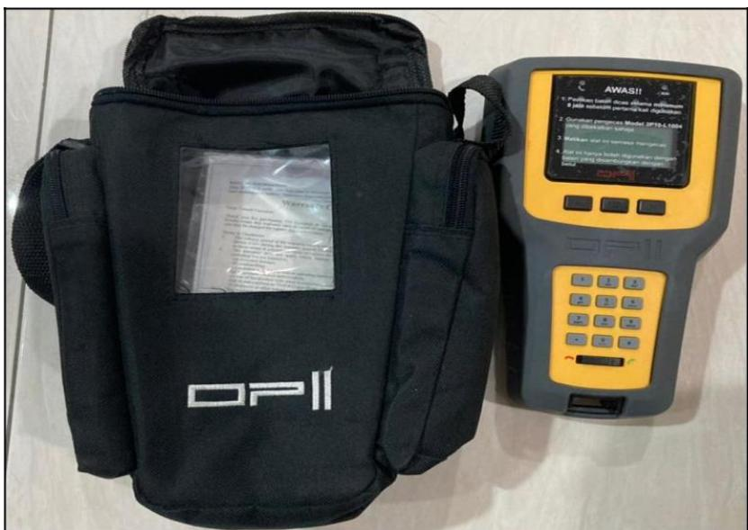

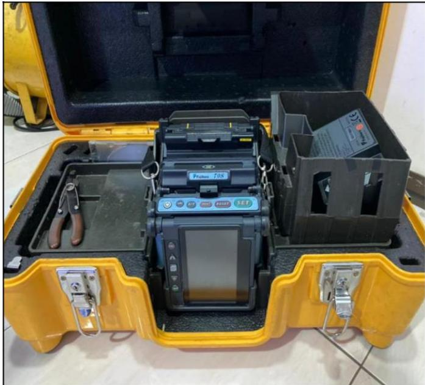  
MESIN SPLICING

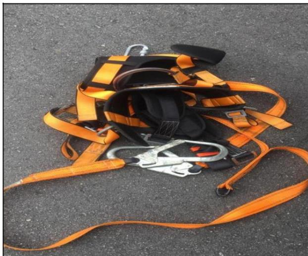  
DOUBLE LANYARD & SNAP HOOK CUTTER

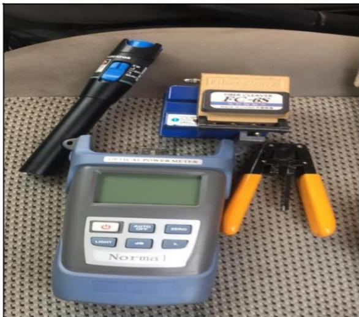  
LAMPU PICIT, POWER METER,

# TMHOUSEKEEPING

# TM Group

Our reference: (15) TM/RPO/SOUTHERN/RFQ/LOA- JU 2

# LETTER OF AWARD

JAK MAX (M) SDN. BHD. [2009/1012484 (8899320)] NO.01- 31,JALAN AUSTIN PERDANA 2/22, TAMAN AUSTIN PERDANA, 81100 JOHOR BAHRU,JOHOR

Tel:0137702500 Fax:073517879 Email:Jak_Corp@yahoo.com

Attn.:JASMAN BBN AMAT KAIRONI

BY TMODS/EMAIL

AGREEMENT NO.K1540820/22

AGREEMENT TITLE: PROPOSED MANAGEMENT OF HOUSEKEEPING SERVICES (CATEGORY 2) FOR SOUTHERN REGION FOR TELEKOM MALAYSIA BERHAD (GROUP JU 2) (the "Agreement")

1. We, Telekom Malaysia Berhad ("TM"), are pleased to inform you that JAK MAX (M) SDN. BHD. are hereby appointed for the provision of works/services as above mentioned subject to the terms and conditions herein provided, the Attachments herein, the Terms and Conditions of Agreement, Specifications, Price Schedule and other contract documents of the above Agreement.

2. The Agreement Value and Agreement Period of this Agreement shall be as stated in the Schedule to the Letter of Award.

3. For the avoidance of doubt, TM are not obliged to extend the Agreement Period upon its expiry or increase the Agreement Value should the Agreement Value is fully utilized.

4. You are required to execute and sign the formal Agreement between TM and yourselves within two (2) months from the date of the Letter of Award. Pending the execution of the formal Agreement, your Tender/Proposal submission as clarified and amended in the Schedule to the Letter of Award, the Terms and Conditions of Agreement as attached in the RFQ Documents and this Letter of Award shall constitute a binding agreement between yourselves and TM.

5. You are required to submit the documents as provided in the Schedule to the Letter of Award within fourteen (14) working days from the date of this Letter of Award. Unless stated otherwise, the documents and/or requirements stated under this paragraph 5 shall be a condition precedent to the validity of this Letter of Award.

6. If you fail to comply with the provisions of paragraphs 4 above stated within two (2) months from the date of this Letter of Award, TM reserves any or all of the following rights until the formal Agreement is signed by you

(a) Withhold the issuance of any new purchase order/work order,

The undersigned hereby acknowledge receipt and acceptance of the above Letter of Award, a copy of which had been retained and confirmed that apart from those stated in this Letter of Award, no terms, conditions or stipulations additional to those that had already been mutually agreed, have been imposed by the issuance of this Letter of Award.

Based on the above, the undersigned, a duly authorized representative of JAK MAX (M) SDN. BHD. [200501012184 (689532U)] hereby unconditionally agree, consent and accept this Letter of Award.

Signature of Vendor  Name in Full: JASMAN BIN AMAT KAIRONI  Designation: MANAGING DIRECTOR in the capacity of duly authorized to sign for and on behalf of

JAK MAX (M) SDN BHD (44632- 1)  No.01- 31, Jalan Austin Perdana 2/22,  Taman Austin Perdana,  81100 Johar Bahru,  Tel: 07- 3644756  Fax: 017- 7440698  Email: jak44632- 1@juk.com

Vendor's Seal or Stamp

Date: 1.9.2012

(b) Withhold the payment for any work/service rendered, and/or  
(c) Terminate this Letter of Award by written notice

7. We reserve our right to impose a consequence action against you via suspension or blacklisting and you may also be liable to pay for all costs that TM and/or respective subsidiaries will incur as a result of your breach to this Letter of Award without prejudice to TM and/or the respective subsidiaries right to pursue all remedies available to it at law against you.

8. Subject to Para 4 above, your Proposal submitted on 09/05/2022 and 22/08/2022 in connection with this Agreement shall be deemed FINAL and constitute the integral parts of the Agreement. TM reserve the discretion to revoke this Letter of Award if there is any change(s) made to the Tender/Proposal after the date of this Letter of Award without TM's prior written consent.

This Letter of Award is sent to you in duplicate. Kindly signify your acceptance of this Agreement by signing the Acknowledgement of Acceptance appended herein and return the same within fourteen (14) working days of the date of this Letter of Award. In the event we do not receive the same within the time stipulated, we shall treat that you are no longer interested in pursuing the transaction and unless TM state otherwise, this Letter of Award shall cease to have effect.

Notwithstanding the above, please take note that TM have an absolute discretion to revoke this Letter of Award at any time before your acceptance without any liability against any losses, costs, expenses or damages that may be incurred by you pursuant to the revocation of this Letter of Award by TM.

Thank you.

Yours sincerely,

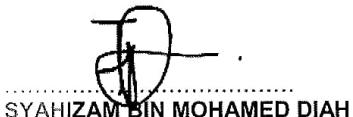

# Manager

Regional Procurement Office Southern Group Procurement Telekom Malaysia Berhad 28 Aug 2022

# TM Group

Our reference: (12) TM/RPO/SOUTHERN/RFQ/LOA- JS 5

# LETTER OF AWARD

JAK MAX (M) SDN. BHD. [20090112484 (6899326)] NO.01- 31,JALAN AUSTIN PERDANA 2/22, TAMAN AUSTIN PERDANA, 81100 JOHOR BAHRU,JOHOR

Tel:0137702500 Fax:073517879 Email:Jak Corp@yahoo.com

Attn.:JASMAN BIN AMAT KAIRONI

BY TMODS/EMAIL

AGREEMENT NO:K1540817/22 AGREEMENT TITLE: PROPOSED MANAGEMENT OF HOUSEKEEPING SERVICES (CATEGORY 2) FOR SOUTHERN REGION FOR TELEKOM MALAYSIA BERHAD (GROUP JS 5) (the "Agreement")

1. We, Telekon Malaysia Berhad ("TM"), are pleased to inform you that JAK MAX (M) SDN. BHD, are hereby appointed for the provision of works/services as above mentioned subject to the terms and conditions herein provided, the Attachments herein, the Terms and Conditions of Agreement, Specifications, Price Schedule and other contract documents of the above Agreement.

2. The Agreement Value and Agreement Period of this Agreement shall be as stated in the Schedule to the Letter of Award.

3. For the avoidance of doubt, TM are not obliged to extend the Agreement Period upon its expiry or increase the Agreement Value should the Agreement Value is fully utilized.

4. You are required to execute and sign the formal Agreement between TM and yourselves within two (2) months from the date of the Letter of Award. Pending the execution of the formal Agreement, your Tender/Proposal submission as clarified and amended in the Schedule to the Letter of Award, the Terms and Conditions of Agreement as attached in the RFQ Documents and this Letter of Award shall constitute a binding agreement between yourselves and TM.

5. You are required to submit the documents as provided in the Schedule to the Letter of Award within fourteen (14) working days from the date of this Letter of Award. Unless stated otherwise, the documents and/or requirements stated under this paragraph 5 shall be a condition precedent to the validity of this Letter of Award.

6. If you fail to comply with the provisions of paragraphs 4 above stated within two (2) months from the date of this Letter of Award, TM reserves any or all of the following rights until the formal Agreement is signed by you -

(a) Withhold the issuance of any new purchase order/work order,

The undersigned hereby acknowledge receipt and acceptance of the above Letter of Award, a copy of which had been retained and confirmed that apart from those stated in this Letter of Award, no terms, conditions or stipulations additional to those that had already been mutually agreed, have been imposed by the issuance of this Letter of Award.

Based on the above, the undersigned, a duly authorized representative of JAK MAX (M) SDN. BHD. [200501012484 (689532U)] hereby unconditionally agree, consent and accept this Letter of Award.

Signature of Vendor  Name in Full: JASMAN BIN AMAT KAIRONI  Designation: MANAGING DIRECTOR in the capacity of duly authorized to sign for and on behalf of

JAK MAX (M) SDN BHD (689532U)  No.01- 31, Jalan Austin Perdana 2/22, 81100 Joohor Bariu, Tel: 07- 3644756 MP- 017- 7440696 Email: jak.com@zyahoo.com

Vendor's Seal or Stamp  Date: 1.9.2002

(b) Withhold the payment for any work/service rendered, and/or  
(c) Terminate this Letter of Award by written notice

7. We reserve our right to impose a consequence action against you via suspension or blacklisting and you may also be liable to pay for all costs that TM and/or respective subsidiaries will incur as a result of your breach to this Letter of Award without prejudice to TM and/or the respective subsidiaries' right to pursue all remedies available to it at law against you.

8. Subject to Para 4 above, your Proposal submitted on 09/05/2022 and 22/08/2022 in connection with this Agreement shall be deemed FINAL and constitute the integral parts of the Agreement. TM reserve the discretion to revoke this Letter of Award if there is any change(s) made to the Tender/Proposal after the date of this Letter of Award without TM's prior written consent.

This Letter of Award is sent to you in duplicate. Kindly signify your acceptance of this Agreement by signing the Acknowledgement of Acceptance appended herein and return the same within fourteen (14) working days of the date of this Letter of Award. In the event we do not receive the same within the time stipulated, we shall treat that you are no longer interested in pursuing the transaction and unless TM state otherwise, this Letter of Award shall cease to have effect.

Notwithstanding the above, please take note that TM have an absolute discretion to revoke this Letter of Award at any time before your acceptance without any liability against any losses, costs, expenses or damages that may be incurred by you pursuant to the revocation of this Letter of Award by TM.

Thank you.

Yours sincerely,

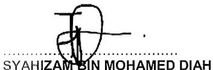

Manager  Regional Procurement Office Southern  Group Procurement  Telekom Malaysia Berhad  28 Aug 2022

# TM Group

Our reference: (11) TM/RPO/SOUTHERN/RFQ/LOA- JS 4

LETTER OF AWARD

JAK MAX (M) SDN. BHD. [20001012404 (88932U)] NO.01- 31,JALAN AUSTIN PERDANA 2/22, TAMAN AUSTIN PERDANA, 81100 JOHOR BAHRU,JOHOR

Tel:0137702500 Fax:073517879 Email:Jak_Corp@ yahoo.com

Attn.:JASMAN BIN AMAT KAIRONI

BY TMODS/EMAIL

AGREEMENT NO.:K1540816/22

AGREEMENT TITLE: PROPOSED MANAGEMENT OF HOUSEKEEPING SERVICES (CATEGORY 2) FOR SOUTHERN REGION FOR TELEKOM MALAYSIA BERHAD (GROUP JS 4) (the "Agreement")

1. We, Telekom Malaysia Berhad ("TM"), are pleased to inform you that JAK MAX (M) SDN. BHD. are hereby appointed for the provision of works/services as abovementioned subject to the terms and conditions herein provided, the Attachments herein, the Terms and Conditions of Agreement, Specifications, Price Schedule and other contract documents of the above Agreement.

2. The Agreement Value and Agreement Period of this Agreement shall be as stated in the Schedule to the Letter of Award.

3. For the avoidance of doubt, TM are not obliged to extend the Agreement Period upon its expiry or increase the Agreement Value should the Agreement Value is fully utilized.

4. You are required to execute and sign the formal Agreement between TM and yourselves within two (2) months from the date of the Letter of Award. Pending the execution of the formal Agreement, your Tender/Proposal submission as clarified and amended in the Schedule to the Letter of Award, the Terms and Conditions of Agreement as attached in the RFQ Documents and this Letter of Award shall constitute a binding agreement between yourselves and TM.

5. You are required to submit the documents as provided in the Schedule to the Letter of Award within fourteen (14) working days from the date of this Letter of Award. Unless stated otherwise, the documents and/or requirements stated under this paragraph 5 shall be a condition precedent to the validity of this Letter of Award.

6. If you fail to comply with the provisions of paragraphs 4 above stated within two (2) months from the date of this Letter of Award, TM reserves any or all of the following rights until the formal Agreement is signed by you -

(a) Withhold the issuance of any new purchase order/work order,

The undersigned hereby acknowledge receipt and acceptance of the above Letter of Award, a copy of which had been retained and confirmed that apart from those stated in this Letter of Award, no terms, conditions or stipulations additional to those that had already been mutually agreed, have been imposed by the issuance of this Letter of Award.

Based on the above, the undersigned, a duly authorized representative of JAK MAX (M) SDN. BHD. [200501012484 (689532U)] hereby unconditionally agree, consent and accept this Letter of Award.

Signature of Vendor  Name in Full: JASMAN BIN AMAT KAIRONI  Designation: MANAGING DIRECTOR in the capacity of duly authorized to sign for and on behalf of

JAK MAX (M) SDN BHD (688332- 1)  No.01- 31, Jalan Austrin Perdana 2/22,  Taman Austria Perdana,  81100 John Behnu.  Tel: 07- 3644756  Hot: 017- 7440696  Email: jak_corpor@ yahoo.com

Vendor's Seal or Stamp  Date: ...1. .9. .8.02

(b) Withhold the payment for any work/service rendered, and/or  
(c) Terminate this Letter of Award by written notice

7. We reserve our right to impose a consequence action against you via suspension or blacklisting and you may also be liable to pay for all costs that TM and/or respective subsidiaries will incur as a result of your breach to this Letter of Award without prejudice to TM and/or the respective subsidiaries' right to pursue all remedies available to it at law against you.

8. Subject to Para 4 above, your Proposal submitted on 09/05/2022 and 22/08/2022 in connection with this Agreement shall be deemed FINAL and constitute the integral parts of the Agreement. TM reserve the discretion to revoke this Letter of Award if there is any change(s) made to the Tender/Proposal after the date of this Letter of Award without TM's prior written consent.

This Letter of Award is sent to you in duplicate. Kindly signify your acceptance of this Agreement by signing the Acknowledgement of Acceptance appended herein and return the same within fourteen (14) working days of the date of this Letter of Award. In the event we do not receive the same within the time stipulated, we shall treat that you are no longer interested in pursuing the transaction and unless TM state otherwise, this Letter of Award shall cease to have effect.

Notwithstanding the above, please take note that TM have an absolute discretion to revoke this Letter of Award at any time before your acceptance without any liability against any losses, costs, expenses or damages that may be incurred by you pursuant to the revocation of this Letter of Award by TM.

Thank you.

Yours sincerely,

SYAHIZAMBIN MOHAMED DIAH  Manager  Regional Procurement Office Southern  Group Procurement  Telekom Malaysia Berhad  28 Aug 2022

# TM Group

Our reference: (10) TMRPO/SOUTHERN/RFQ/LOA- JS 3

# LETTER OF AWARD

JAK MAX (M) SDB. BHD. [20050112484 (089538U)] NO.01- 31,JALAN AUSTIN PERDANA 2/22, TAMAN AUSTIN PERDANA, 81100 JOHOR BAHRU,JOHOR

Tel:0137702500 Fax:073517879 Email:Jak Corp@ yahoo.com

Attn.:JASMAN BIN AMAT KAIRONI

BY TMODS/EMAIL

AGREEMENT NO:K1540815/22

AGREEMENT TITLE: PROPOSED MANAGEMENT OF HOUSEKEEPING SERVICES (CATEGORY 2) FOR SOUTHERN REGION FOR TELEKOM MALAYSIA BERHAD (GROUP JS 3) (the "Agreement")

1. We, Telekon Malaysia Berhad (TM), are pleased to inform you that JAK MAX (M) SDN. BHD. are hereby appointed for the provision of works/services as above mentioned subject to the terms and conditions herein provided, the Attachments herein, the Terms and Conditions of Agreement, Specifications, Price Schedule and other contract documents of the above Agreement.

2. The Agreement Value and Agreement Period of this Agreement shall be as stated in the Schedule to the Letter of Award.

3. For the avoidance of doubt, TM are not obliged to extend the Agreement Period upon its expiry or increase the Agreement Value should the Agreement Value is fully utilized.

4. You are required to execute and sign the formal Agreement between TM and yourselves within two (2) months from the date of the Letter of Award. Pending the execution of the formal Agreement, your Tender/Proposal submission as clarified and amended in the Schedule to the Letter of Award, the Terms and Conditions of Agreement as attached in the RFQ Documents and this Letter of Award shall constitute a binding agreement between yourselves and TM.

5. You are required to submit the documents as provided in the Schedule to the Letter of Award within fourteen (14) working days from the date of this Letter of Award. Unless stated otherwise, the documents and/or requirements stated under this paragraph 5 shall be a condition precedent to the validity of this Letter of Award.

6. If you fail to contact with the provisions of paragraphs 4 above stated within two (2) months from the date of this Letter of Award, TM reserves any or all of the following rights until the formal Agreement is signed by you -

(a) Withhold the issuance of any new purchase order/work order,

The undersigned hereby acknowledge receipt and acceptance of the above Letter of Award, a copy of which had been retained and confirmed that apart from those stated in this Letter of Award, no terms, conditions or stipulations additional to those that had already been mutually agreed, have been imposed by the issuance of this Letter of Award.

Based on the above, the undersigned, a duly authorized representative of JAK MAX (M) SDN. BHD. [200501012184 (689532U)] hereby unconditionally agree, consent and accept this Letter of Award.

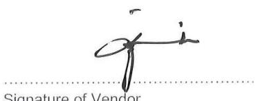

Signature of Vendor Name in Full: JASMAN BIN AMAT KAIRONI Designation: MANAGING DIRECTOR

in the capacity of duly authorized to sign for and on behalf of

JAK MAX (M) SDN BHD (689532U) No.01- 31, Jalan Luatin Pardana 2/22, Taman Autun Pardana, 81100 Johor Behru. Tel: 07- 3844750 HPP: 017- 7440096 Email: lek_qrd@yahoo.com

Vendor's Seal or Stamp Date: ...J.9. J.692.

(b) Withhold the payment for any work/service rendered, and/or  
(c) Terminate this Letter of Award by written notice

7. We reserve our right to impose a consequence action against you via suspension or blacklisting and you may also be liable to pay for all costs that TM and/or respective subsidiaries will incur as a result of your breach to this Letter of Award without prejudice to TM and/or the respective subsidiaries' right to pursue all remedies available to it at law against you.

8. Subject to Para 4 above, your Proposal submitted on 09/05/2022 and 22/08/2022 in connection with this Agreement shall be deemed FINAL and constitute the integral parts of the Agreement. TM reserve the discretion to revoke this Letter of Award if there is any change(s) made to the Tender/Proposal after the date of this Letter of Award without TM's prior written consent.

This Letter of Award is sent to you in duplicate. Kindly signify your acceptance of this Agreement by signing the Acknowledgement of Acceptance appended herein and return the same within fourteen (14) working days of the date of this Letter of Award. In the event we do not receive the same within the time stipulated, we shall treat that you are no longer interested in pursuing the transaction and unless TM state otherwise, this Letter of Award shall cease to have effect.

Notwithstanding the above, please take note that TM have an absolute discretion to revoke this Letter of Award at any time before your acceptance without any liability against any losses, costs, expenses or damages that may be incurred by you pursuant to the revocation of this Letter of Award by TM.

Thank you.

Yours sincerely,

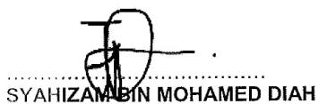

# Manager

Regional Procurement Office Southern Group Procurement Telekom Malaysia Berhad 28 Aug 2022

# TM Group

Our reference: (08) TM/RPO/SOUTHERN/RFQ/LOA- JS 1

LETTER OF AWARD

JAK MAX (M) SDB. BHD. [200501112484 (8895326)] NO.01- 31,JALAN AUSTIN PERDANA 2/22, TAMAN AUSTIN PERDANA, 81100 JOHOR BAHRU,JOHOR

Tel:0137702500 Fax:073517879 Email:Jak Corp@yahoo.com

Attn.:JASMAN BIN AMAT KAIRONI

BY TMODS/EMAIL

AGREEMENT NO:K1540813/22

AGREEMENT TITLE: PROPOSED MANAGEMENT OF HOUSEKEEPING SERVICES (CATEGORY 2) FOR SOUTHERN REGION FOR TELEKOM MALAYSIA BERHAD (GROUP JS 1) (the "Agreement")

1. We, Telekon Malaysia Berhad ("TM"), are pleased to inform you that JAK MAX (M) SDN. BHD. are hereby appointed for the provision of works/services as above mentioned subject to the terms and conditions herein provided, the Attachments herein, the Terms and Conditions of Agreement, Specifications, Price Schedule and other contract documents of the above Agreement.

2. The Agreement Value and Agreement Period of this Agreement shall be as stated in the Schedule to the Letter of Award.

3. For the avoidance of doubt, TM are not obliged to extend the Agreement Period upon its expiry or increase the Agreement Value should the Agreement Value is fully utilized.

4. You are required to execute and sign the formal Agreement between TM and yourselves within two (2) months from the date of the Letter of Award. Pending the execution of the formal Agreement, your Tender/Proposal submission as clarified and amended in the Schedule to the Letter of Award, the Terms and Conditions of Agreement as attached in the RFQ Documents and this Letter of Award shall constitute a binding agreement between yourselves and TM.

5. You are required to submit the documents as provided in the Schedule to the Letter of Award within fourteen (14) working days from the date of this Letter of Award. Unless stated otherwise, the documents and/or requirements stated under this paragraph 5 shall be a condition precedent to the validity of this Letter of Award.

6. If you fail to comply with the provisions of paragraphs 4 above stated within two (2) months from the date of this Letter of Award, TM reserves any or all of the following rights until the formal Agreement is signed by you -

(a) Withhold the issuance of any new purchase order/work order,

The undersigned hereby acknowledge receipt and acceptance of the above Letter of Award, a copy of which had been retained and confirmed that apart from those stated in this Letter of Award, no terms, conditions or stipulations additional to those that had already been mutually agreed, have been imposed by the issuance of this Letter of Award.

Based on the above, the undersigned, a duly authorized representative of JAK MAX (M) SDN. BHD. [200501012384 (689532U)] hereby unconditionally agree, consent and accept this Letter of Award.

Signature of Vendor  Name in Full: JASMAN BIN AMAT KAIRONI  Designation: MANAGING DIRECTOR in the capacity of duly authorized to sign for and on behalf of

JAK MAX (M) SDN BHD (889532- 1)  No.01- 31, Jaiar Austin Ferdana 2/22,  Taman Austran Ferdana,  81100 Joktor Bahru,  Tel: 07- 3644756  MP- 017- 7440896  Email: jak_yoo@yahoo.com

Vendor's Seal or Stamp  Date: .... 1: 9: 90:02

(b) Withhold the payment for any work/service rendered, and/or  
(c) Terminate this Letter of Award by written notice

7. We reserve our right to impose a consequence action against you via suspension or blacklisting and you may also be liable to pay for all costs that TM and/or respective subsidiaries will incur as a result of your breach to this Letter of Award without prejudice to TM and/or the respective subsidiaries' right to pursue all remedies available to it at law against you.

8. Subject to Para 4 above, your Proposal submitted on 09/05/2022 and 22/08/2022 in connection with this Agreement shall be deemed FINAL and constitute the integral parts of the Agreement. TM reserve the discretion to revoke this Letter of Award if there is any change(s) made to the Tender/Proposal after the date of this Letter of Award without TM's prior written consent.

This Letter of Award is sent to you in duplicate. Kindly signify your acceptance of this Agreement by signing the Acknowledgement of Acceptance appended herein and return the same within fourteen (14) working days of the date of this Letter of Award. In the event we do not receive the same within the time stipulated, we shall treat that you are no longer interested in pursuing the transaction and unless TM state otherwise, this Letter of Award shall cease to have effect.

Notwithstanding the above, please take note that TM have an absolute discretion to revoke this Letter of Award at any time before your acceptance without any liability against any losses, costs, expenses or damages that may be incurred by you pursuant to the revocation of this Letter of Award by TM.

Thank you.

Yours sincerely,

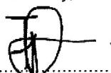

# SYAHIZAM BIN MOHAMED DIAH

Manager  Regional Procurement Office Southern  Group Procurement  Telekom Malaysia Berhad  28 Aug 2022

# TM Group

Our reference: (19) TM/RPO/SOUTHERN/RFQ/LOA- JU 6

LETTER OF AWARD

JAK MAX (M) SDN. BHD. [2009/10/12/04 (869932U)] NO.01- 31,JALAN AUSTIN PERDANA 2/22, TAMAN AUSTIN PERDANA, 81100 JOHOR BAHRU,JOHOR

Tel:0137702500 Fax:073517879 Email:Jak_Corp@yahoo.com

Attn.:JASMAN BNI AMAT KAIRONI

BY TMODS/EMAIL

AGREEMENT NO.:K1540824/22

AGREEMENT TITLE: PROPOSED MANAGEMENT OF HOUSEKEEPING SERVICES (CATEGORY 2) FOR SOUTHERN REGION FOR TELEKOM MALAYSIA BERHAD (GROUP JU 6) (the "Agreement")

1. We,Telekom Malaysia Berhad (TM),are pleased to inform you that JAK MAX (M) SDN. BHD. are hereby appointed for the provision of works/services as above mentioned subject to the terms and conditions herein provided, the Attachments herein, the Terms and Conditions of Agreement, Specifications, Price Schedule and other contract documents of the above Agreement.

2. The Agreement Value and Agreement Period of this Agreement shall be as stated in the Schedule to the Letter of Award.

3. For the avoidance of doubt, TM are not obliged to extend the Agreement Period upon its expiry or increase the Agreement Value should the Agreement Value is fully utilized.

4. You are required to execute and sign the formal Agreement between TM and yourselves within two (2) months from the date of the Letter of Award. Pending the execution of the formal Agreement, your Tender/Proposal submission as clarified and amended in the Schedule to the Letter of Award, the Terms and Conditions of Agreement as attached in the RFQ Documents and this Letter of Award shall constitute a binding agreement between yourselves and TM.

5. You are required to submit the documents as provided in the Schedule to the Letter of Award within fourteen (14) working days from the date of this Letter of Award. Unless stated otherwise, the documents and/or requirements stated under this paragraph 5 shall be a condition precedent to the validity of this Letter of Award.

6. If you fail to comply with the provisions of paragraphs 4 above stated within two (2) months from the date of this Letter of Award, TM reserves any or all of the following rights until the formal Agreement is signed by you

(a) Withhold the issuance of any new purchase order/work order,

The undersigned hereby acknowledge receipt and acceptance of the above Letter of Award, a copy of which had been retained and confirmed that apart from those stated in this Letter of Award, no terms, conditions or stipulations additional to those that had already been mutually agreed, have been imposed by the issuance of this Letter of Award.

Based on the above, the undersigned, a duly authorized representative of JAK MAX (M) SDN. BHD. [200501012484 (689532U)] hereby unconditionally agree, consent and accept this Letter of Award.

Signature of Vendor  Name in Full: JASMAN BIN AMAT KAIRONI  Designation: MANAGING DIRECTOR

in the capacity of duly authorized to sign for and on behalf of

JAK MAX (M) SDN BHD (889532- 1)  No.01- 31, Jalan Austin Perdana 2/22, Taman Austin Perdana, 81100 Junior Ballu.  Tel: 07- 3644756  WP- 017- 7440696  Email: jak_qgyahoo.com

Vendor's Seal or Stamp  Date: ....1.9.2002

(b) Withhold the payment for any work/service rendered, and/or  
(c) Terminate this Letter of Award by written notice

7. We reserve our right to impose a consequence action against you via suspension or blacklisting and you may also be liable to pay for all costs that TM and/or respective subsidiaries will incur as a result of your breach to this Letter of Award without prejudice to TM and/or the respective subsidiaries right to pursue all remedies available to it at law against you.

8. Subject to Para 4 above, your Proposal submitted on 09/05/2022 and 22/08/2022 in connection with this Agreement shall be deemed FINAL and constitute the integral parts of the Agreement. TM reserve the discretion to revoke this Letter of Award if there is any change(s) made to the Tender/Proposal after the date of this Letter of Award without TM's prior written consent.

This Letter of Award is sent to you in duplicate. Kindly signify your acceptance of this Agreement by signing the Acknowledgement of Acceptance appended herein and return the same within fourteen (14) working days of the date of this Letter of Award. In the event we do not receive the same within the time stipulated, we shall treat that you are no longer interested in pursuing the transaction and unless TM state otherwise, this Letter of Award shall cease to have effect.

Notwithstanding the above, please take note that TM have an absolute discretion to revoke this Letter of Award at any time before your acceptance without any liability against any losses, costs, expenses or damages that may be incurred by you pursuant to the revocation of this Letter of Award by TM.

Thank you.

Yours sincerely,

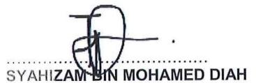

# Manager

Regional Procurement Office Southern Group Procurement Telekom Malaysia Berhad 28 Auc 2022

# TM Group

Our reference: (16) TM/RPO/SOUTHERN/RFQ/LOA- JU 3

# LETTER OF AWARD

JAK MAX (M) SDN. BHD. [2009/01/12/4/4 (689332G)] NO.01- 31,JALAN AUSTIN PERDANA 2/22, TAMAN AUSTIN PERDANA, 81100 JOHOR BAHRU,JOHOR

Tel:0137702500 Fax:073517879 Email:Jak_Corp@yahoo.com

Attn.:JASMAN BIN AMAT KAIRONI

BY TMODS/EMAIL

AGREEMENT NO:K1540821/22

AGREEMENT TITLE: PROPOSED MANAGEMENT OF HOUSEKEEPING SERVICES (CATEGORY 2) FOR SOUTHERN REGION FOR TELEKOM MALAYSIA BERHAD (GROUP JU 3) (the "Agreement")

1. We,Telekon Malaysia Berhad (TM),are pleased to inform you that JAK MAX (M) SDN. BHD. are hereby appointed for the provision of works/services as above mentioned subject to the terms and conditions herein provided, the Attachments herein, the Terms and Conditions of Agreement, Specifications, Price Schedule and other contract documents of the above Agreement.

2. The Agreement Value and Agreement Period of this Agreement shall be as stated in the Schedule to the Letter of Award.

3. For the avoidance of doubt, TM are not obliged to extend the Agreement Period upon its expiry or increase the Agreement Value should the Agreement Value is fully utilized.

4. You are required to execute and sign the formal Agreement between TM and yourselves within two (2) months from the date of the Letter of Award. Pending the execution of the formal Agreement, your Tender/Proposal submission as clarified and amended in the Schedule to the Letter of Award, the Terms and Conditions of Agreement as attached in the RFQ Documents and this Letter of Award shall constitute a binding agreement between yourselves and TM.

5. You are required to submit the documents as provided in the Schedule to the Letter of Award within fourteen (14) working days from the date of this Letter of Award. Unless stated otherwise, the documents and/or requirements stated under this paragraph 5 shall be a condition precedent to the validity of this Letter of Award.

6. If you fail to comply with the provisions of paragraphs 4 above stated within two (2) months from the date of this Letter of Award, TM reserves any or all of the following rights until the formal Agreement is signed by you -

(a) Withhold the issuance of any new purchase order/work order,

The undersigned hereby acknowledge receipt and acceptance of the above Letter of Award, a copy of which had been retained and confirmed that apart from those stated in this Letter of Award, no terms, conditions or stipulations additional to those that had already been mutually agreed, have been imposed by the issuance of this Letter of Award.

Based on the above, the undersigned, a duly authorized representative of JAK MAX (M) SDN. BHD. [200501012084 (689532U)] hereby unconditionally agree, consent and accept this Letter of Award.

Signature of Vendor  Name in Full: JASMAN BIN AMAT KAIRONI  Designation: MANAGING DIRECTOR

in the capacity of duly authorized to sign for and on behalf of

JAK MAX (M) SDN BHD (886532- 1)  No.01- 31, Jalan Austin Perdana 2/22, Taman Austin Perdana, 81100 Jobar Bahnu.  Tel: 07- 3644756 E/F: 017- 7440606  Email: jek.com@bahnu.com

Vendor's Seal or Stamp  Date: .../...9. - 2022

(b) Withhold the payment for any work/service rendered, and/or  
(c) Terminate this Letter of Award by written notice

7. We reserve our right to impose a consequence action against you via suspension or blacklisting and you may also be liable to pay for all costs that TM and/or respective subsidiaries will incur as a result of your breach to this Letter of Award without prejudice to TM and/or the respective subsidiaries' right to pursue all remedies available to it at law against you.

8. Subject to Para 4 above, your Proposal submitted on 09/05/2022 and 22/08/2022 in connection with this Agreement shall be deemed FINAL and constitute the integral parts of the Agreement. TM reserve the discretion to revoke this Letter of Award if there is any change(s) made to the Tender/Proposal after the date of this Letter of Award without TM's prior written consent.

This Letter of Award is sent to you in duplicate. Kindly signify your acceptance of this Agreement by signing the Acknowledgement of Acceptance appended herein and return the same within fourteen (14) working days of the date of this Letter of Award. In the event we do not receive the same within the time stipulated, we shall treat that you are no longer interested in pursuing the transaction and unless TM state otherwise, this Letter of Award shall cease to have effect.

Notwithstanding the above, please take note that TM have an absolute discretion to revoke this Letter of Award at any time before your acceptance without any liability against any losses, costs, expenses or damages that may be incurred by you pursuant to the revocation of this Letter of Award by TM.

Thank you.

Yours sincerely,

SYAHIZAMBIN MOHAMED DIAH  Manager  Regional Procurement Office Southern  Group Procurement  Telekom Malaysia Berhad  28 Aug 2022

Our reference : (004)RPOMLK/eLOA/05/2021

# LETTER OF AWARD

JAK MAX (M) SDN BHD NO 01- 31 JALAN AUSTIN PERDANA 2/22 TAMAN AUSTIN PERDANA 81100 JOHOR BAHRI JOHOR

Tel No:0137702500/073511922 Fax No:6007351787

Attn:EN JASMAN BIN AMAT KAIRONI

CONTRACT NO.:K1440252/21 CONTRACT TITLE: PROPOSED SUPPLY AND DELIVER DISINFECTION CLEANING SERVICES FOR TM SOUTHERN REGION (JOHOR SELATAN) FOR TELEKOM MALAYSIA BERHAD (the "Contract") Internal Ref No:SR0118022021

1. We,Telekom Malaysia Berhad (TM),are pleased to inform you that JAK MAX (M) SDN BHD is hereby appointed for the provision of works/services as abovementioned subject to the terms and conditions herein provided, the Attachments herein, the Terms and Conditions of Contract, Specifications, Price Schedule and other contract documents of the above Contract.

2. The Contract Value and Contract Period of this Contract shall be as stated in the Schedule to the Letter of Award.

3. For the avoidance of doubt, TM are not obliged to extend the Contract Period upon its expiry or increase the Contract Value should the Contract Value is fully utilized.

4. This Letter of Award inclusive its Schedule to the Letter of Award, the Terms and Conditions as provided under Appendix A together with all other attachments appended to this Letter of Award shall constitute a binding agreement between yourselves and TM. Notwithstanding the above, you may be required to execute a formal Contract between TM and yourselves if TM deems fit. In the event of any conflict between any provisions of this Letter of Award and the Terms and Conditions, the provisions of the Terms and Conditions shall prevail.

5. You are required to submit the documents as provided in the Schedule to the Letter of Award within fourteen (14) working days from the date of this Letter of Award. Unless stated otherwise, the documents and/or requirements stated under this paragraph 5 shall be a condition precedent to the validity of this Letter of Award.

6. We reserves our right to impose a consequence action against you via suspension or blacklisting and you may also be liable to pay for all costs that TM and/or respective subsidiaries will incur as a result of your breach to this Letter of Award without prejudice to TM and/or the respective subsidiaries' right to pursue all remedies available to it at law against you.

Kindly signify your acceptance of this Contract by signing the Acknowledgement of Acceptance appended herein and return the same within fourteen (14) working days of the date of this Letter of Award.

In the event we do not receive the same within the time stipulated, we shall treat that you are no longer interested in pursuing the transaction and unless TM state otherwise, this Letter of Award shall cease to have effect.

Notwithstanding the above, please take note that TM have an absolute discretion to revoke this Letter of Award at any time before your acceptance without any liability against any losses, costs, expenses or damages that may be incurred by you pursuant to the revocation of this Letter of Award by TM.

Thank you.

Yours sincerely,

ZANARIAH BT MANSOR Manager RPO Southern Division Fulfillment Group Procurement Telekom Malaysia Bernad

SUPPLY AND DELIVER DISINFECTION CLEANING SERVICES FOR TELEKOM MALAYSIA BERHAD BUILDING AT SOUTHERN REGION JOHOR SELATAN (SANITASI COVID- 19)

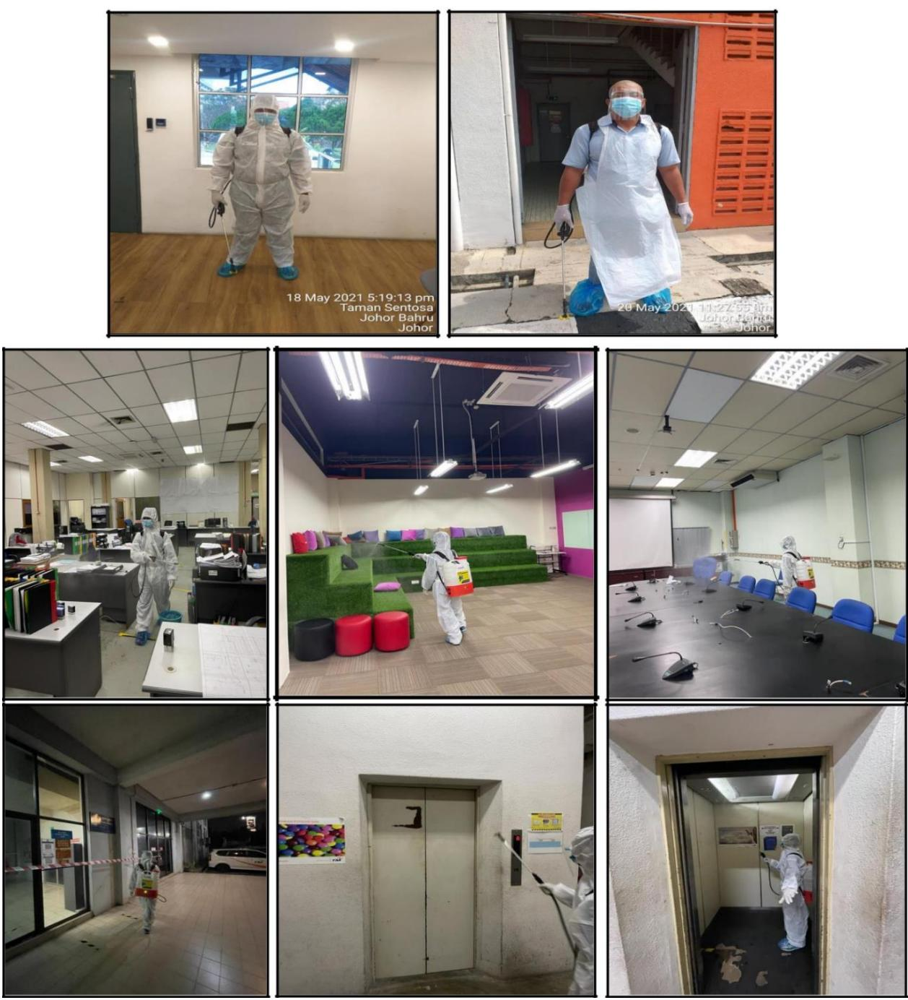

Our ref.: (04) JHR/2019/CLEANING SERVICES- PENINSULAR (VO- MWO) 01 December 2020 2020

JAK MAX (M) SDN BHD NO 01- 31 JALAN AUSTIN PERDANA 2/22 TAMAN AUSTIN PEREDANA 81100 JOHOR BAHRU JOHOR

Tel No: 013 7702500/07 3518611 Email : Jak_Corp@yahoo.com

Attrr.: En Jasman Bin Amat Kaironi

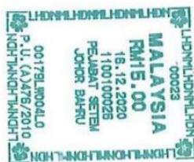

BY HAND/EMAIL

CONFIDENTIAL

SUPPLEMENTARY AGREEMENT NO.1 FOR AGREEMENT NO.: K1540207/19(3400029512) AGREEMENT TITLE: AGREEMENT FOR CLEANING SERVICES AT TM BUILDINGS IN PENINSULAR FOR TELEKOM MALAYSIA BERHAD ("TM") (the "Principal Agreement")

1. We, Telekom Malaysia Berhad ("TM") are pleased to inform you that we hereby agreed to amend or modify the terms and conditions to the Principal Agreement, in accordance with the terms and conditions herein contained and to the extend herein provided, particularly stipulated in Attachment A of this letter.

2. This letter shall serve as a Supplementary Agreement No.1 and shall constitute a binding agreement between yourselves and TM. This Supplementary Agreement No.1 shall be supplementary to and be read together with the Principal Agreement, save and to the extent of the amendment to the Principal Agreement, agreed herein, the terms and conditions of the Principal Agreement, shall continue to apply, be valid and subsisting.

3. You are required to deposit a Performance Guarantee with an amount of RM718.90 for the purpose of an Additional Agreement Value and to submit to TM within fourteen (14) working days from the date of this Supplementary Agreement No.1.

4. You are required to renew your insurance and to produce for inspection, the policies, cover notes and receipt for premium paid to TM within fourteen (14) working days from the date of this Supplementary Agreement No.1.

5. You are further required to submit to TM a duly executed of the Declaration of Independency as per Attachment B within fourteen (14) working days of the date of this letter.

6. The provision of the paragraph 3, 4 and 5 shall be a condition precedent to the validity of this letter.

Telekom Malaysia Berhad 19841016183 (128740- P) Group Procurement Level 4, North Wing, Menara TM, Jalan Pantai Baharu,50672 Kuala Lumpur, Malaysia. Tel: 03 2240 1935 Fax: 03 2241 2970 www.tm.com.my

7. For purposes of Related Party Transaction/Recurrent Related Transaction pursuant to Chapter 10, Bursa Malaysia Securities Berhad's Main Market Listing Requirements, you are required to complete the Declaration on RPT/RRPT form ("Declaration Form") as per Attachment C and return it to TM together with the duly signed Acknowledgment of Acceptance appended herein. Please note that the information provided in the Declaration Form may also be used by TM for the purpose of Malaysian Financial Reporting Standard (MFRS) 124 Related Party Disclosures issued by Malaysian Accounting Standard Board.

8. This Supplementary Agreement No. 1 and the amendments herein shall take effect from  $1^{\text{st}}$  February 2020.

This letter is sent to you in duplicate. Kindly signify your acceptance if this letter by signing the Acknowledgement of Acceptance appended herein and return the same within fourteen (14) working days of the date of this letter. In the event, we do not receive the same within the time stipulated, we shall treat that you are no longer interested in pursuing the transaction and unless TM states otherwise, this letter shall cease to have effect.

Notwithstanding the above, please take note that TM has an absolute discretion to revoke this letter at any time before your acceptance without any liability against any losses, costs, expenses or damages that may be incurred by you pursuant to the revocation of this letter by TM.

Thank you.

Yours sincerely,

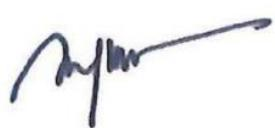

ZANARIAH MANSOR Manager RPO Southern Group Procurement Telekom Malaysia Berhad

# CONTRACT CLEANING FOR SERVICES AT TM BUILDING IN SOUTHERN REGIONFOR TELEKOM MALAYSIA BERHAD JOHOR UTARA - JOHOR SELATAN

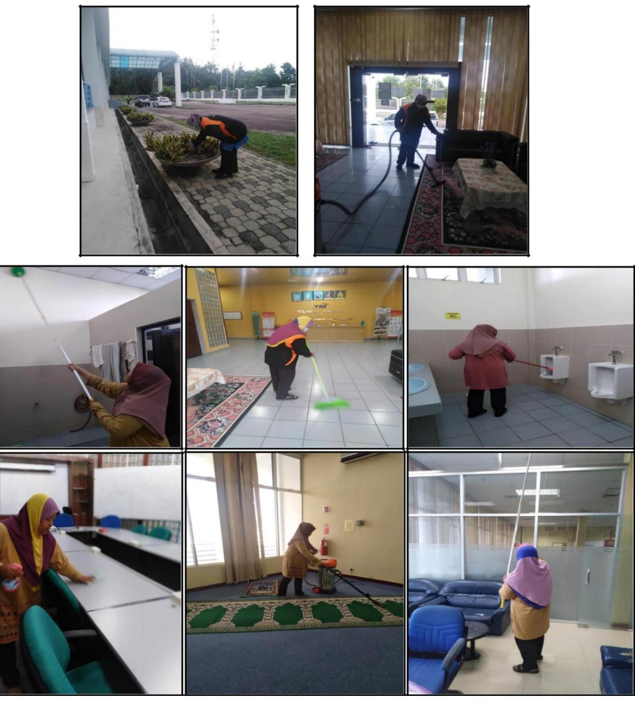

FGV

# FGV Johor Bulkers Sdn Bhd (Formerly known as Felda-Johore Bulkers Sdn Bhd)

Surat kami : FGV.JB-JMSM- Hygiene/EZ/MNZ/2020(01)

30 Disember 2020

JAK MAX (M) SDN BHD No.01- 31, Jalan Austin Perdana 2/22 Taman Austin Perdana 81100 Johor Bahru

U.p. : En Abdul Hazir Bin Abdul Latip

Tuan,

FGVJB/ADM/MNZ/05/2020 SERVICE CONTRACT TO SUPPLY AND INSTALL DIGITAL AIR DEODORISER, SANITARY BIN AND SANITARY DEODORIZER AT FGV JOHOR BULKERS SDN BHD (TERMINAL 1, 2 & 3) FOR THE PERIOD OF THREE YEARS  $(2 + 1)$ .

Tawaran kerja yang tersebut di atas adalah dirujuk.

Sukacita dimaklumkan bahawa Syarikat tuan telah berjaya dalam tawaran sebutharga kerja- kerja yang tersebut di atas bagi tempoh 1 Jan 2021 hingga 31 Dis 2023 pada harga tawar 80 setahun at: 10 untuk Tiga Tahun. Dengan ini pihak tuan dimintai mengatur jadual untuk memulakan kerja- kerja memarung peralatan di lokasi yang telah dimaklumkan dalam syarat- syarat tawaran.

Pihak Syarikat akan mengeluurkan Works Order bagi tujuan pengesahan perlantikan tersebut.

Sekian untuk makluman dan tindakan lapuiut dari pihak tuan.

Terima kasih.

Yang benar b/p FGV JOHOR BULKERS SDN BHD

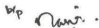

HJH ASLILA BINTI MOHD BAKRI HRBP, Syarikat Kumpulan FJB

s.k. : Ketua Pegawai Ekspektif Ketua Operasi Syarikat Kumpulan

Rise with P.R.I.D.E Partnership - Respect - Integrity - Dynamism - Enthusiasm

No Tender Jenis Kerja

Projek Tarikh Perundingan Nama Kontraktor Jumlah Harga Asal

AKUAN TEMURUNDING  

<table><tr><td colspan="3">RFQ/SMB/007/2021 @ Q210098954</td></tr><tr><td colspan="3">Menyediakan Tenaga Kerja Berinsurans, Pengangkutan, Perulatan, Perkakasan Dan Lain-Lain Yang Berkaitan Bagi Melakukan Kerja-Kerja Meracun Dan Memotong Rumput Di Kawasan Kilang Bagi Tempoh Setuan di Kilang Isi Sawit Semambu,</td></tr><tr><td colspan="3">Kilang Isi Sawit Semambu</td></tr><tr><td colspan="3">Jak Max (M) Sdn Bhd</td></tr><tr><td></td><td>Jumlah Harga Baru (Dirunding)</td><td></td></tr></table>

<table><tr><td>No</td><td>Item</td><td>Harga Asal (RM)</td><td>Harga Dirunding (RM)</td><td>Nota</td></tr><tr><td>1.</td><td>Melakukan Kerja-Kerja Meracun Dan Memotong Rumput Dikang Bagi Tempoh Setahun .</td><td></td><td></td><td>Mayanar: 60 Hari Sulepas Siap Kerja</td></tr><tr><td>*SPK akan Dikeluarkan Oleh Pihak Kilang Setiap Bulan Sebelum Melakukan Kerja</td><td></td><td></td><td></td><td></td></tr></table>

Saya Mengistiharkan Dan Mengesahkan Bahawa Harga Dirunding Di Atas Adalah Betul Dan Benar.

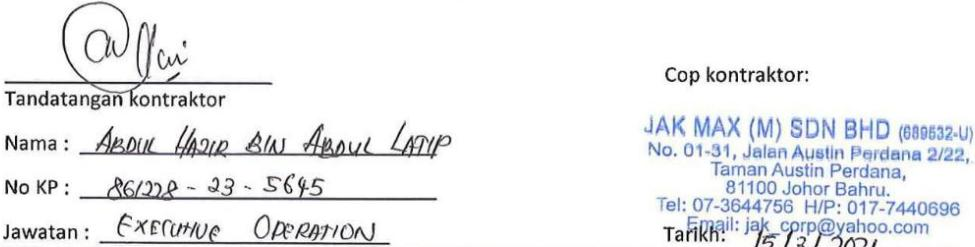

Kami, ahli- ahli jawatankuasa temurunding bersama- sama mengesahkan bahawa harga dirundingkan di atas adalah betul dan benar.

Ahmad Marzuki bin said

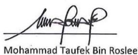

JAK MAX SDN BHD No.01- 31,Jalan Austin Perdana 2/22, Taman Austin Perdana, 81100 Johor Bahru, Johor.

Attn:Abdul Hazir Bin Abdul Latip (Executive Operation)

Dear Sirs,

Re Project

:LETTER OF AWARD ("LOA") To provide insured manpower and else necessary for conducting PKE Pallet processing work, bagging PKE loose, loading cargo, unloading raw material and other general works at Kilang Makanan Ternakan Semambu for a term of two (2) years (1 March 2021 until 28 February 2023)

Contractor

We thank you for your quotation submission dated 16 February 2021. We are pleased to appoint your company as our Contractor for the abovementioned Project based on the following terms and conditions (terms used in this LOA shall have the same meanings as defined or ascribed thereto in the tender documents):

# 1. SCOPE OF WORK

1.1 The scope of work under this LOA shall be as set forth in Item 1 of Table 1 ("Work").

2. TERM

2.1 The term of the Work shall be as set forth in Item 2 of Table 1 ("Term").

2.2 The Contractor shall commence the Work on the date as set out in Item 2 of Table 1 ("Commencement Date") and in accordance with the timeline as set out in Item 3 of Table 1 ("Work Timeline").

3. PRICE & PAYMENT

3.1 The price in consideration for the Work shall be as set forth in Item 4 of Table 1 ("Price").

3.2 The Price shall remain fixed during the Term stated in this LOA. Any additional expenses incurred during the Term stated in this LOA shall be borne by the Contractor.

3.3 The payment terms of the Price shall be as set forth in Item 5 of Table 1 ("Payment Terms").

3.4 The Company's obligation to make payment of the Price shall be conditional upon the submission by the Contractor of an invoice and all other supporting documentation as may be reasonably required by the Company and the requisite payment shall be made by the Company within the timeline as set out in Item 5 of Table 1. For the avoidance of doubts, no payment due under this LOA shall be due or payable by the Company until the Contractor has fulfilled its obligation under Clause 6.1.

# CONTRACT SUPPLY MANPOWER FOR CONDUCTING PKE PALLET PROCESSING WORK, BAGGING PKE LOSE, LOADING CARGO & UNLOADING RAW MATERIAL AT FGV KERNEL PRODUCTION, SEMAMBU KUANTAN

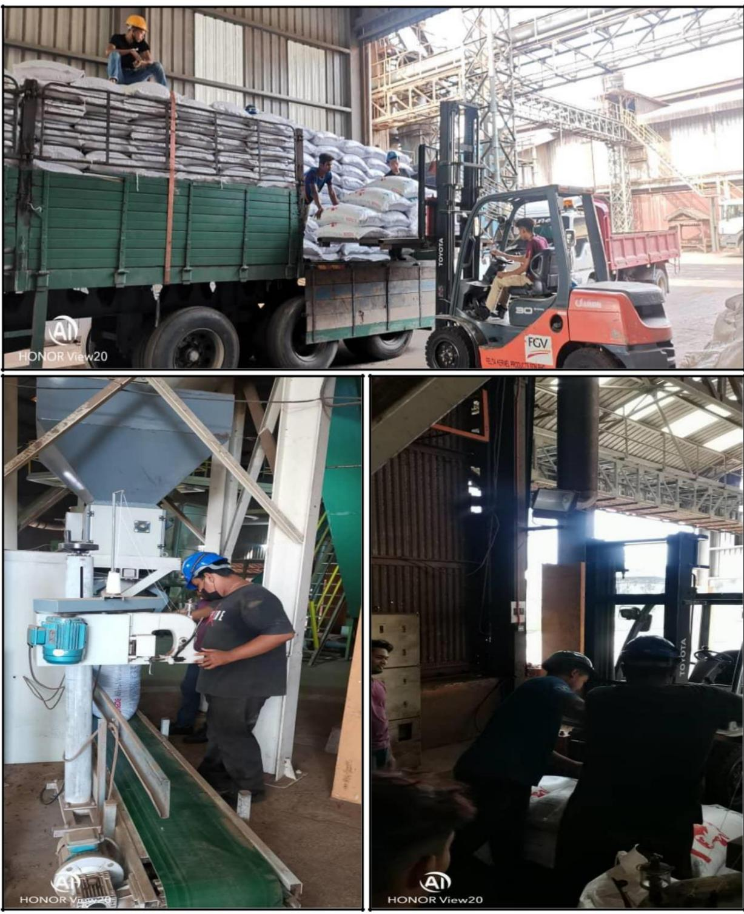

# FGV Johor Bulkers Sdn Bhd (Formerly known as Felda-Johore Bulkers Sdn Bhd)

Surat kami : FGVJB- JMSM/EZ/MNZ/2020(01)

30 Disember 2020

JAK MAX (M) SDN BHD No.01- 31,Jalan Austin Perdana 2/22 Temon Austin- Berdano 81100 Johor Bahru

U.p. : En Abdul Hazir Bin Abdul Latip

Tuan,

# FGVJB/ADM/MNZ/06/2020 KERJA-KERJA MEMOTONG DAN MEMBERSIHKAN RUMPUT DI KAWASAN FGV JOHOR BULKERS SDN BHD (TERMINAL 1,2 & 3), FGV BULKERS SDN BHD - TERMINAL 4, FGV GRAINS TERMINAL SDN BHD DAN LANGSAT BULKERS SDN BHD

Tawaran kerja yang tersebut di atas adalah dirujuk.

Sukacita dimaklumkan bahawa Syarikat tuan telah berjaya dalam tawaran sebutharga kerja- kerja yang tersebut di atas bagi tempoh 1 Jan 2021 hingga 31 Dis 2021 pada harga tawaran sebulan atau setahun. Dengan ini pihak tuan diminta mengatur jadual untuk memulakan kerja- kerja memorong rumput di kawasan yang telah dimaklumkan datam syarat- syarat tawaran.

Pihak Syarikat akan mengeluarkan Works Order bagi tujuan pengesahan perlantikan tersebut.

Sekian untuk makluman dan indukakan larjut dari pihak tuan.

Terima kasih.

Yang benar b/p FGV JOHOR BULKERS SDN BHD

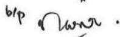

HJH ASLILA BINTI MOHD BAKRI HRBP, Syarikat Kumpulan FJB

s.k. : Ketua Pegawai Eksekutif Ketua Operasi Syarikat Kumpulan

# Rise with P.R.I.D.E

Partnership - Respect - Integrity - Dynamism - Enthusiasm

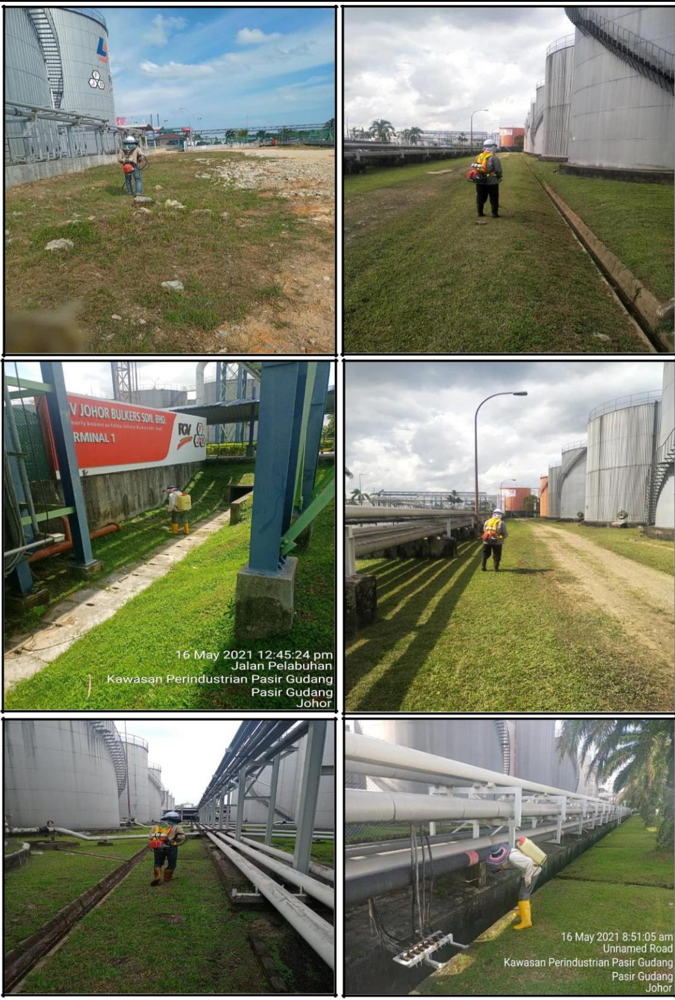

# MONOPOLETOWER

# AGREEMENTROHAS

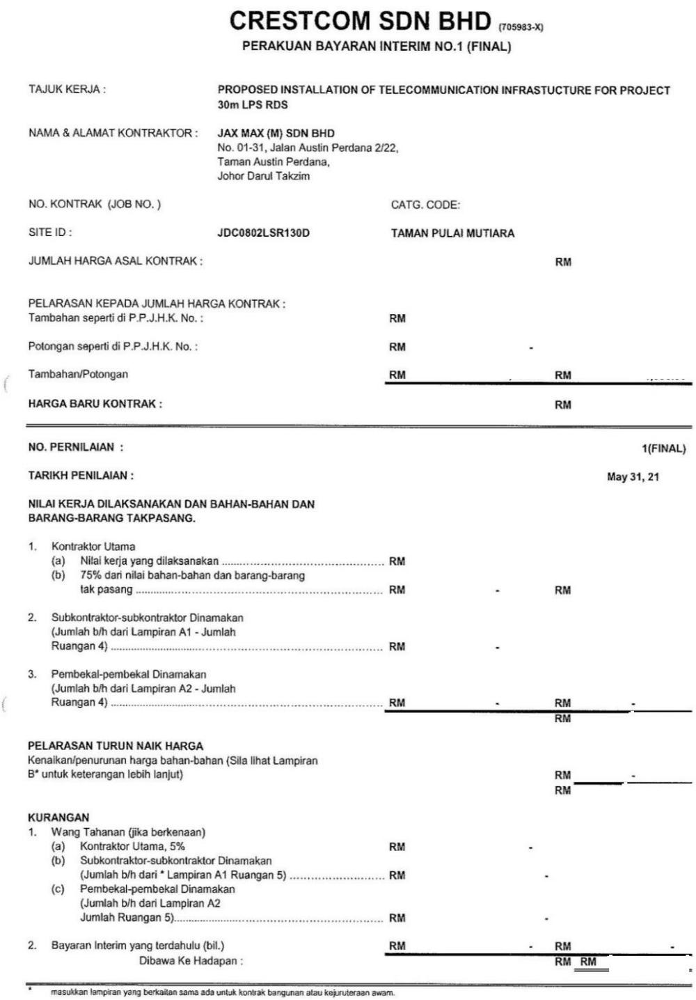

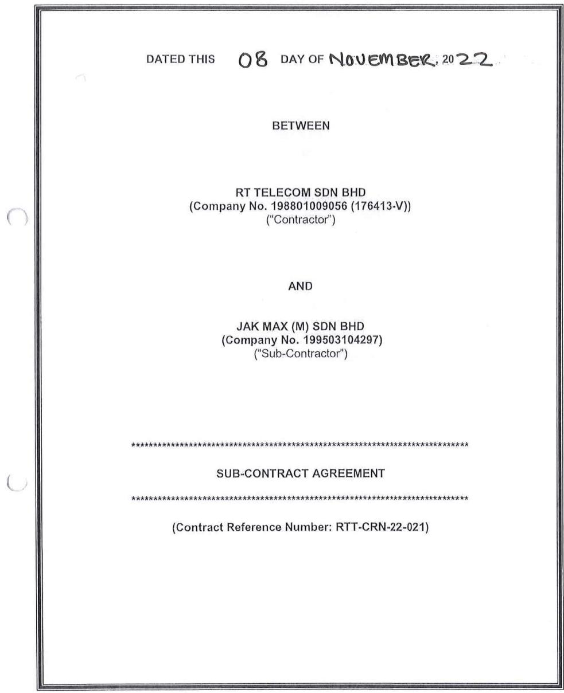

# THIS SUB-CONTRACT AGREEMENT ("Agreement") is made this 08 day of NOV 2022

# BETWEEN

RT TELECOM SDN BHD (Company No. 198801009056 (176413- V)), a company incorporated and registered in Malaysia and having its registered office at  $15^{\text{th}}$  Floor, Rohas Pure Circle, East Wing, 9, Jalan P. Ramlee, 50250, Kuala Lumpur (the "Contractor") of the one part;

# AND

JAK MAX (M) SDN BHD (Company No. 200501012484 (689532- U)), a company incorporated and registered in Malaysia and having its registered office at No. 01- 31 Jalan Austin Perdana 2/22, Taman Austin Perdana, 81100 Johor Bahru (the "Sub- Contractor") of the other part.

The Contractor and the Sub- Contractor shall collectively be referred to as the "Parties", and "Party" shall mean any one of them.

# RECITAL

# WHEREAS:

A. A Network Facilities Provider (NFP) duly registered with Malaysian Communications and Multimedia Commission (MCMC) ("Client") has awarded the Contractor with the Contract for carrying out works in connection with a project identified as "Universal Service Provision (USP) under Invitation Ref No: MCMC/USP/DPUD(01)/JENDELA_P1/TC/11/2020(06)_rev2021(03)" (Revised Invitation to Register Interest and submit a draft Universal Service Plan as a Universal Service Provider under the Communications and Multimedia (Universal Service Provision) Regulations 2002for the installation of network facilities and deployment of network service for the provisioning of public cellular services at the Universal Service Targets under the Jalian Digital Negara (JENDELA) Phase 1 Initiative" ("Project").

B. The Contractor is desirous of appointing the Sub-Contractor to complete the Sub-Contract Works (as he reinafter defined) in connection with the Project and to carry out the obligations of the Contractor under the Project including but not limited to the Scope of Sub-Contract Works as agreed and set out in this Agreement.

C. The Sub-Contractor has confirmed and represented to the Contractor that the Sub-Contractor is capable and willing to undertake the duties and responsibilities in respect of Sub-Contract Works required for the Project and possesses the required expertise, knowledge and availability of capable, skilled and experienced personnel for the purpose of coordinating, conducting and completing the Sub-Contract Works.

D. The Parties are now desirous of entering into this Agreement to regulate the rights and obligations of the Parties in relation to the completion of the Sub-Contract Works upon the terms and conditions contained in this Agreement.

# IT IS AGREED AS FOLLOWS:

# 1. DEFINITION

1.1 In this Agreement unless the context requires otherwise:

IN WITNESS WHEREOF the hands of the duly authorized representatives of the Parlier herefo have hereunto been set on the date first before written.

# CONTRACTOR

# SIGNED by

for and on behalf of RT TELECOM STDN BHD (Company No.178413- V)

# SUB-CONTRACTOR

# SIGNED by

# SIGNED by

for and on behalf of JAK MAX (M) STDN BHD (Company No. 1200501012484) in the presence of:

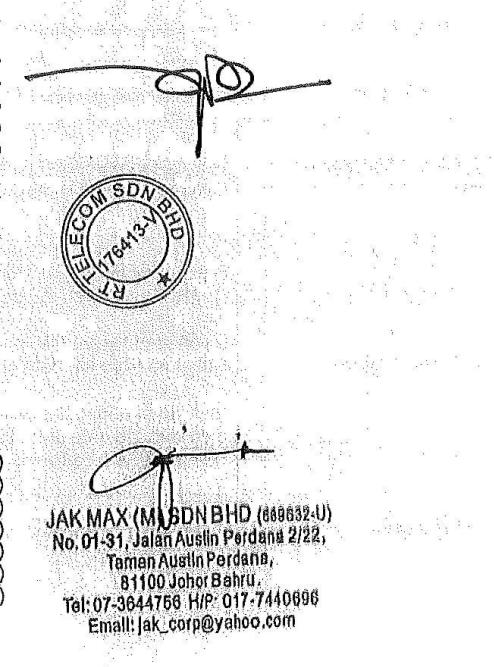

# AGREEMENTD'HARMONI

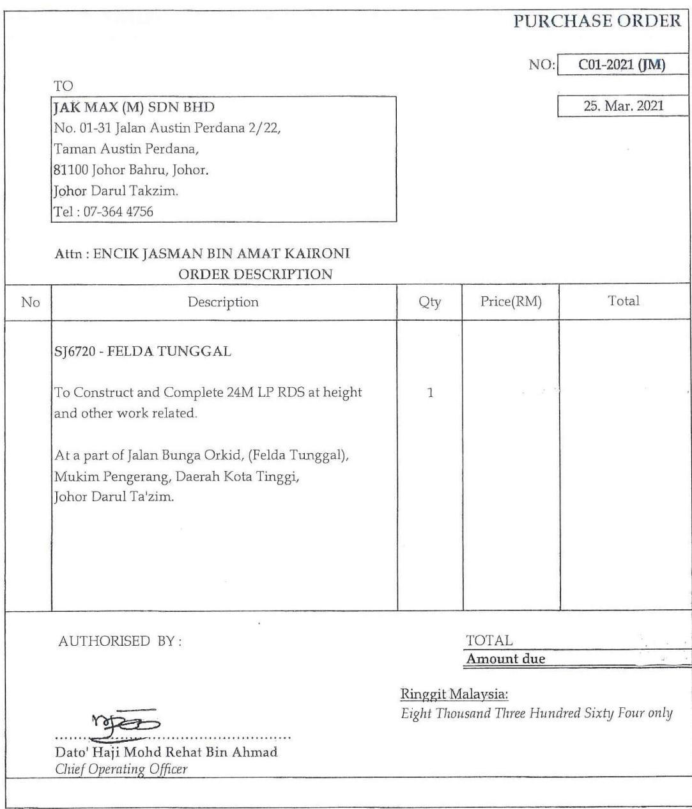

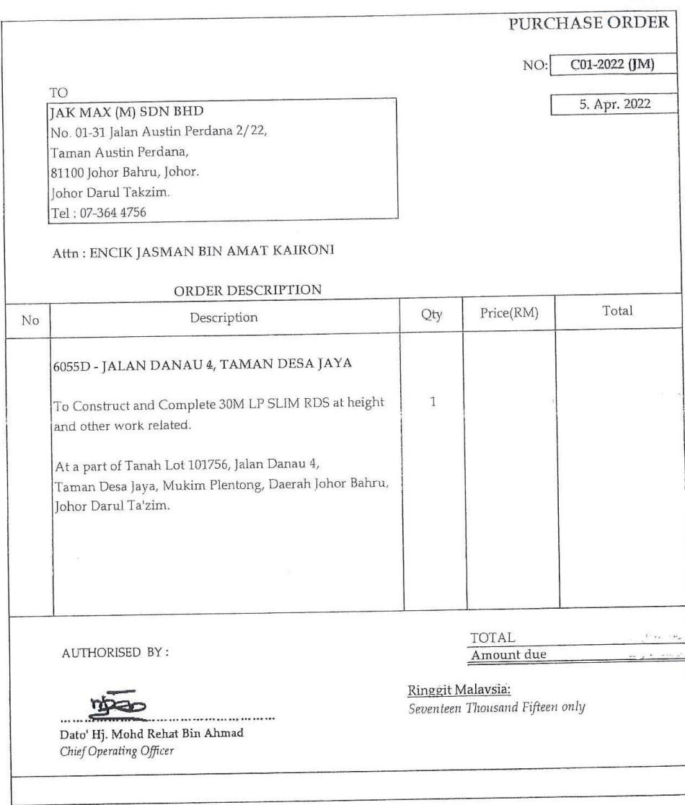

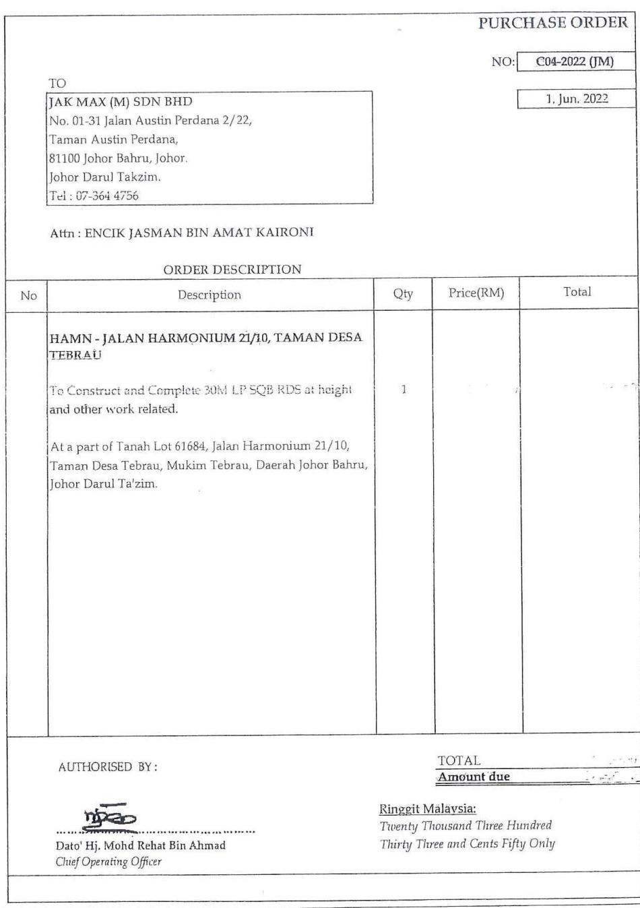  
No.30-02:Jalan Kencana Mas 1/5, Tebrau Business Park, Taman Daya, 81100 Johor Bahru, Johor Darul Takzim Tel:07-3573399Fax:07-3639889

# AGREEMENTYTL

TB/YX- KJWJE- 1/L&M/S/TEL.SAT/034

30 July 2022

JAK MAX (M) SDN BHD (JA0051) NO.01- 31JALAN AUSTIN PERDANA2/22 TAMAN AUSTIN PERDANA 81100 JOHOR BAHRU JOHOR DARUL TAKZIM Tel :+607- 3644756 H/P :+6012- 7668049

Attn :ENCIK MOHD SYAZNI BIN RUSLAN

Dear Sir

THE INSTALLATION OF NETWORK FACILITIES AND DEPLOYMENT OF NETWORK SERVICE FOR THE PROVISIONING OF PUBLIC CELLULAR SERVICES AT THE UNIVERSAL SERVICE TARGETS UNDER THE JALINAN DIGITAL NEAGRA (JENDELA) PHASE 1- PART 1 (YX- KJWJE- 1)

SUPPLY, DELIVER AND INSTALL THE TOWER STRUCTURE(S) AND ITS ANCILLARIES (TURNKEY CME WORKS) CLUSTER 18 (JOHOR) Subcontract No.TB/YX- KJWJE- 1/L&M/S/TEL.SAT/034

Further to your quotation, we are pleased to confirm our acceptance of your offer (subject to the Conditions of Subcontract, Specification, attached Revised Bills of Quantities/schedule of Rates and the terms and conditions of this letter) at the Estimated Subcontract Sum of Ringgit Malaysia : Three Hundred Twenty Thousand Two Hundred Sixty Seven Only (RM320,267.00).

# 2 Subcontract Sum

The Subcontract Sum (including all the rates and prices submitted) shall be exclusive of any sales and services tax which may become payable under the Sales Tax Act 2018 and Services Act 2018 respectively.

# 3 Subcontract Agreement

You are to enter into a Subcontract Agreement with us which shall be executed at a later date. Meanwhile, this Letter of Acceptance shall constitute a binding Subcontract between us which Subcontract shall subsist even if no formal Subcontract Agreement is ever signed.

# 4 Subletting and Assignment

4.1 In accordance with Clause 14.1 of the Conditions of Subcontract, you shall not assign the Subcontract or any part thereof, or any benefit, interest or any money due or which may be due.

4.2 In accordance with Clause 14.2 of the Conditions of Subcontract, you shall not sublet the whole of the Subcontract Works. Any subletting of any part of the Subcontract Works shall be subject to our prior approval.

# 5 Access to Workshops etc

5 Access to Workshops etcYou shall allow our staff or any representative appointed by us access to your workshop or places where any part of the Subcontract Works are being manufactured, fabricated or prepared. Our staff and/or appointed representative shall be entitled to inspect, examine, test, and witness the testing of any of the materials, equipment or any other part of the Subcontract Works to be supplied and installed under the Subcontract. If any of the materials, equipment or any other part of the Subcontract Works are being manufactured, fabricated or prepared in workshops or places other than those of your own, you shall secure similar rights of access, inspection, examination, testing etc for our staff and appointed representative as if the workshop or place was your own.

# 6 Employment of Workmen

6.1 Notwithstanding the provisions of Clause 28.1 of the Conditions of Subcontract, you may with the prior approval of our Site Manager, employ non- citizens or non- permanent residents of Malaysia provided that each of such employees possess a valid Pass complying with the Immigration Act 1959/1963 and the Passports Act 1966 and any subsequent modification and re- enactment thereof. In respect of each and every of such employee, you are required to submit to our Site Manager, a copy of the employee's passport and/or "Surat Perjalanan Laksana Passport" (SPLP) and work permit. Under no circumstance shall a non- citizen or non- permanent resident of Malaysia who does not possess a valid Pass be employed. Your attention is drawn to subsections (1), (3) and (5) of Section 55B of the Immigration Act 1959/1963 which read as follows:

(1) Any person who employs one or more persons, other than a citizen or a holder of an Entry Permit, who is not in possession of a valid Pass shall be guilty of an offence and shall, on conviction, be liable to a fine of not less than ten thousand ringgit but not more than fifty thousand ringgit for each such employee."

(3) Where, in the case of an offence under subsection (1), it is proved to the satisfaction of the court that the person has at the same time employed more than five such employees that person shall, on conviction, be liable to imprisonment for a term of not less than six months but not more than five years."

(5) Where the offence under subsection (1) has been committed by a body corporate, any person who at the time of the commission of the offence was a member of the board of directors, a manager, a secretary or a person holding an office or a position similar to that of a manager or secretary of the body corporate shall be guilty of that offence and shall be liable to the same punishment to which the body corporate is liable under subsection (1) or (3)."

6.2 To comply with the Internal Security (Registration of Labour) Regulation 1960 you are to maintain a register of your workmen, giving all the particulars required by Regulation 3. You are required to submit this register together with two (2) recent photographs of each workmen to our Site Manager within fourteen (14) days of posting or delivery by hand of this Letter of Acceptance.

# 7 Site Representative

7 Site RepresentativeYou are to submit for our approval the name and curriculum vitae of an efficient and experienced site representative.

# 8 Site Regulations

8 Site RegulationsYou are to ensure that your employees and workmen abide by the side rules set out. These will help in creating a safe and harmonious working environment for all parties.

# 9 Contractor's All Risks Insurance Policy

In accordance with Clause 44 of the Conditions of Subcontract, we are insured on a Contractor's All Risks Insurance Policy covering the Contract Sum incorporating a Public Liability Claim Limit of Ringgit Malaysia : Only (RM. ) per claim. Claims made on the policy for loss, damage, theft and such other provisions in the insurance policy shall be subject to the following excess per occurrence:

(a) Acts of God/Subsidence/Upheaval/ To be insert later Landslide/Landslip/inundation 
(b) Collapses from Any Cause To be insert later 
(c) Theft To be insert later 
(d) Faulty Design And/or Defective To be insert later Material and/or Workmanship (resultant damage) 
(e) Others To be insert later 
(f) Vibration, Removal or Weakening Of To be insert later Support/Underground Services 
(g) Other Third Party Property Damage To be insert later

In the event of a claim made on the insurance policy as a result of loss, damage, theft and/or such like, the excess shall be borne by you. Please also note that there shall be no obligation on us to make any claim for or on your behalf in respect of any occurrence covered by the insurance policy and no liability whatsoever shall be attached to us for failing to maintain the policy, to give any notice to the insurance company, and for any other matter relating to the policy or claims thereto.

Further, apart from other exclusions, any legal liability arising out of the use of any vehicle where indemnity is provided by any motor insurance policy or where insurance or security is required by law to be borne by you, such liability shall be pursued under your motor or other insurance policy with all due haste.

# 9 Contractor's All Risks Insurance Policy (Cont'd)

In the event that the Subcontract Works require usage of your own tools and equipment/machinery, you shall be responsible for the regular servicing and maintenance of such tools and equipment/machinery including undertaking all repairs promptly should breakdown occur for any reasons whatsoever to ensure that the Subcontract Works can proceed in accordance with the approved programme of work.

You shall provide adequate insurance coverage for your own tools and equipment/machinery including adequate coverage for your own operator.

# 10 Workmen's Compensation Policy

Notwithstanding Clause 45.2 of the Conditions of Subcontract, you are required to take out and maintain a workmen's compensation insurance policy to cover your liabilities in respect of the workmen employed by you. You shall before the commencement of work, deposit with our Site Manager the insurance policy together with the receipt of premiums paid. In respect of workmen who are non- citizens or non- permanent residents of Malaysia, you shall take out and maintain a foreign worker's compensation insurance policy in compliance with the Workmen's Compensation (Foreign Workers Compensation Scheme (Insurance) Order 1998) and any subsequent amendment thereto. You shall before the commencement of work, deposit with our Site Manager the insurance policy together with the receipt of premiums paid.

# 11 SOCSO Registration and Contributions

In accordance with Clause 45.3, you are required to register your workmen and pay at your own cost and expense all contributions required to be paid under the Social Security Scheme (SOCSO) and comply with the provisions of the Employees' Social Security Act, 1969. You shall before the commencement of work furnish to our Site Manager your code number of registration as an employer with SOCSO, and shall upon commencement of work and whenever necessary thereafter furnish to our Site Manager the SOCSO registration numbers of workmen employed by you together with evidence of contributions made.

# 12 Performance Bond

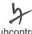

In accordance with Clause 46 of the Conditions of Subcontract, you are required to submit to us a Performance Bond in the sum of Ringgit Malaysia : (RM) being  $5\%$  of the Subcontract Sum. A sample performance bond as extracted from the Tender Document is enclosed.

# 13 Subcontract Period and Commencement of Subcontract Works

In accordance with Clause 47.1 of the Conditions of Subcontract, you shall commence the Subcontract Works within seven (7) days from the date of the Order to Commence Work. Your programme of work which shall be subject to our approval, shall conform to our programme of work. Your total Subcontract Works shall in any event be completed within ninety three (93) days from the date of the Order to Commence Work.

TB/YX- KJWJE- 1/L&M/S/TEL.SAT/034 30 July 2022 JAK MAX (M) SDB BHD (JA0051) Page 5

# 14 Payment

(a) Unless otherwise determined by us, all payments payable under the Sub-Contract shall be remitted into your nominated bank account ("Nominated Bank Account"). Accordingly, you must provide us with the relevant details of your nominated bank account as required by us together with a copy of bank statement to facilitate remittance into the Nominated Bank Account.

(b) Remittance of monies into the Nominated Bank Account shall constitute a good and sufficient discharge of our payment obligations under the Sub-Contract until our actual receipt of written notification from you of any changes to the details of the Nominated Bank Account.

(c) It is your responsibility to inform us immediately in the event of any changes to the Nominated Bank Account by sending us a written confirmation together with the completed details of your new bank account details as required by us.

# 15 Taxes

15.1 The Sub-Contractor is solely responsible and liable for payment of, and undertakes that it will pay, or ensure the payment of, all Taxes in respect of the supply of the Sub-Contract Works in accordance with all Law.

15.2 The Sub-Contractor Sum (including all the rates and prices submitted) is exclusive of SST (if any).

15.3 The Sub-Contractor declares and confirms that the Sub-Contractor shall be liable to be registered as a taxable person under the Sales Tax Act and Services Tax Act. The Sub- Contractor shall comply with the provisions of the Sales Tax Act and Services Tax Act applicable to it including all fines and penalties imposed by the relevant Authorities arising from any non or late payment of the SST.

15.4 The Sub-Contractor shall provide the Main Sub-Contractor with all the required tariff codes, documents and other information (including without limitation, invoices from its sub- subcontractors and suppliers) required by the Main Sub- Contractor so as to assist the Main Sub- Contractor in applying for and obtaining an exemption from SST (in part or in whole) for the Project.

15.5 In the event the Main Sub- Contractor is unable to obtain an exemption from SST for the Project, the Main Sub- Contractor shall pay to the Sub- Contractor the exact amount of SST imposed on the Sub- Contractor by its sub- subcontractors and suppliers as evidenced by the invoices of its sub- subcontractors and suppliers provided that the Main Sub- Contractor shall not be obliged to make such payment if the Sub- Contractor has failed to comply with its obligations under Clause 15.4.

TB/YX- KJWJE- 1/L&M/S/TEL.SAT/034 30 July 2022 JAK MAX (M) SDBI BHD (JA0051) Page 6

# 15 Taxes (Cont'd)

15.6 If after the date of the Sub- Contract, the Sub- Contractor is exempted or relieved in whole or in part from the payment of any Taxes included in the Sub- Contract Sum, the Sub- Contractor shall promptly notify the Main Sub- Contractor of such exemption or relief and, at the option of the Main Sub- Contractor, the Sub- Contract Sum shall be correspondingly decreased by such amount or taxes that is exempted or relieved or such amount of Taxes that is exempted or relieved shall be paid to the Main Sub- Contractor as a debt due and payable.

# 16 Notice of Claims

If you consider that you may have grounds to claim any payment in addition to payments due to you under this Subcontract, you shall give notice and submit in writing a detail and accurate estimate complete with all necessary documentation and supporting calculations to us within fourteen (14) days from the occurrence of the event giving rise to the claim. This shall be a condition precedent to your right to be paid for any variation or to make any claim for additional payment.

# 17 Deductions

Where any amount is owing to, or to be paid to, or reimbursed to us or any of our associated or related companies by the Sub- Contractor (including amounts owing by the any of the Sub- Contractor's associated or related firms or companies), whether under the provisions of this Sub- Contract or any other contract or sub- contract, we may, without prejudice to any other remedies that we or our associated or related companies may have, deduct the amount from any payment due to the Sub- Contractor. Where the amount has not been ascertained, we may, pending ascertainment, deduct an amount reasonably estimated by us in that regard and upon ascertainment the payment shall be adjusted accordingly.

# 18 Letter of Acceptance

This Letter of Acceptance shall form part of the Subcontract Documents and Agreement, and is sent to you in duplicate. Kindly acknowledge receipt by returning to us the ORIGINAL copy, duly signed and witnessed and retain one copy.

Thank you.

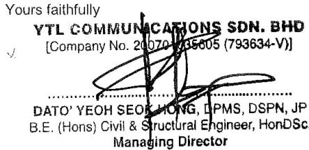

# KERJA - KERJA MEMASANG LPS RDS MONOPOLE DI FELDA TUNGGAL, KOTA TINGGI, JOHOR

# SETINGGI 30M

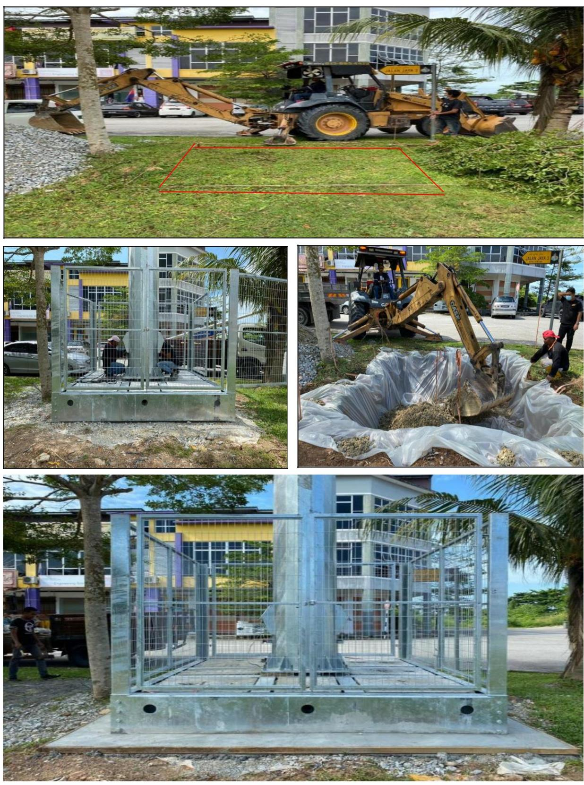

# SETTING SITE

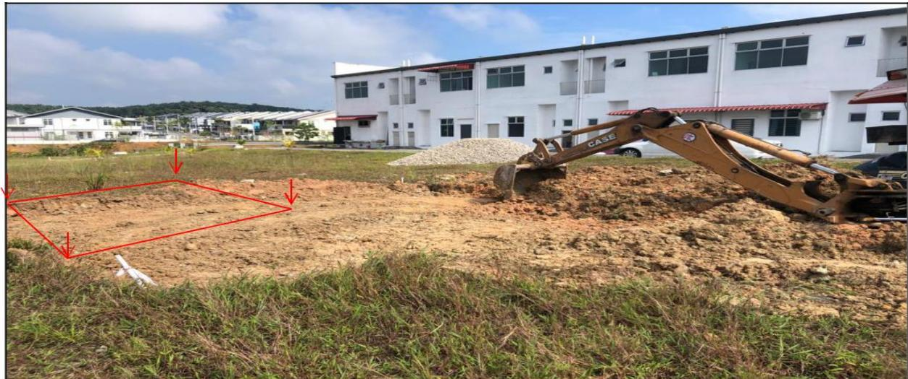

# SITE EXCAVATE

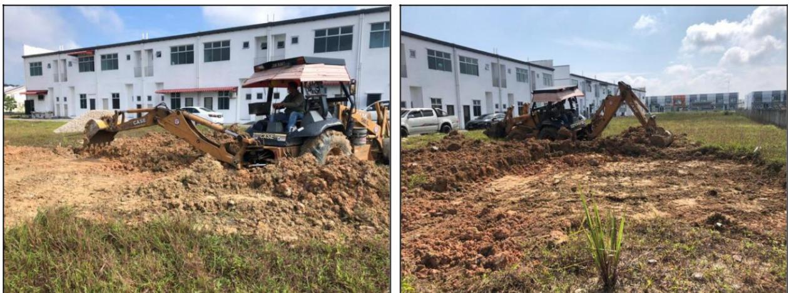

# CADWELD ON PROGRESS

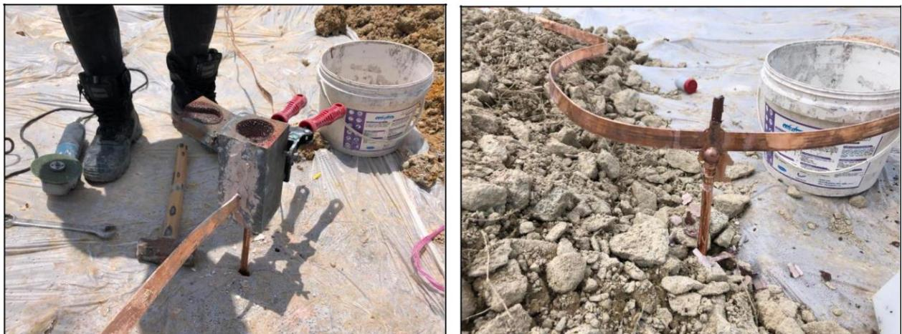

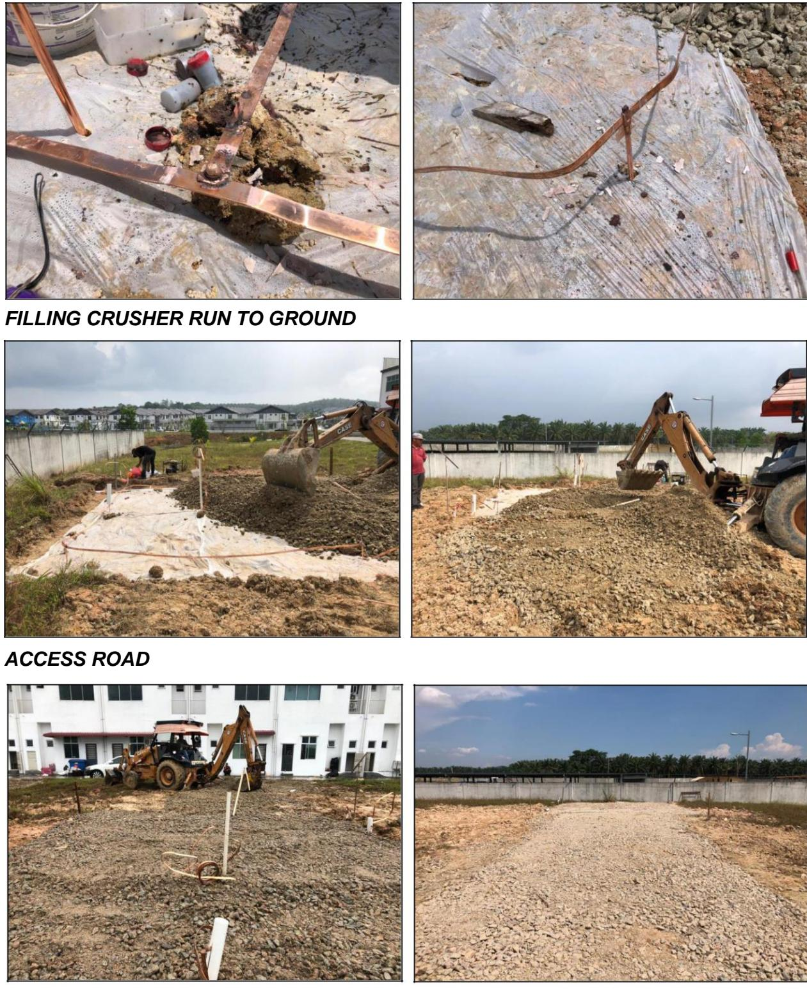

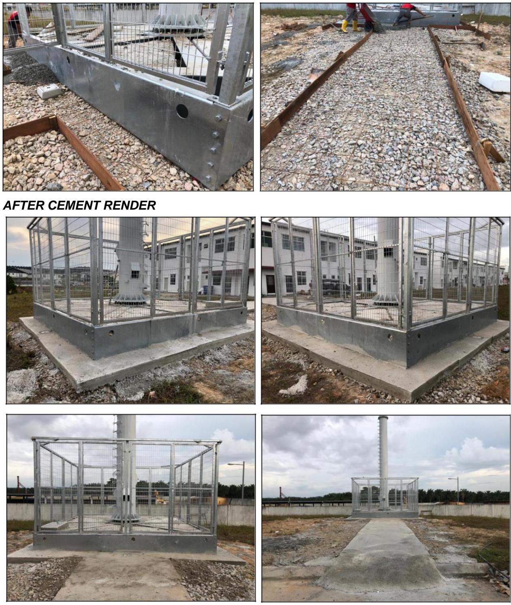

# 2 NOS MOUNTED GROUNDING BUSBAR INSTALLED

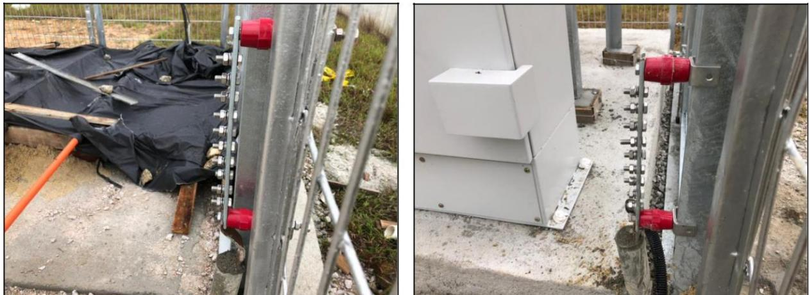

# EARTH CHAMBER

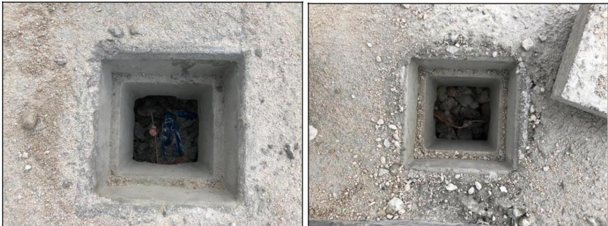

# SITE COMPOUND

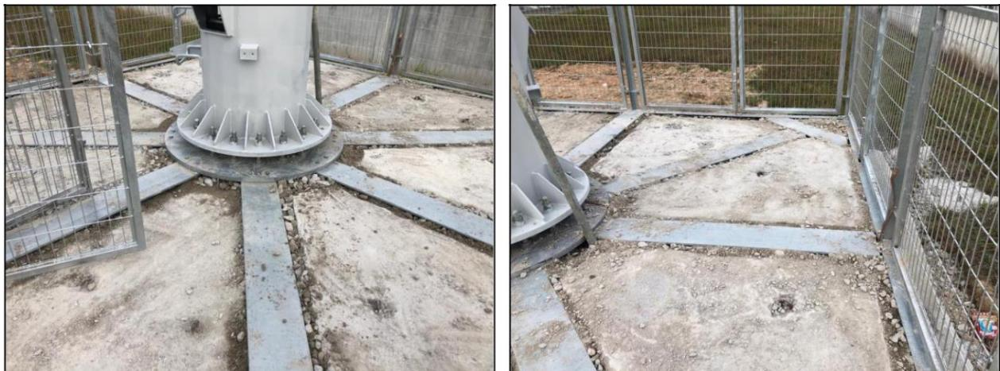

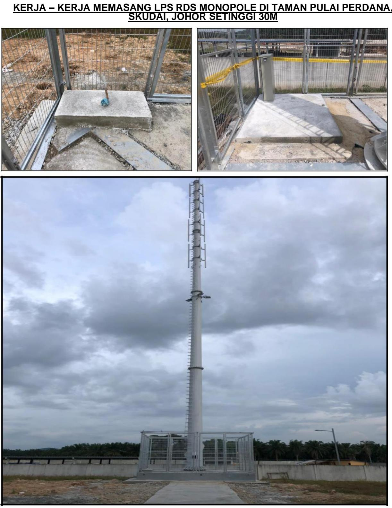

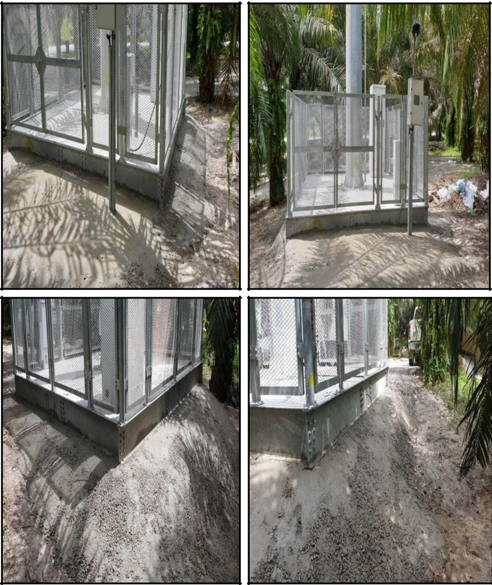

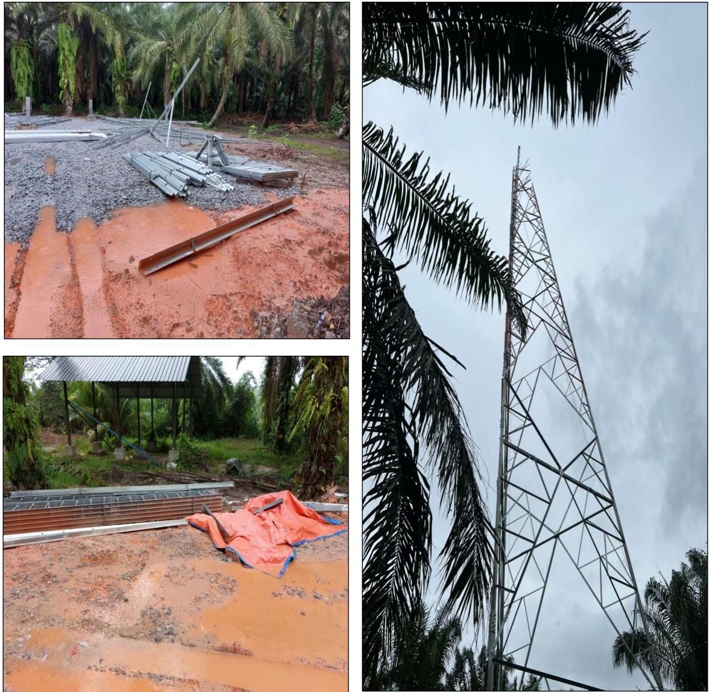

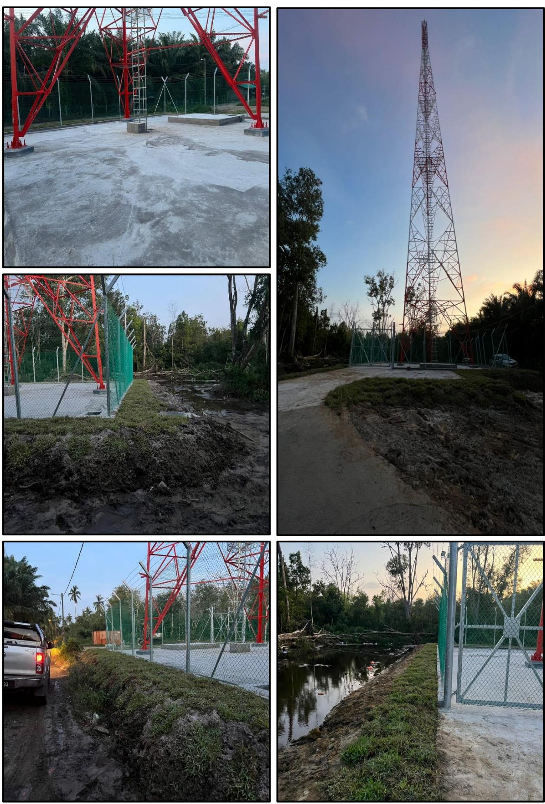