# COMPANY PROFILE

1. SCOPE OF BUSINESSES Registered Services

2. COMPANY BUSINESS PROFILE Corporate Organization & Management Services

3. COMPANY INFORMATION The Company Registration & General Information

4. CORPORATE STRUCTURE AND MANAGEMENT Board of Director and Management Teams

5. CORPORATE STRUCTURE AND MANAGEMENT Project Management Teams

6. THE ASSOCIATE MANAGEMENT TEAMS Integrated Consulting Management & Supervision

7. THE COMPANY MACHINERIES & EQUIPMENTSLists of Machineries & Equipments

8. THE SUPPLIERBuilding Materials, Machineries & Specialist Works Suppliers

9. THE FINANCE FACILITIESBanking Facilities

10. THE FINANCE FACILITIESSupplier Credit Facilities

11. WORKING EXPERIENCESLists of Current Project

12. WORKING EXPERIENCESLists of Completed Project

# Registered Services

# REGISTERED WITH 'PUSAT KHIDMAT KONTRAKTOR' (PKK) CLASS 'A' (Bumiputra)AND CIDB GRED G7

Kejuruteraan Awam Pembinaan Jalan Perparitan dan Saliran Pembaikan Cerun Runtuh Infrastruktur Pemasangan Sistem Pembetungan Kerja- kerja Pemasangan Paip Civil Works Road Woks

# REGISTERED WITH MINISTER of FINANCE (SUPPLY & SERVICES) (KEMENTERIAN KEWANGAN)

Bahan minuman Makanan Memasak Islam Kimia Pemprosesan Air Kelengkapan Makmal Mencuci Bangunan Jentera Berat / Kenderaan / Jentera Pengangkutan Lori (Perkhidmatan) Membersih Kawasan Membeli Barang Lusuh Komputer & Perkhidmatan Berkaitan Alat Ganti / Aksesori Kenderaan Mesin dan Peralatan Worksyop Kerja- kerja Khusus (Baikpulih Enjin) Perabot Bahan- bahan Pembungkusan / Pekakas Tenaga Pengajar Alat Tulis Cenderamata dan Hadiah Mesin- mesin Pejabat Alat Perhubungan Semua Peralatan Sukan / Ukuran Perkakas Elektrik Kelengkapan Dapur Permaidani / Ambar Mesin Kediaman Hiasan Lalaman Bangunan & Hiasan Jalan / Kawasan

SURUHANJAYA PERKHIDMATAN AIR NEGARA PERMIT IPA JENIS C1 (PEMBENTUNGAN)

# Corporate Organization & Management Services

# GTS

Contractor Sdn. Bhd. (GTS) is a new generation construction, project management, civil and structure consultancy company. Construction activities are undertaken through GTS Contractor Sdn. Bhd. whereas project management, civil and structural consultancy activities are undertaken through Associate Consultant, Jurutera Perunding SB. Other specialist Works such as Shoring and Piling Works, GTS will utilised our Associate Company, Ikhmas Jaya Sdn. Bhd. GTS also work together with our associate demolition Contractor, Chang Cherng Trading, which has over 13 years experienced in building demolition works

# Incorporated

since  $27^{\mathrm{th}}$  January 1994, GTS Contractor Sdn. Bhd. is a registered contractor with PKK (Class A) Bumputra Status Contractor, CIDB (Group 7) and Suruhanjaya Perkhidmatan Air Negara (Jenis C1).

GTS Contractor Sdn. Bhd. is a Specialist Contractor in the planning, design, procurement and construction of water and waste- water works facilities. The Company is also active in other Civil Engineering and Building Works. Jurutera Perunding SB. is a specialist Civil and Structure Design Consultancy Company registered with the Board of Engineer Malaysia and Ministry of Finance Malaysia. The Company provides Civil and Structural design and services for water facilities, buildings and civil engineering works including highways, airport, port and infrastructures to support the requirement of GTS Engineering Consultancy needs. In addition, Jurutera Perunding SB Principal was involved in several construction projects in the Middle East

# Our vision

is to be a world class construction and project management consulting company providing services not only in Malaysia but also in the region. To fast track towards the vision, GTS has tied up with several international and reputable construction and project management and engineering consulting company. The personnel of GTS was involved in the planning, design, procurement and construction of several mega projects in Malaysia including the Double Tracking Project, Kuala Lumpur City Centre (Petronas Twin Tower) and Hospital Projects in  $7^{\mathrm{th}}$  Malaysia Plan. GTS has an excellent track record in the provision of project management services. GTS has experienced professional, most of who are professionals of various disciplines including civil, mechanical and electrical engineering, architecture, quantity surveying and accounting.

# Our philosophy

in the provision of services is to consistently meet and exceed the clients' requirement. To achieve this objective, we always take advantage of the interaction among sound technical knowledge, good management skill and information technology. We benchmark against world class organizations to ensure we possess the finest and latest knowledge and ideas; the ability to operate at the highest standards of any place, anywhere; and the best relationships, which provide access to the resources of other people and organizations around the world. We are committed to Quality Excellence towards developing a high performance culture in the company through the implementation of a Quality Management System based on the ISO 9001 framework.

# GTS

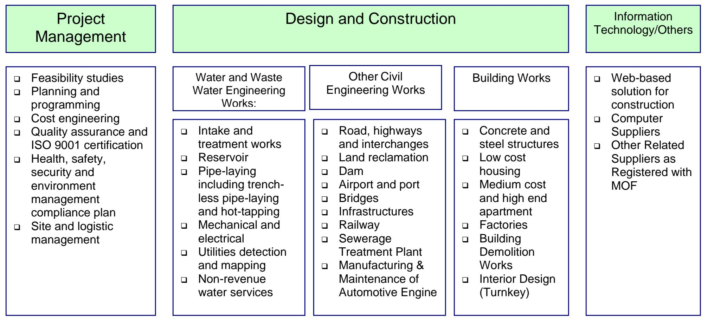

# COMPANYINFORMATION

# COMPANY BUSINESS Profile

The Company Registration & General Information

Company Name

GTS CONTRACTOR SDN BHD (Formerly known as Gens Trade & Services Sdn Bhd)

Registration Number

288361- M

Incorporated Date

$27^{\mathrm{th}}$  January, 1994

Registered Office

18- 2, Susur 6, Jalan Tun Razak, Taman Suria Muafakat 80200 Johor Bahru, Johor

Corporate Office

No: 85- 1, Jalan SBC 1, Taman Sri Batu Caves, 68100 Batu Caves, Selangor Darul Ehsan.

Telephone Number

03- 61864402,61879350

Fax Number

03- 61879345

Email Address

gtscontractor@gmail.com

Authorized Capital

RM 25,000,000.00 (25 Million)

Paid- up Capital

RM 10,000,000.00 (10 Million)

The Board of Director:

1. HJ. RUSMANI BIN ABDUL RAHMAN  
2. RUSLI BIN ABDUL RAHMAN  
3. SULIMAN BIN BAKAR

- Managing Director  
- Director  
- Technical Director

Banker

1. CIMB Bank Berhad Taman Sri Gombak, Selangor  
2. Bank Islam (M) Berhad Jalan Ipoh, Selayang, KL

Company Secretary

Double Hope Management Sdn Bhd. Unit A12B- 1, Jalan Selaman 1/1, Dataran Palma, 68000 Ampang, Selangor Darul Ehsan.

Auditor

Norazizi Rashid & Associates

COMPANYREGISTRATION(PKK, CIDB,Minister of Finance,SPAN License)

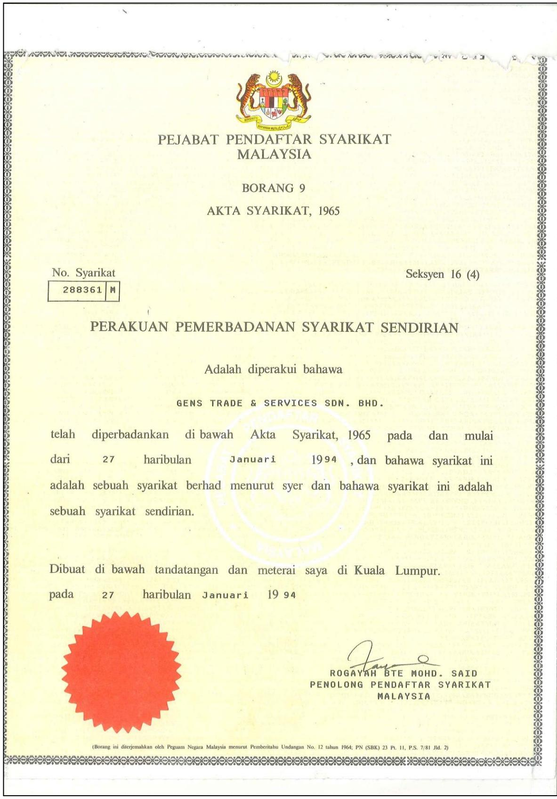

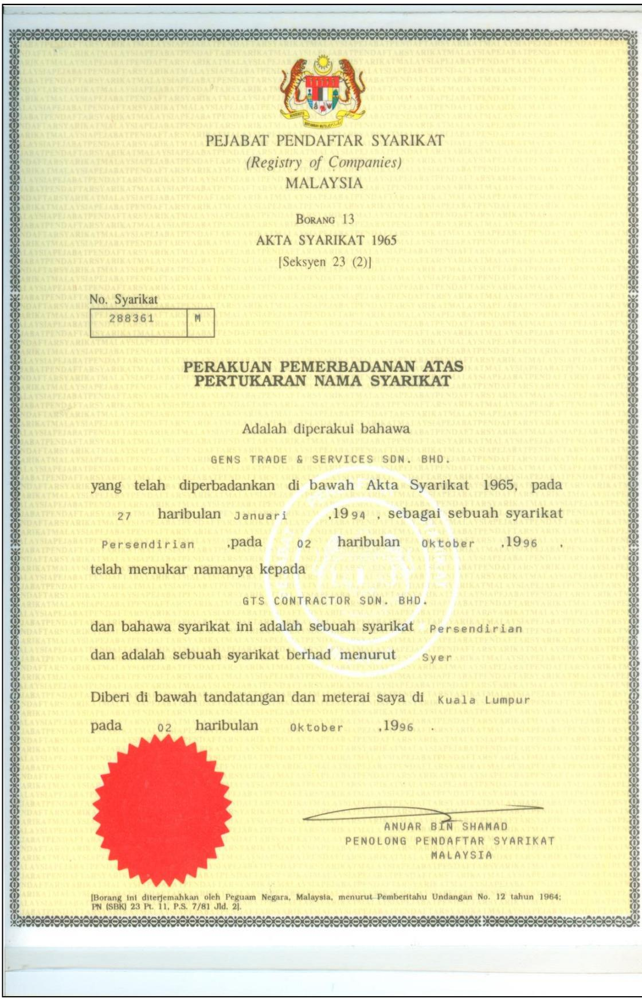

# PERAKUAN PENDAFTARAN

Adalah dengan ini diperakui bahawa kontraktor yang dinyatakan di bawah ini telah berdaftar dengan Lomizaga mengkat Bahagian "A Nata Lomizaga Pombangunan industri Pombakistan Malaysia 1961 Pendaftaran ini adalah tertakluk kepada syarat- syarat yang telah ditetapkan bersama perakuan ini.

No. Pendaftaran 1960910- SL005420  Nama Kontraktor : GTS CONTRACTOR SDN. BHD.  Alamat Berdaftar : 18- 2, SUSUR 6 JALAN TUN RAZAK TAMAN SURIA MUAFAKAT 80200 JOHOR BAHRU  JOHOR  Daerah : JOHOR BAHRU  Tarikh Mula Berdaftar : 10/09/1998  GRED KATEGORI PENGKHUSUSAD  G7 B B03 B04 B11  G7 CE CE01 CE02 CE07 CE11 CE19 CE20 CE21 CE22 CE30 CE31 CE32 CE34  CE42 CE43  G7 ME M15 M19

Tarikh Mula Berkuatkuasa : 17/07/2023  Tarikh Habis Tempoh Perakuan : 10/10/2026  STATUS: AKTIF

Ketua Eksebutif  Lembaga Pembangunan Industri Pembinaan Malaysia  Tarikh: 17/07/2023

# SIJIL PEROLEHAN KERJA KERAJAAN

Adabah disabkan syarikat/Firma ini adalah beradafter dengan Lembaga Pembangunan Industri Pembinaan Malaysia dan tertakluk kepada syarat- syarat termaktub bersama sijil ini.

No.Pendaftaran 1960910- SL003420 Nama Kontraktor GTSCONTRACTORSDN.BHD. Alamat Berdaftar 18- 2,SUSUR 6JALAN TUN RAZAK TAMAN SURIA MUAFAKAT 80200JOHORBAHRU JOHORDAHORBAHRU Tarikh Mula Berdaftar 10/09/1998

# GRED KATEGORI

G7 B (Pembinaan Bangunan)  G7 CE (Pembinaan Kejuruteraan Awam)  G7 ME (Mekanikal dan Elektrikal)

# PEGAWAISYARIKATYANGDITAULIAHKAN

# NO.K/P

SULIMAN BIN BAKAR  RUSL BIN ABDUL RAHMAN  RUSMANI BIN ABDUL RAHMAN  MUHAMMAD AMIR BIN RUSMANI

620710105729 641030055329 580720055039 970921146125

Tarikh Mula Berkuatkuasa : 18/07/2023  Tarikh Habis Tempoh Perakuan : 10/10/2026

Ketua Eksekutif

Lembaga Pembangunan Industri Pembinaan Malaysia  Tarikh: 18/07/2023

# PUSAT KHIDMAT KONTRAKTOR

KEMENTERIAN PEMBANGUNAN USAHAWAN DAN KOPERASI  SIJIL TARAF BUMIPUTERA  KONTRAKTOR KERJA

Acalah dengan ini syarikat tuan sepeti tercatit di dalam Sijil ini diiktiraf sebagai kontraktor kerja betaraf Bumiputera.  Pemberian pengiktirafan ini adalah tertailuk kepada syarat- syarat termaktub di belakang sijil.

<table><tr><td>NO. SIJIL PENDAFTARAN</td><td>GRED PENDAFTARAN</td><td>KATEGORI</td><td>TEMPOH SAH LAKU</td></tr><tr><td rowspan="3">1960910-SL005420</td><td>G7</td><td>B</td><td>DARI : 06/09/2023</td></tr><tr><td>G7</td><td>CE</td><td rowspan="2">HINGGA : 10/10/2026</td></tr><tr><td>G7</td><td>ME</td></tr></table>

# NAMA DAN ALAMAT BERDAFTAR

GTS CONTRACTOR SDN. BHD.

13- 2. SUSUR 6 JALAN TUN RAZAK TAMAN SURIA MUFAKAT

80200 JOHOR BAHRU

JOHOR

JOHOR BAHRU

PEGAWAI SYARIKAT YANG DITAULIAHKAN

SULIMAN BIN BAKAR

RUSLI BIN ABDUL RAHMAN

RUSMANI BIN ABDUL RAHMAN

MUHAMMAD AMIR BIN RUSMANI

NO.K/P

620710105729

641030055329

580720055039

970921146125

(DR. NARIMAN BIN ROJULAI)

Pengarah  Pusat Khidmat Kontraktor  Kementerian Pembangunan Usahawan dan Koperasi

TARIN: 36/09/2023

# KEMENTERIAN KEWANGAN MALAYSIASIJIL AKUAN PENDAFTARAN SYARIKAT

NO. SIJIL : K11701219483722747  NO. RUJUKAN PENDAFTARAN : 357- 00044576  TEMPOH SAH LAKU : 18/12/2023 - 06/03/2027

# Bahawa dengan ini diperakui syarikat :

GTS CONTRACTOR SDN. BHD. (288361- M)  NO.85- 1, JALAN SBC 1  TMN SRI BATU CAVES  GOMBAK  68100 BATU CAVES  SELANGOR, MALAYSIA

Telah berdaftar dengan Kementerian Kewangan Malaysia dalam bidang bekalan/perkhidmatan di bawah sektor, bidang dan sub- bidang seperti di Lampiran A. Kelulusan ini adalah tertakluk kepada syarat- syarat seperti yang dinyatakan di Lampiran B. Individu yang diberi kuala oleh sypakat bagi urasan perolehan Kerjaan adalah seperti berikut :

ENCIK RUSMANI BIN ABDUL RAHMAN

580720055039

MANAGING DIRECTOR

t.t

DATO' INDERA AB RAHIM BIN AB RAHMAN Bahagian Perolehan Kerajaan b.p. Ketua Setiausaha Perbendaharaan Kementerian Kewangan Malaysia

Tarikh Berdaftar Dengan Kementerian Kewangan Malaysia : 18/12/2023

(Sijil ini adalah cetakan komputer dan tidak memerlukan tandatangan)

NO SIJIL NO RUJUKAN PENDAFTARAN TEMPOH SAH LAKU

: K11701219483722747 : 357- 00044576 : 18/12/2023 - 06/03/2027

<table><tr><td>BIL</td><td>TARIKH DIFTAR BIDANG</td><td>KOD BIDANG</td><td>KETERANGAN</td><td>STATUS</td></tr><tr><td>1</td><td>15/12/2023</td><td>020101</td><td>PERABOT, PERALATAN PEJABAT, HIASAN DALAMAN DAN DOMESTIK/PERABOT, KELENGKAPAN DAN AKSESORI/PERABOT, PERABOT MAKMAL DAN KENGKAPAN BERASASKAN KAYU/ROTAN/FABRIK/LOGAM/PLASTIK</td><td>Aktif</td></tr><tr><td>2</td><td>15/12/2023</td><td>020103</td><td>PERABOT, PERALATAN PEJABAT, HIASAN DALAMAN DAN DOMESTIK/PERABOT, KELENGKAPAN DAN AKSESORI/PERMAIDANI/AMBAR</td><td>Aktif</td></tr><tr><td>3</td><td>15/12/2023</td><td>020201</td><td>PERABOT, PERALATAN PEJABAT, HIASAN DALAMAN DAN DOMESTIK/MESIN-MESIN PEJABAT DAN AKSESORI/ MESIN MESIN PEJABAT DAN AKSESORI</td><td>Aktif</td></tr><tr><td>4</td><td>15/12/2023</td><td>020301</td><td>PERABOT, PERALATAN PEJABAT, HIASAN DALAMAN DAN DOMESTIK/PERKAKAS ELEKTRIK DAN ELEKTRONIK/PERKAKAS ELEKTRIK DAN AKSESORI</td><td>Aktif</td></tr><tr><td>5</td><td>15/12/2023</td><td>020302</td><td>PERABOT, PERALATAN PEJABAT, HIASAN DALAMAN DAN DOMESTIK/PERKAKAS ELEKTRIK DAN ELEKTRONIK/PERKAKAS ELEKTRONIK DAN AKSESORI</td><td>Aktif</td></tr><tr><td>6</td><td>15/12/2023</td><td>020401</td><td>PERABOT, PERALATAN PEJABAT, HIASAN DALAMAN DAN DOMESTIK/PERALATAN DAN PERKAKAS DOMESTIK/PERKAKAS DOMESTIK/PERALATAN DAN PERKAKAS DOMESTIK/PERMASUK BARANG-BARANG PANG TIDAK LEKAT DI BADAN)</td><td>Aktif</td></tr><tr><td>7</td><td>15/12/2023</td><td>020501</td><td>PERABOT, PERALATAN PEJABAT, HIASAN DALAMAN DAN DOMESTIK/BAHAN PEMBUNGKUSAN/BEKAS/BAHAN PEMBUNGKUSAN BEKAS/KOTAK/PALET</td><td>Aktif</td></tr><tr><td>8</td><td>15/12/2023</td><td>060501</td><td>KIMIA, BAHAN KIMIA DAN PERALATAN MAKMAL/PERALATAN MAKMAL/PERALATAN MAKMAL SERTA AKSESORI</td><td>Aktif</td></tr><tr><td>9</td><td>15/12/2023</td><td>090101</td><td>BAHAN BINAAN DAN PERALATAN KESELAMATAN JALAN RAYA/BAHAN BINAAN/BAHAN BINAAN</td><td>Aktif</td></tr><tr><td>10</td><td>15/12/2023</td><td>100101</td><td>PERALATAN SUKATAN DAN UKURAN/PERALATAN SUKATAN DAN UKURAN/SEMAU PERALATAN SUKATAN/UKURAN</td><td>Aktif</td></tr><tr><td>11</td><td>15/12/2023</td><td>110201</td><td>PENGANGKUTAN, KOMPONEN DAN AKSESORI/JENTERA BERAT/JENTERA BERAT</td><td>Aktif</td></tr><tr><td>12</td><td>15/12/2023</td><td>110301</td><td>PENGANGKUTAN, KOMPONEN DAN AKSESORI/ALAT GANTI DAN AKSESORI KENDERAAN/JENTERA BERAT/ALATGANTI/AKSESORI KENDERAAN</td><td>Aktif</td></tr><tr><td>13</td><td>15/12/2023</td><td>110402</td><td>PENGANGKUTAN, KOMPONEN DAN AKSESORI/ KENDERAAN BER REL, PERALATAN DAN ALAT GANTI/LOKOMOTIF</td><td>Aktif</td></tr><tr><td>14</td><td>15/12/2023</td><td>110403</td><td>PENGANGKUTAN, KOMPONEN DAN AKSESORI/ KENDERAAN BER REL, PERALATAN DAN ALAT GANTI/PERALATAN DAN ALATGANTI KERETAPI</td><td>Aktif</td></tr><tr><td>15</td><td>15/12/2023</td><td>130101</td><td>PERALATAN KEJURUTERAAN DAN MESIN PENGELUARAN/MESIN, KELENGKAPAN BENGKEL DAN MESIN PENGELUARAN/MESIN DAN KELENGKAPAN BENGKEL</td><td>Aktif</td></tr><tr><td>16</td><td>15/12/2023</td><td>130202</td><td>PERALATAN KEJURUTERAAN DAN MESIN PENGELUARAN/JANAKUASA ELEKTRIK DAN PERALATAN GENERATOR/ALAT GANTI DAN BATERI/MESIN DAN KELENGKAPAN KHUSUS</td><td>Aktif</td></tr></table>

<table><tr><td>17</td><td>15/12/2023</td><td>220201</td><td>PERKHIDMATAN/ PENYELENGGARAAN/PEMBAIKAN MESIN
PERABOT PEJABAT/KEDIAMAN/ MESIN-MESIN PEJABAT/KEDIAMAN</td><td>Aktif</td></tr><tr><td>18</td><td>15/12/2023</td><td>220301</td><td>PERKHIDMATAN/ PENYELENGGARAAN/PEMBAIKAN ALAT HAWA DINGIN/ ALAT HAWA DINGIN (WINDOW/SPLIT/BERPUSAT)</td><td>Aktif</td></tr><tr><td>19</td><td>15/12/2023</td><td>220401</td><td>PERKHIDMATAN/ PENYELENGGARAAN/PEMBAIKAN ALAT KESELAMATAN/ ALAT KEBOMBAAN/ALAT PENYELAMAT/PEMADAM API</td><td>Aktif</td></tr><tr><td>20</td><td>15/12/2023</td><td>220503</td><td>PERKHIDMATAN/ PENYELENGGARAAN/PEMBAIKAN KEJURUTERAAN DAN KOMUNIKASI/PERBAKAS/SISTEM ELECTRIK</td><td>Aktif</td></tr><tr><td>21</td><td>15/12/2023</td><td>220504</td><td>PERKHIDMATAN/ PENYELENGGARAAN/PEMBAIKAN KEJURUTERAAN DAN KOMUNIKASI/ MESIN DAN PERALATAN WOKSYOP</td><td>Aktif</td></tr><tr><td>22</td><td>15/12/2023</td><td>220507</td><td>PERKHIDMATAN/ PENYELENGGARAAN/PEMBAIKAN KEJURUTERAAN DAN KOMUNIKASI/ PUMP/PAIP AIR DAN KOMPONEN</td><td>Aktif</td></tr><tr><td>23</td><td>15/12/2023</td><td>221010</td><td>PERKHIDMATAN/ KHEDMAT KEBERSIHAN DAN RAWATAN/ KOLAM KUMBAHAN / SISTEM PERAWATAN/TALIAN PAIP/SESALUR.</td><td>Aktif</td></tr><tr><td>24</td><td>15/12/2023</td><td>221110</td><td>PERKHIDMATAN/ GUNA TENAGA/ KHIDMAT LATIHAN, TENAGA PENGAJAR DAN MODERATOR/NEGOTIATOR</td><td>Aktif</td></tr><tr><td>25</td><td>15/12/2023</td><td>221401</td><td>PERKHIDMATAN/ PENGINDAHAN/ BANGUNAN/HIASAN DALAMAN</td><td>Aktif</td></tr><tr><td>26</td><td>15/12/2023</td><td>221503</td><td>PERKHIDMATAN/ PENYEWAAN DAN PENGURUSAN/ KENDERAAN/JENTERAKAENDERAAN REKREASI</td><td>Aktif</td></tr><tr><td>27</td><td>15/12/2023</td><td>221901</td><td>PERKHIDMATAN/ BARANG LUSUH/ MEMBELI BARANG LUSUH (TIDAK PERLU PERMIT)</td><td>Aktif</td></tr></table>

Tarikh Berdaftar Dengan Kementerian Kewangan Malaysia : 18/12/2023

# KEMENTERIAN KEWANGAN MALAYSIA

# SUIE AKUAN PENDAFTARAN SYARIKAT BUMIPUTERA

NO. SIJIL : BP11701219483722747  NO. RUJUKAN PENDAFTARAN : 357- 00044576  TEMPOH SAH LAKU : 18/12/2023 - 06/03/2027

# Bahawa dengan ini diperakui syarikat :

GTS CONTRACTOR SDN. BHD. (288361- M)  NO.85- 1, LALAN SBC 1  TMN SRI BATSU CAVES  GOMBAK  68100 BATSU CAVES  SELANGOR, MALAYSIA

Telah dikitif sebagai Syarikat Bumiputera oleh Kementerian Kewangan Malaysia. Taraf Bumiputera bukannya hak dan boleh ditarik balik sekiranya syarikat gagal mematuhi syarat/kriteria yang ditetapkan. Kelulusan ini adalah tertakluk kepada syarat- syarat seperti yang dinyatakan di Sijil Akun Pendaftaran Syarikat Bumiputera (Lampiran C).

# t.t

DATO'INDERA AB RAHIM BIN AB RAHMAN  Perbendaharaan Malaysia Semenanjung  b.p. Ketua Setiausaha Perbendaharaan  Kementerian Kewangan Malaysia

Tatikh Beratifar Dengan Kementerian Kewangan Malaysia : 18/12/2023

(Sijil ini adalah cetakan komputer dan tidak memerlukan tandatangan)

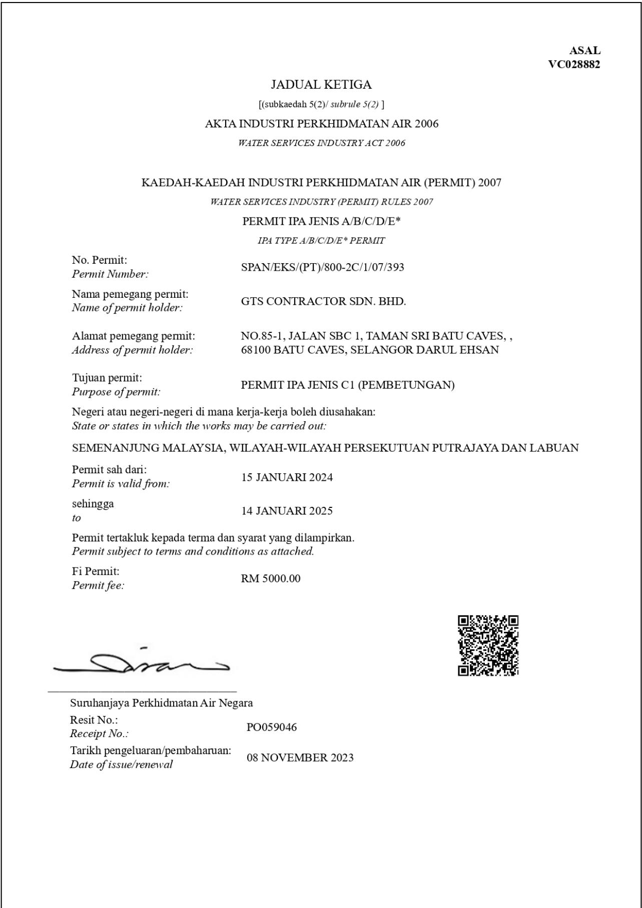

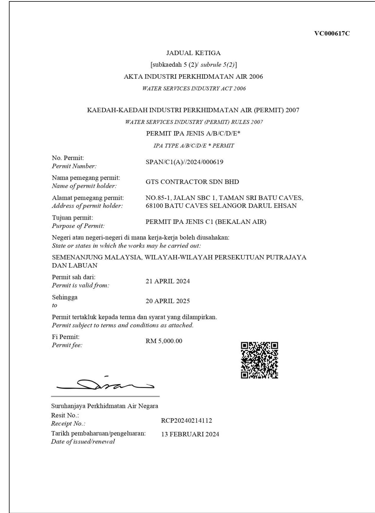

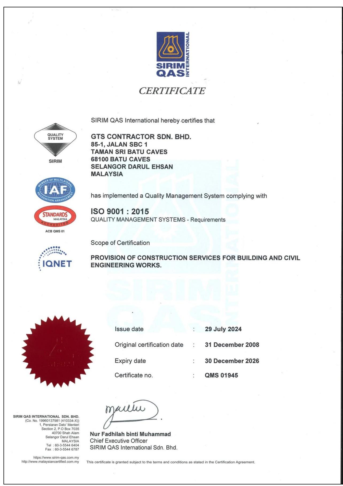

# Certificate

SIRIM QAS International has issued an IQNET recognized certificate that the organization:

# GTS CONTRACTOR SDN.BHD.

85- 1Jalan SBC1Taman Sri Batu Caves68100 Batu CavesSelangor Darul EhsanMalaysia

has implemented and maintains a Quality Management Systems

for the following scope:

Provision of construction services for building and civil engineering works.

which fulfils the requirements of the following standard:

# ISO9001:2015

Issued on: 29 July 2024First issued on: 31 December 2008Expires on: 30 December 2026

Registration Number: MY - QMS 01945

Alex Stoichitoiu President of IQNET

Nur Fadhilah Muhammad Chief Executive Officer of SIRIM QAS International Sdn.Bhd.

This attestation is directly linked to the IQNET Members original certifcate and shall not be used as a stand- alone document.

IQNET Members: AENCER Spain AFNOR Certification France APCER Portugal CCC Cyprus CISQ Italy CQC China CQM China COs Czech Republic Crocert Croatia DQS Holding GmbH Gemany EAGLE Certification Group USA FCAV Brazil FONDONORMA Venezuela ICONTEC Colombia ICS Bosnia and Herzegovina Inspecta Sertifointiny Finland INTECO Costa Rica IRAM Argentina JQA Japan KFQ Korea LSQAUruguay MIRTEC Greece MSZT Hungary Nemko AS Norway NSAl Ireland NYCE- SIGE Mexico PCBC Poland Quality Austria Austria SIl Israel SIQ Slovenia SIRIM QAS International Malaysia SQSWitzerland SRAC Romania TSE Turkey YUQSGerbia

The List of IQNET Members is valid at the time of issue of this certifcate. Updated information is available under www.iqnet- certifcation com

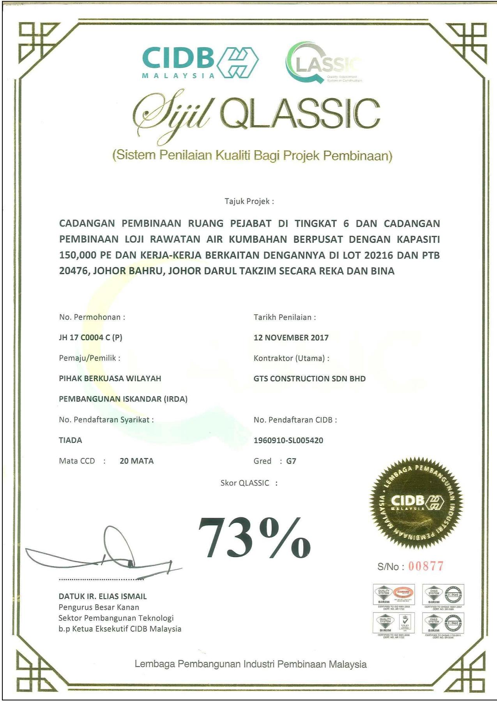

<table><tr><td colspan="4">No. Permothonan : JH 17 C0004 C (P)</td></tr><tr><td colspan="4">Projek:</td></tr><tr><td colspan="4">CADANGAN PEMBINAAN RUANG PEJABAT DI TINGKAT 6 DAN CADANGAN PEMBINAAN LOTI KAWATAN AIR KUMBAHAN BERPUSAT DENGAN KAPASITI 150,000 PE DAN KERJA-KERJA BERKAITAN DENGANNYA DI LOT 20216 DAN PTB 20476, JOHOR BAHRU, JOHOR DARUL TAKZIM SECARA REKA DAN BINA</td></tr><tr><td colspan="3">Nilai Kontak Projek: RM 95,244,708.44</td><td>Gross Floor Area (GFA): 16,900 m²</td></tr><tr><td colspan="3">Pemaju / Pemilik:</td><td>Kontraktor Utama:</td></tr><tr><td colspan="3">PIHAK BERKUASA WILAYAH</td><td>GTS CONSTRUCTION SDN BHD</td></tr><tr><td colspan="3">PEMBANGUNAN ISKANDAR (IRDA)</td><td>NO 85-1, JALAN SBC 1</td></tr><tr><td colspan="3">G-01, BLOCK 8, DANGA BAY</td><td>TAMAN SRI BATU CAVES</td></tr><tr><td colspan="3">JALAN SKUDAI</td><td>68100 BATUS CAVES</td></tr><tr><td colspan="3">80200 JOHOR BAHRU</td><td>SELANGOR DARUL EHSAN</td></tr><tr><td colspan="3">JOHOR</td><td></td></tr><tr><td colspan="3">No. Pendaftaran Syarikat:</td><td>No. Pendaftaran CIDB : 1960910-SL005420 Gred : G7</td></tr><tr><td colspan="3">TIADA</td><td></td></tr><tr><td colspan="3"></td><td>Pengurus Projek / Superintending Officer (SCO: EN. MOHD AZMIN BIN ZAINI)</td></tr><tr><td>Arkitek</td><td colspan="3">SHAHRANI CONSULT S ON BHD</td></tr><tr><td>Jurutera Struktur</td><td colspan="3">MUDA CONSULT S ON BHD</td></tr><tr><td>Jurutera NI &amp;amp; E</td><td colspan="3">AD ASSOCIATES S ON BHD</td></tr><tr><td colspan="3">Pegawai Penilai (assessor):</td><td>Wakil Kontraktor/ Pemaju/ Pemilik:</td></tr><tr><td colspan="3">1. EN. AHAAS ALHAKIM BIN DESA</td><td>EN. INNAZ EZWAN BIN INDAH</td></tr><tr><td colspan="3">2. EN. MOHD NOR KHAIRUL BIN TAPA</td><td></td></tr><tr><td colspan="3">Tarikh Penilaian:</td><td>Skop Penilaian:</td></tr><tr><td colspan="3">12 NOVEMBER 2017</td><td>1. Architectural Works</td></tr><tr><td colspan="3"></td><td>2. External Works</td></tr><tr><td colspan="3"></td><td>3. Basic M&amp;amp;E Fittings</td></tr><tr><td colspan="4">Cuaca: BAIK</td></tr><tr><td colspan="4">Keterangan Penilaian:</td></tr><tr><td colspan="4">Sebanyak 30 sample telah di nilai. Hanya penilaian untuk Architectural Works, External Works dan Basic M&amp;amp;E Fittings sahaja dilakukan. Structural Works dan M&amp;amp;E Works tidak dinilai bagi maksud penilaian ini.</td></tr><tr><td colspan="4">Sampling dan penilaian adalah berdasarkan kepada Construction Industry Standard (CIS) 7:2006 Quality Assessment System For Building Construction Working dikelujarkan oleh CIDB.</td></tr><tr><td colspan="4">Peralatan yang digunakan semasa penilaian dijalankan adalah seperti berikut:-
a) Spirit Level (1.2 m length)      e) Tapping Rod
b) Steel Measuring Tape (8m)      f) Steel Gauge
c) Long Measuring Tape (30m)      g) Steel Wedge
d) L-square (24&quot; X 12&quot;)</td></tr><tr><td colspan="4">Pecahan Markah:</td></tr><tr><td colspan="4">Pecahan markah penilaian untuk Architectural Works, External Works dan Basic M&amp;amp;E Fittings bagi projekt ini adalah seperti di mikasurat 2.</td></tr></table>

No.Permohonan : JH 17 C0004 C (P)  

<table><tr><td>ITEM</td><td>ELEMENT</td><td>TOTAL 
WEIGHTAGE</td><td>BREAKDOWN 
WEIGHTAGE</td><td>SCORE (%)</td></tr><tr><td>A</td><td>ARCHITECTURAL WORKS</td><td>75.63</td><td></td><td>54.72</td></tr><tr><td>1</td><td>Internal Finishes</td><td>65.12</td><td></td><td></td></tr><tr><td>1.1</td><td>Door</td><td></td><td>18.60</td><td>11.10</td></tr><tr><td>1.2</td><td>Internal Wall</td><td></td><td>18.60</td><td>11.42</td></tr><tr><td>1.3</td><td>Ceiling</td><td></td><td>6.98</td><td>5.26</td></tr><tr><td>1.4</td><td>Door</td><td></td><td>6.98</td><td>5.26</td></tr><tr><td>1.5</td><td>Window</td><td></td><td>6.98</td><td>4.82</td></tr><tr><td>1.6</td><td>Fixtures (Internal)</td><td></td><td>6.98</td><td>5.32</td></tr><tr><td>2</td><td>Roof</td><td>11.63</td><td></td><td>9.69</td></tr><tr><td>3</td><td>External Wall</td><td>11.63</td><td></td><td>8.72</td></tr><tr><td>4</td><td>Apron &amp;amp; Perimeter Drain</td><td>4.65</td><td></td><td>3.72</td></tr><tr><td>5</td><td>Material &amp;amp; Functional Test</td><td>6.98</td><td></td><td>6.98</td></tr><tr><td>B</td><td>EXTERNAL WORKS</td><td>16.81</td><td></td><td>12.61</td></tr><tr><td>C</td><td>BASIC M&amp;amp;E FITTINGS</td><td>7.56</td><td></td><td>5.96</td></tr><tr><td colspan="4">QLASSIC SCORE (%)</td><td>73.29</td></tr></table>

Kesimpulan: QLASSIC SCORE : 73%

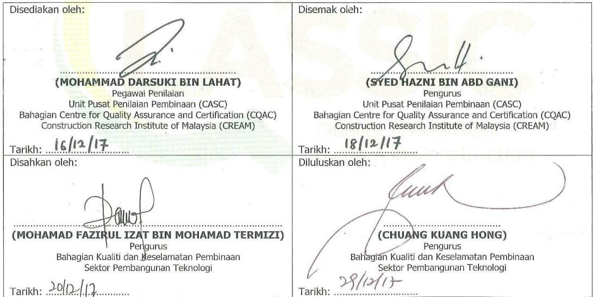

Not: GLASSIC is a method to evaluate the quality of workmanship and finishes of building project against approved standard and the assessment is based on random sampling and statistical approach. CIDB Malaysia is not liable for reliance of this report for whatever purposes. The project architect and/or the project engineer at all time responsible for the quality of construction according to the approved practices, specifications and drawings.

Rujuk Pengiraan Skor QLASSIC Di Lampiran 1

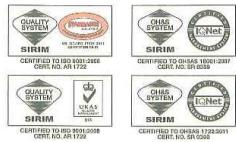

# Certificate of Achievement

This is to Certify that

GTS CONTRACTOR SDN. BHD. 1960910- SL005420 Grade Registered : G7

has been evaluated according to the SCORE criterias set by the Board and has achieved the rating of

(3 Star)

for the year

2023

(Valid until 19/10/2025)

Good management and technical capabilities, compliance to best practices and good project management.

#

SC087495

Adalah dengan ini diperakui bahwa kontraktor yang dinyatakan di bawah ini telah berdaftar dengan Johor Centre for Construction Development (JCCD). Pendaftaran ini adalah tertakluk kepada syarat- syarat yang telah ditetapkan bersama sijil perakuan ini.

No. Pendaftaran : JCCD/SK/24/11/00004  Nama Kontraktor : GTS CONTRACTOR SDN BHD  Alamat Berdaftar : NO.85- 1, JALAN SBC 1, TAMAN SRI BATU CAVES, 68100 BATU CAVES, SELANGOR

Daerah NON- JOHOR

Gred

G7

Kategori Pengkhususan

B

B03, B04, B11  CE01, CE02, CE07, CE11, CE19, CE20, CE21, CE22, CE30, CE31, CE32, CE34, CE42, CE43  M15, M19

No. Pendaftaran MOF

Kod Bidang MOF

020101, 020103, 020201, 020301, 020401, 020501, 060501, 090101, 100101, 110201, 110301, 110402, 110403, 130101, 130202, 220201, 220301, 220402, 220503, 220504, 220507, 220901, 221010, 221110, 221401, 221503

Pegawei Syarikat Yang Ditauliahkan  RUSLI BIN ABDUL RAHMAN

No. Kad Pengenalan  641030055329

Tarikh Mula Berkuatkuasa

Tarikh Tamat Tempoh Perakuan

Perakuan ini hendaklah diperbaharui setiap tahun, selewatnya- lewatnya 30 hari sebelum tarikh tamat tempoh.

YAB DATUK ONN HAFIZ BIN GHAZI

JOHOR CENTRE FOR CONSTRUCTION DEVELOPMENT  (JCCD)

11/01/2024 07:37:32

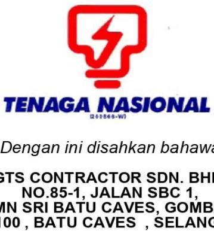

Telah berdaftar dengan Tenaga Nasional Berhad sebagai Pembekal & Kontraktor Perkhidmatan di bawah kategori yang tercatat dalam sijil ini

020101, 020103, 020201, 020301, 020302, 020401, 020501, 060501, 090101, 100101, 110201, 110301, 110402, 110403, 130101, 130202, 220201, 220301, 220401, 220503, 220504, 220507, 221010, 221110, 221401, 221503, 221901***

BUTIR- BUTIR PENDAFTARAN NO PENDAFTARAN TNB : 3009610 NO PENDAFTARAN SYARIKAT : 288361M NO SIJIL KEMENTERIAN KEWANGAN : K11701219483722747 TEMPOH SAHLAKU SEHINGGA : 06.03.2027 TARA F : BUMIPUTERA LAIN- LAIN PENDAFTARAN : SPKK0000 /2024,PPK0000 /2024,PKK0000/2024.

Tarikh tempoh sahlaku pendaftarani adalah tertakluk kepada tempoh sahlaku Pendaftarani sijil- sijil Komentarian Kewangan(KC),Lembaga Pombangunan Industri Pombinan Malaysia (CIDB) dan sijil- sijil professional yang berkaitan.

Amir Mahmod bin Abdullah Ketua Pegawai Perolehan Bahagian Procurement & Supply Chain Tenaga Nasional Berhad

Tarikh kelulusan : 19.04.2024

Ini adalah cetakan komputer dan tidak memerlukan tandatangan.

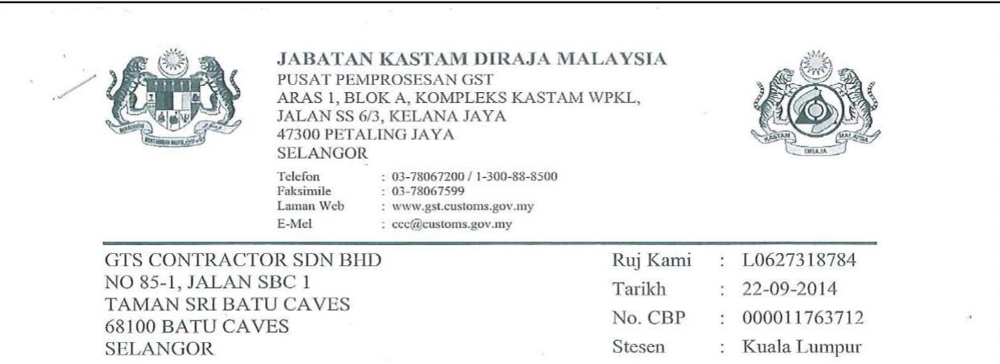

Tuan,

# KEPUTUSAN PERMOHONAN PENDAFTARAN DI BAWAH SEKSYEN 21 AKTA CUKAI BARANG DAN PERKHIDMATAN: PENDAFTARAN NORMAL

Perkara di atas dirujuk. Dimaklukan bahawa permohonan tuan telah dihuloksan. Maklumat pendaftar an akaun tuan adalah seperti berikut:

Tarikh Permohonan :18- 09- 2014 Tarikh Kuatkuasa Pendaftaran :01- 04- 2015 Asas Perakaunan :Asas Akruan Tempoh Bercukai :Bulanan Tempoh Bercukai Pertama :01- 04- 2015 hingga 30- 04- 2015 Tarikh Akhir Mengemukakan Penyata dan Bayaran :31- 05- 2015 Tempoh Bercukai Kedua :01- 05- 2015 hingga 31- 05- 2015 Tarikh Akhir Mengemukakan Penyata dan Bayaran :30- 06- 2015 Tempoh Bercukai Berikutnya : Setiap Bulanan Tarikh Akhir Mengemukakan Penyata dan Bayaran : Hari terakhir bulan berikutnya setelah tamat tempoh bercukai

Stesen Mengawal & Alamat :Stesen Kuala Lumpur Pengarah Kastam Negeri WPKL Kompleks Kastam WPKL 22,Jalan SS 6/3 Kelana Jaya 47301 Pemaling Jaya

Sebagai orang yang telah didaftarkan di bawah Akta Cukai Barang dan Perkhidmatan 2014 tuan dikehendaki mematuhi kehendak Akta Cukai Barang dan Perkhidmatan 2014 dan Peraturan- Peraturan Cukai Barang dan Perkhidmatan seperti di LAMPIRAN I.

Tuan boleh melayari laman web Cukai Barang dan Perkhidmatan atau menghubungi pejabat ini seperti maklumat yang tertera di atas untuk keterangan dan.

Sekian, terima kasih.

"BERKHIDMAT UNTUK NEGARA"

Ketua Pengarah Kastam Jabatan Kastam Diraja Malaysia

# CORPORATE STRUCTURE & MANAGEMENT

# CORPORATE STRUCTURE AND MANAGEMENT

Board of Director & Management Teams

# The Board of Director:

# 1. HAJI RUSMANI BIN ABDUL RAHMAN

\~ Position : MANAGING DIRECTOR \~ Identify Card No. : 580720- 05- 5039 \~ Qualification : Diploma in Surveyor (UITM) BSc. (Hons) in Surveyor (UITM) MSc. ICPM (UITM) \~ Professional Affiliation : Member of Institution of Surveyors, Malaysia (ISM) \~ Experience : 13 Years experiences as Land Surveyor at FELDA 20 Years experiences in Construction Industry.

# 2. RUSLI BIN ABDUL RAHMAN

\~ Position : DIRECTOR \~ 1/ C No. : 641030- 05- 5329 \~ Qualification : Diploma in Civil Engineering (UTM) Bachelor of Accounting Diploma in Agribusiness Master of Management (UM) \~ Professional Affiliation : Member of Malaysian Institute of Accountants (MIA) \~ Experience : 15Years experiences in Construction Industry 8 Years experiences in Accounting

# 3. IR. HI. SULIMAN BIN BAKAR

\~ Position : TECHNICAL DIRECTOR \~ 1/ C No. : 620710- 01- 5428 \~ Qualification : B. Eng (Hons) in Civil Engineering (UK) Diploma in Civil Engineering (UTM) \~ Professional Affiliation : Member of Institution of Engineer, Malaysia \~ Experience : 25 Years experiences in Construction Industry.

# CORPORATE STRUCTURE AND MANAGEMENT

Project Management Teams

# The Technical Management Team:

# 1. ABU BAKAR BIN MOHD DAN

\~ Position : SENIOR PROJECT MANAGER \~ I / C No. : 710301- 01- 6011 \~ Qualification : Master of Environmental Engineering Bachelor of Chemical Science \~ Experience : 20 Years experiences in Construction Industry

# 2. AHMAD RUSTAM BIN MOHAMAD RIDZUAN

\~ Position : PLANT MANAGER \~ I / C No. : 760915- 08- 5519 \~ Qualification : Bachelor of Science In Applied Chemistry (UiTM) \~ Experience : 10 Years experiences in Construction Industry

# 3. KHAIRUL BIN HASHIM

\~ Position : PROJECT ENGINEER (MECHANICAL & ELECTRICAL) \~ I / C No. : 810530- 04- 5375 \~ Qualification : Bachelor of Engineering Material Mechanical (UTM) \~ Experience : 15 Years experiences in Construction Industry.

# 4. MUHAMMAD AMIR BIN RUSMANI

\~ Position : SUPERVISOR \~ I / C No. : 970921- 14- 6125 \~ Qualification : Diploma in Civil Engineering (Politeknik Sultan Salahuddin Abdul Aziz Shah) \~ Experience : 2 Years experiences in Construction Industry.

# 5. NORZAKI BIN PATHIROON

\~ Position : SITE AGENT \~ I / C No. : 661013- 01- 5737 \~ Qualification : Inst. Tech. Negeri - Mechanical Engineering \~ Experience : 20 Years experiences in Construction Industry.

# CORPORATE STRUCTURE AND MANAGEMENT

Project Management Teams

# The Technical Management Team (continued):

# 6. MAD JALA BIN SALIMIN

6. MAD JALA BIN SALIMIN- Position : SITE SUPERVISOR- I / C No. : 720303-10-5113- Qualification : Dip. In Computer Science (UITM) (1997)- Experience : 20 Years experiences in Construction Industry.

# 7. MUHAMMAD KHASSAF BIN KHALID

7. MUHAMMAD KHASSAF BIN KHALID- Position : SITE SUPERVISOR- I / C No. : 830516-05-5399- Qualification : Certificate. In Civil Engineering- Experience : 10 Years experiences in Construction Industry.

# 8. FATHURASIDIN BIN MOHAMED HAFEZ

8. FATHURASIDIN BIN MOHAMED HAFEZ- Position : MACHINE OPERATOR- I / C No. : 740530-08-6643- Qualification : SPM- Experience : 20 Years experiences in Operating Machine

# 9. RAMILI BIN OMAR

9. RAMILI BIN OMAR- Position : EXCAVATOR OPERATOR- I / C No. : 770106-04-5639- Qualification : SPM- Experience : 15 Years experiences in Operating Excavator.

# 10. MOHD SALIM BIN KHASBULLAH

10. MOHD SALIM BIN KHASBULLAH- Position : EXCAVATOR MECHANIC- I / C No. : 640330-01-5789- Qualification : MCE- Experience : 8 Years experiences with Tractor Malaysia. 18 Years experience with GTS Contractor Sdn. Bhd.

# CORPORATE STRUCTURE AND MANAGEMENT

Project Management Teams

The Technical Management Team (continued):

# 11. IZZUDIN BIN RUSLI

$\sim$  Position : HEAVY MACHINERY OPERATER $\sim$  I / C No. : 970915- 10- 5335 $\sim$  Qualification : Diploma Kemahiran Malaysia - Teknologi AutomotifSijil Kemahiran Malaysia - Penyelenggaraan Jentera Tolak Tanah

# CORPORATE STRUCTURE AND MANAGEMENT

Project Management Teams

# The Finance & Administration Team:

# 1. NORMALA BINTI HASSAN

\~ Position : ADMINISTRATION & FINANCE MANAGER \~ I / C No. : 750922- 02- 6120 \~ Qualification : BSc. Information Technology (UUM, Sintok, Kedah) (1999) \~ Experience : 20 Years experiences in Administration & Finance.

# 2. MOHD DANIEL DARWISY BIN MOHD ZUKI

\~ Position : ACCOUNT EXECUTIVE \~ I / C No. : 951217- 10- 6185 \~ Qualification : Diploma in Management Technology (Accountancy) \~ Experience : 2 Years experiences in Accounting

# 3. NORAIMY NADIYAH BINTI WAHAB

\~ Position : ADMIN EXECUTIVE \~ I / C No. : 851105- 11- 5070 \~ Qualification : Diploma Office Administration (UUM) \~ Experience : 10 Years experiences in Administration

# 4. AHMAD ZAHIERUDDIN BIN ISMAIL

\~ Position : ADMIN & ACCOUNT ASSISTANT \~ I / C No. : 920119- 14- 5883 \~ Qualification : Diploma Perbankan Islam & Kewangan \~ Experience : 6 Years experiences

# CORPORATE STRUCTURE AND MANAGEMENT

Project Management Teams

# The Procurements Team:

# 1. NORIMAH BINTI YUSOFF

\~ Position : CONTRACT MANAGER CUM QUANTITY SURVEYOR \~ I/ C No. : 810922- 11- 5248 \~ Qualification : Diploma In Quantity Surveyor (Politeknik) \~ Experience : 13 Years experiences in Construction Industry.

# 2. INTAN MAZHALEEDA BINTI MAZLAN

\~ Position : QUANTITY SURVEYOR \~ I/ C No. : 940314- 11- 5506 \~ Qualification : Diploma In Quantity Surveyor (Politeknik) \~ Experience : 3 Years experiences in Construction Industry.

# 2. HAZLINA BINTI MOHD YUSOFF

\~ Position : ASSISTANT QUANTITY SURVEYOR \~ I/ C No. : 730802- 03- 5482 \~ Qualification : Cert. In Civil Engineering (Construction) (PKB Kelantan) (1994) \~ Experience : 20 Years experiences in Construction Industry.

# TRADE FACILITIES

Supplier Trade Facilities

<table><tr><td>NO</td><td>NAME</td><td>MATERIAL SUPPLIED / SERVICE</td><td>CREDIT LIMIT (RM)</td></tr><tr><td>1</td><td>Archin Trading</td><td>Transport</td><td>100,000.00</td></tr><tr><td>2</td><td>Yulita Parts Trading (M) SB</td><td>Machineries Parts</td><td>50,000.00</td></tr><tr><td>3</td><td>Yu Lik Diesel Pump Service</td><td>Petrol and Diesel</td><td>100,000.00</td></tr><tr><td>4</td><td>Transcomas Machinery SB</td><td>Heavy machineries rental</td><td>50,000.00</td></tr><tr><td>5</td><td>K.S. Kim Sui Engineering SB</td><td>Machineries Rental</td><td>100,000.00</td></tr><tr><td>6</td><td>Unitaphax Equipment</td><td>Machineries Rental</td><td>50,000.00</td></tr><tr><td colspan="4">Building Material</td></tr><tr><td>1</td><td>Sy. Bumi Hardware</td><td>Constructions Materials</td><td>80,000.00</td></tr><tr><td>2</td><td>Sy. Poh Tze Sdn. Bhd</td><td>Hardware Material</td><td>100,000.00</td></tr><tr><td>3</td><td>V-Loc Products</td><td>Hardware Material</td><td>300,000.00</td></tr><tr><td>4</td><td>Far East Worldwide Trading</td><td>Hardware Material</td><td>200,000.00</td></tr><tr><td>5</td><td>Sykt. Hong Seng</td><td>Hardware Material</td><td>100,000.00</td></tr><tr><td colspan="4">Timber &amp;amp; Plywood</td></tr><tr><td>1</td><td>E&amp;amp;O Trading Sdn. Bhd</td><td>Constructions Materials</td><td>100,000.00</td></tr><tr><td>2</td><td>Chuan Yew Metal</td><td>Constructions Materials</td><td>100,000.00</td></tr><tr><td colspan="4">Piling</td></tr><tr><td>1</td><td>SB Geotechnic</td><td>Piling &amp;amp; Sheet Piling Works</td><td>500,000.00</td></tr><tr><td>2</td><td>ECPI</td><td>Piling &amp;amp; Sheet Piling Works</td><td>500,000.00</td></tr><tr><td colspan="4">Concrete</td></tr><tr><td>1</td><td>Lafarge Supermix Concrete</td><td>Concrete</td><td>100,000.00</td></tr><tr><td>2</td><td>Ready Mix Concrete</td><td>Concrete</td><td>500,000.00</td></tr><tr><td>3</td><td>YNH Ready Mix</td><td>Concrete</td><td>200,000.00</td></tr><tr><td>4</td><td>Tasek Concrete Sdn Bhd</td><td>Concrete</td><td>100,000.00</td></tr><tr><td colspan="4">Quarry</td></tr><tr><td>1</td><td>Ames Markerting Sdn. Bhd</td><td>Quarry Product</td><td>500,000.00</td></tr><tr><td>2</td><td>C.K.D Enterprise</td><td>Earth Supplier</td><td>100,000.00</td></tr></table>

# THE ASSOCIATE MANAGEMENT TEAMS

Integrated Consulting Management & Supervision.

# The Project Development Supporting Team:

1) Ir. Suliman Bin Bakar  
2) Ir. Paramjit Singh  
3) Azize Bin Abdullah  
4) Mohd Amri Bin Yunus  
5) Hamdan Bin Abd. Rahman

- C & S Engineer.  
- M & E Engineer.  
- Contract Manager.  
- Interior Design Principal.a  
- Interior Design

# The Construction Team:

1) Marzuki Bin Che Omar  
2) Aziz Bin Hussain  
3) Abdul Razak Bin Rahman  
4) Hisham Bin Saleh  
5) Harun Bin Ghani

- Site Manager  
- Site Coordinator  
- Site Coordinator  
- Site Supervisor  
- Site Supervisor

# Personal Consultants:

1) Zulkifli Bin Ismail (Chartered Architect)  
2) Amiruddin Bin Ahmad (Chartered Architect)  
3) Ir. Muhammad Yatin Bin Ismail (Chartered C & S Engineer)  
4) Ir. Zailani Bin Hj. Johari (Chartered M & E Engineer)  
5) Medalishah Bin Mohamad (Interior Designer)  
6) Pn. Naimah Binti Hj. Bidin (Interior Designer)

# Panel Sub-Contractors & Suppliers

1) Leong Kee Chong Piling & Construction Sdn. Bhd. (Piling Contractor)  
2) Chang Cherng Trading (Demolition Work Specialist)  
3) Cahaya Klang Sdn. Bhd. (Civil & Building Construction)  
4) Husnul Niaga (M) Sdn. Bhd. (Civil & Building Construction)  
5) Wisma Mosaic (M) Sdn. Bhd. (Civil & Building Construction)  
6) Ban Ghee Engineering Sdn. Bhd. (Civil & Structural Construction)  
7) Gumi Asli Elektrikal Sdn. Bhd. (Mechanical & Electrical Construction)  
8) Frontec (M) Sdn. Bhd. (Mechanical & Electrical Construction)  
9) Cempaka Kreatif Sdn. Bhd. (Interior Design Construction)  
10) Intreno Sdn. Bhd. (Interior Design Construction)  
11) Universal Granite & Marble Sdn. Bhd. (Tiling Constructor)  
12) Wong Seng Aluminium Trading (Ceiling Construction)  
13) LAFARGE (Supermix Concrete)  
14) RMC (Ready Mixed Concrete)  
15) UPC (Unipati Concrete Sdn. Bhd.)  
16) CGE Construction Sdn. Bhd. (Civil & Structural Construction)  
17) SDE Bina (Civil & Building Construction)  
18) Tekad Nusantara Sdn. Bhd. (Civil & Structural Construction)  
19) RAR Alam Bina Sdn. Bhd. (Civil & Structural Construction)

# THE FINANCE FACILITIES

# THE FINANCE FACILITIES

Banking Facilities

# 1. BANK PERUSAHAAN KECIL & SEDERHANA MALAYSIA BERHAD (SME BANK BHD.)

Type of Facilities:

a. Revolving Credit-I (RC-i) - RM 1,000,000.00

TOTAL BANK FACILITIES AMOUNT - RM 1,000,000.00

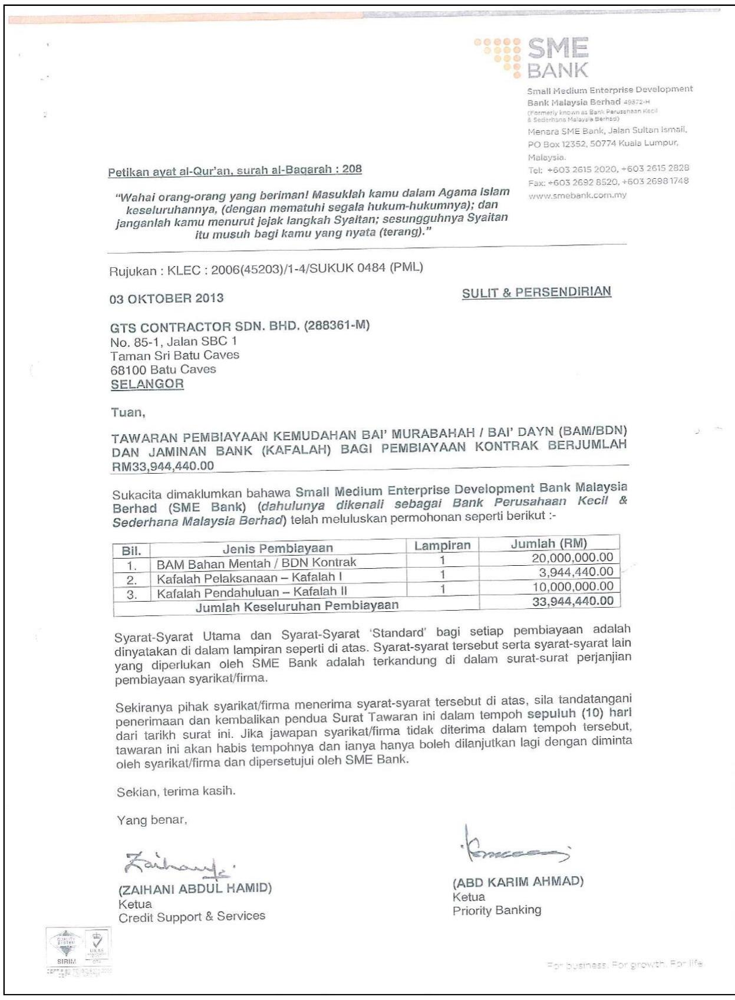

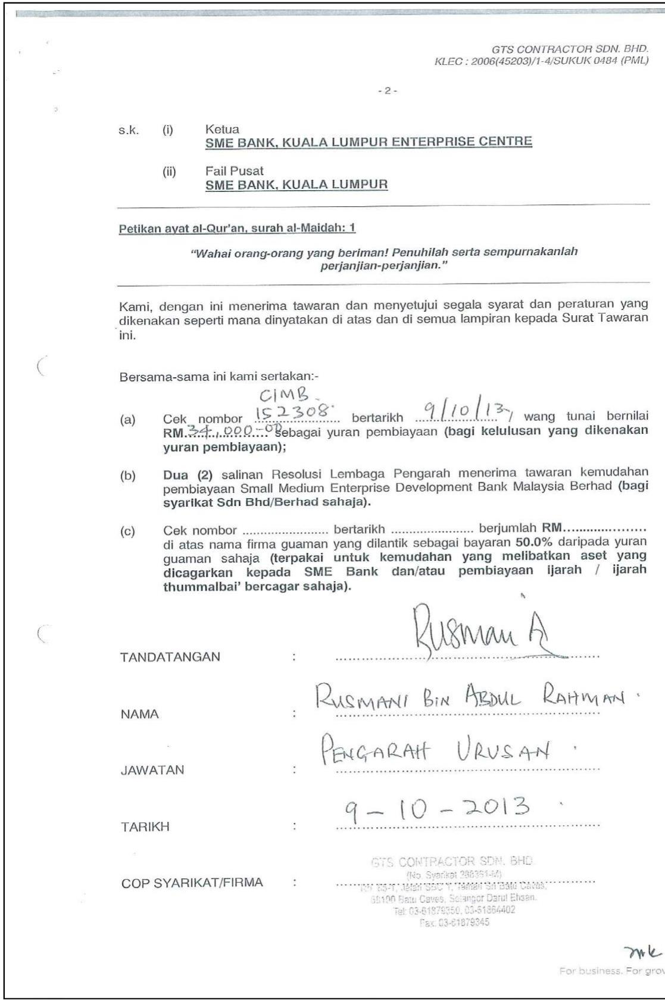

THE COMPANY MACHINERIES & EQUIPMENTS

# THE COMPANY MACHINERIES & EQUIPMENTS

List of Machineries & Equipments.(All owned)

# The List of Machineries for Constructions and Earthworks:

1. Long Boom Excavator 2 units  
2. Excavator 04 & 12 8 units  
3. Mini Excavator 4 units  
4. CA 15 Dynapac Roller Vibrator 1 unit  
5. 25 Tonne Roller Vibrator- Bomag 2 units  
6. 5 Tonne Roller Vibrator 2 units  
7. Plate Compactor 4 units  
8. Backhoe 1 units  
9. 10 Wheeler Dump Truck 2 units  
10. Robin Water pump 15 units  
11. Generator Set 250 KVA 1 units  
12. Generator Set 30 KVA 2 units  
13. Portable Generator Set 5 units  
14. Sampling Drilling Machine 1 unit  
15. Air Compressor 2 units  
16. Komatsu Motor Grader 1 unit  
17. Caterpillar Dozer - D5 2 units  
18. 4 Wheeler Dumper 1 units  
19. Komatsu PC 400-5 cum with vibro & pre-bore 1 unit

# THE COMPANY MACHINERIES & EQUIPMENTSL

List of Machineries & Equipments.(All owned)

# The List of Equipments:

# The List of Construction Facilities:

1. Portable Cabin 20' 8' 5 units  
2. Tower Crane 1 unit  
3. Sheet Piling 700 pairs  
4. Scaffolding

# The List of Survey Equipment :

1. Total Station 2 units  
2. Geodimeter 510N 1 unit  
3. Electronic Distance Measurement (EDM) 1 unit  
4. Theodolite - Topcon 10s 2 units  
5. Leveling - Nikon 6 units  
6. Drafting Computer & Plotter 1 unit

# The List of On Site Transportation :

1. Mitsubishi Pajero 2 units  
2. Toyota Hilux 3 units  
3. 1 Tonne Lorry Tipper 2 units  
4. 5 Tonne Lorry 1 unit  
5. Toyota Fortuner 3 unit

# WORKINGEXPERIENCES

# WORKING EXPERIENCE

List of Current Project

<table><tr><td>NO.</td><td>PROJECT TITLE</td><td>PROJECT OWNER</td><td>MAIN CONTRACTOR</td><td>CONTRACT AMOUNT (RM)</td><td>START DATE</td><td>FINISH DATE</td></tr><tr><td>1</td><td>Cadangan Kerja-Kerja Naiktaraf Loji Kumbahan Dan Kerja Perpaipan Serta Kerja-Kerja Lain Yang Berkaitan Di Kem Sungai Ara, Pulau Pinang</td><td>Kementerian Pertahanan Malaysia</td><td>GTS Contractor Sdn Bhd</td><td>11,828,800.00</td><td>19/09/2024</td><td>18/09/2025</td></tr><tr><td>2</td><td>Proposed Rectification Works At Network Pumping Station (Asset No. 567), Located At Kuala Sawah, Seremban, Negeri Sembilan.</td><td>Indah Water Konsortium (IWK)</td><td>GTS Contractor Sdn Bhd</td><td>20,000,000.00</td><td>23/09/2024</td><td>22/03/2026</td></tr><tr><td>3</td><td>Cadangan Membina Rangkaian Paip Pembetungan Bagi Kawasan Si Rusa, Daerah Port Dickson, Negeri Sembilan Darul Khusus</td><td>Suruhanjaya Perkhidmatan Air Negara (SPAN)</td><td>GTS Contractor Sdn Bhd</td><td>51,991,773.00</td><td>14/9/2015</td><td>21/02/2024</td></tr><tr><td>4</td><td>Membina Dan Menyiapkan Jalan Dari Kg Beng Ke Kg Raja Intan Suraya, Hulu Perak (Fasa 2 – Dari Kg Batu Reng Ke Intan Suraya)</td><td>Jabatan Kerja Raya Malaysia (JKR)</td><td>GTS Contractor Sdn Bhd</td><td>146,000,000.00</td><td>11/11/2021</td><td>10/11/2025</td></tr><tr><td>5</td><td>Cadangan Pembihaan Masjid Di Atas Lot 78982, Mukim Petaling, Daerah Petaling, Taman Saujana Puchong, Puchong, Selangor</td><td>Jawatankuasa Penaja Pembinaan Masjid Saujana Puchong (JKPPMSP)</td><td>GTS Contractor Sdn Bhd</td><td>8,620,800.00</td><td>15/7/2022</td><td>11/12/2024</td></tr><tr><td>6</td><td>The Proposed Construction And Completion Of Package 2 (CH0+000 To CH8+000) For Pipeline Works For The Water Supply Project From Kemaman, Terengganu To Gebeng, Pahang For The East Coast Economic Region Development Council (ECERDC)</td><td>East Coast Economic Region Development Council (ECERDC)</td><td>GTS Contractor Sdn Bhd</td><td>20,308,000.00</td><td>03/10/2022</td><td>06/09/2024</td></tr></table>

# WORKING EXPERIENCE

# List of Completed Project

<table><tr><td>NO.</td><td>PROJECT TITLE</td><td>PROJECT OWNER</td><td>MAIN CONTRACTOR</td><td>CONTRACT AMOUNT (RM)</td><td>START DATE</td><td>FINISH DATE</td></tr><tr><td>1</td><td>Cadangan Pembimaan Sebahagian Terowong Keluar Dan Masuk Menghubungkan Pembangunan Tun Razak Exchange Dengan Jalan Tun Razak Kuala Lumpur (Reka &amp;amp; Bina)</td><td>Dewan Bandaraya Kuala Lumpur (DBKL)</td><td>GTS Contractor Sdn Bhd</td><td>111,859,253.00</td><td>9/10/2019</td><td>20/06/2023</td></tr><tr><td>2</td><td>Cadangan Pembangunan Kompleks Masjid Di Atas PT 49967 Dan Sebahagian Plot 1, Taman Desa Sentosa, Teras Jernang 43650 Bangi, Dengkil, Selangor Darul Ehsan Untuk Tetuan Majlis Agama Islam Selangor</td><td>Majlis Agama Islam Selangor (MAIS)</td><td>GTS Contractor Sdn Bhd</td><td>9,306,991.81</td><td>2/5/2019</td><td>31/1/2022</td></tr><tr><td>3</td><td>Stage 2- The Proposed Rectification Works of Sewerlines And Network Pump Station (22,000 PE – Zone 1) Located At Kompleks Pendicikan Bandar Enstek, Seremban, N. Sembilan</td><td>Indah Water Konsortium (IWK)</td><td>GTS Contractor Sdn Bhd</td><td>2,695,105.00</td><td>3/10/2019</td><td>19/12/2020</td></tr><tr><td>4</td><td>Skim Bekalan Air Kerian, Perak Pakej 3 – Memberkal, Memasang Dan Mentauliah Paip Air Mentah Dari Muka Sauk Bagan Serai Ke Loji Rawatan Air Sungai Rawa Dan Paip Air Terawat Dari Loji Rawatan Air Sungai Rawa Ke Kolam Air Sedadla Sungai Bogak Bergarispusat Nominal 900mm Serta Kerja-Kerja Berkaitan (“Works”)</td><td>Pengurusan Aset Air Berhad (PAAB)</td><td>GTS Contractor Sdn Bhd</td><td>21,299,533.50</td><td>8/1/2018</td><td>30/9/2019</td></tr><tr><td>5</td><td>Cadangan Pembimaan Loji Rawatan Air Kumbahan Berpusat Dengan Kapasiti 150,000PE dan Kerja-Kerja Berkatitan Dengannya Di Lot 20216 dan PTB 20476, Johor Bahru, Johor Darul Takzim Secara Reka &amp;amp; bina 
‘-Operation of The CSTP for 2 Months Prior Handing-Over To Majlis Bandaraya Johor Bahru (MBJB)</td><td>Pihak Berkuasa Wilayah Pembangunan ISKANDAR (IRDA)</td><td>GTS Contractor Sdn Bhd</td><td>253,944.00</td><td>15/4/2019</td><td>31/8/2019</td></tr></table>

# WORKING EXPERIENCE

# List of Completed Project

<table><tr><td>NO.</td><td>PROJECT TITLE</td><td>PROJECT OWNER</td><td>MAIN CONTRACTOR</td><td>CONTRACT AMOUNT (RM)</td><td>START DATE</td><td>FINISH DATE</td></tr><tr><td>6</td><td>Cadangan Pembinaan Loji Rawatan Air Kumbahan Berpusat Dengan Kapasiti 150,000PE dan Kerja-Kerja Berkatitan Dengannya Di Lot 20216 dan PTB 20476, Johor Bahru, Johor Darul Takzim Secara Reka &amp;amp; Bina</td><td>Pihak Berkuasa Wilayah Pembangunan ISKANDAR (IRDA)</td><td>GTS Contractor Sdn Bhd</td><td>95,244,708.44</td><td>24/6/2013</td><td>31/3/2017</td></tr><tr><td>7</td><td>Cadangan Membina Jambatan Sg. Gombak Dari Jalan Raja Laut/ Jalan Dang Wangi Ke Jalan Kuching, Kuala Lumpur</td><td>Dewan Bandaraya Kuala Lumpur (DBKL)</td><td>GTS Contractor Sdn Bhd</td><td>31,872,541.20</td><td>14/6/2013</td><td>14/3/2017</td></tr><tr><td>8</td><td>Cadangan Pembinaan Jalan Harapan (14/4) Dari Bulatan Jalan Universiti Hiragga Ke Jalan Damansara, Petaling Jaya Untuk Majlis Bandaraya Petaling Jaya (Pakej 2)</td><td>Majlis Bandaraya Petaling Jaya (MBPJ)</td><td>GTS Contractor Sdn Bhd</td><td>10,305,766.20</td><td>29/7/2013</td><td>2/8/2017</td></tr><tr><td>9</td><td>Projek Mass Rapid Transit Lembah Klang : Jajaran Sungai Buloh - Kajang The Relocation Of Existing Water Pipeline For Maluri - Package SYB2 (Sub-Contract No.: SBK-A-17)</td><td>Mass Rapid Transit Corporation Sdn Bhd</td><td>MMC Gamuda KVMRT (PDP) Sdn Bhd (GTS Contractor Sdn Bhd as Sub-Contractor)</td><td>7,466,660.00</td><td>23/3/2012</td><td>25/5/2013</td></tr><tr><td>10</td><td>The Proposed Demolition And Site Clearance Works At Ex-Pudu Jail Land For Proposed Development On Lot 725, 726 &amp;amp; 727 Jalan Pudu/ Jalan Hang Tuah, Section 56, Bendar Kuala Lumpur, Known As Bukit Bintang City</td><td>UDA Holdings Berhad</td><td>GTS Contractor Sdn Bhd</td><td>2,400,700.00</td><td>10/1/2012</td><td>15/1/2013</td></tr><tr><td>11</td><td>Cadangan Meroboh Bangunan Sedia Ada Dan Membina Semula Bangunan Kolej Sains Dan Teknologi (Parcei B) Yang Mengandungi Bangunan Menara 10 Tingkat, Dewan Kuliah Dan Seminar Dan Kerja-Kerja Yang Berkaitan Di Atas Sebahagian Lot 4582 (UTM), Jalan Semarak, Mukim Setapak, Wilayah Persekutuan Kuala Lumpur</td><td>Universiti Teknologi Malaysia (UTM)</td><td>GTS Contractor Sdn Bhd</td><td>58,490,700.00</td><td>26/8/2008</td><td>19/1/2012</td></tr></table>

# WORKING EXPERIENCE

List of Completed Project

<table><tr><td>NO.</td><td>PROJECT TITLE</td><td>PROJECT OWNER</td><td>MAIN CONTRACTOR</td><td>CONTRACT AMOUNT (RM)</td><td>START DATE</td><td>FINISH DATE</td></tr><tr><td>12</td><td>Merekabentuk, Membina Dan Menviŋkan Projek Membaikpulih Loji Rawatan Kumbahan Awam (Pakej 2) di (i) Taman Kurnia Jaya, Pengkalan Chepa – Site 1 (ii) Perumahan Taman Bendahara, Pengkalan Chepa – Site 2 (iii) Projek Kasjaria, Bandar Baru Kubang Kerian, Kota bharu – Site 3 (iv) Taman Tanjung Chat, Jalan Long Yunus – Site 4 (v) Flat Buluh Kubu, Jalan Pintu Pong Kota Bharu – Site 5 (vi) Rumah Kedai Buluh, Jalan Pintu Pong, Kota Bharu – Site 6</td><td>Majaari Services Sdn Bhd</td><td>Konsortium GTS-Pakar-Atostech (GTS Contractor Sdn Bhd Selaku Leading JV)</td><td>13,768,650.00</td><td>12/4/2010</td><td>15/12/2011</td></tr><tr><td>13</td><td>Membina Dan Menyiapkan Balai Polis Sungai Buloh, Daerah Petaling, Selangor Darul Ehsan</td><td>Jabatan Kerja Raya Malaysia</td><td>GTS Contractor Sdn Bhd</td><td>14,488,936.60</td><td>16/4/2009</td><td>24/2/2011</td></tr><tr><td>14</td><td>Cadangan Mempertingkatkan Sistem Perparitan Di Jalan Tun Razak Berhampiran Dengan Kawasan Golf Diraja Selangor Hingga Ke Jalan Ampang Kuala Lumpur Secara “Design &amp;amp; Build” Kuala Lumpur, WP</td><td>Dewan Bandaraya Kuala Lumpur (DBKL)</td><td>GTS Contractor Sdn Bhd</td><td>20,000,000.00</td><td>15/9/2008</td><td>14/9/2010</td></tr><tr><td>15</td><td>Rehabilitation And Strengthening of Track And Associated Works Between Tampin And Batang Melaka Railway Station</td><td>Keretapi Tanah Melayu Berhad</td><td>GTS Contractor Sdn Bhd</td><td>38,500,005.00</td><td>01/02/06</td><td>05/09/08</td></tr><tr><td>16</td><td>Cadangan Membina Dan Menyiapkan Klinik Kesihatan 3 (KK3), Medan Maju Jaya, Selangor Darul Ehsan</td><td>Jabatan Kerja Raya Petaling</td><td>GTS Contractor Sdn Bhd</td><td>6,800,000.00</td><td>12/10/04</td><td>18/10/06</td></tr><tr><td>17</td><td>Kerja-Kerja Meroboh Bangunan Perhentian Bas Klang, Bandar Klang, Selangor Darul Ehsan</td><td>Majlis Perbandaran Klang</td><td>RAR Alam Bina Sdn Bhd</td><td>620,000.00</td><td>01/03/05</td><td>01/06/05</td></tr></table>

# WORKING EXPERIENCE

# List of Completed Project

<table><tr><td>NO.</td><td>PROJECT TITLE</td><td>PROJECT OWNER</td><td>MAIN CONTRACTOR</td><td>CONTRACT AMOUNT (RM)</td><td>START DATE</td><td>FINISH DATE</td></tr><tr><td>18</td><td>Kerja-Kerja Pemaikan Cerun Dan Lain-Lain Kerja Yang Berkaitan Di KM 99 (Seksyen 261) dan KM 101 (Seksyen 259)</td><td>Jabatan Kerja Raya Negeri Pahang</td><td>GTS Contractor Sdn Bhd</td><td>3,433,350.00</td><td>28/01/03</td><td>21/05/04</td></tr><tr><td>19</td><td>Cadangan Pusat Latihan Gabungan Pasukur Tempur (PLGPT) Tentera Darat Fasa II Gemas, Negeri Sembilan Untuk Kementerian Pertahanan Malaysia (Kerja-Kerja Sewerline Dan Water Reticulation)</td><td>Kementerian Pertahanan Malaysia</td><td>GTS Contractor Sdn Bhd</td><td>1,223,690.00</td><td>10/07/02</td><td>03/09/04</td></tr><tr><td>20</td><td>Cadangan Merekabentuk, Membina, Menyiapkan, Menguji Dan Mentauliahkan Loji Kumbahan Dan Teramasuk Kerja-Kerja Yang Berkaitan Bagi Fasa 1 &amp;amp; 2, Cadangan Pcrumahan Kakitangan Kerajaan / Awam Mukim Sungai Terap, Kinta, Perak Darul Ridzuan.</td><td>UDA Holdings Berhad</td><td>GTS Contractor Sdn Bhd</td><td>2,566,631.90</td><td>05/12/01</td><td>29/10/04</td></tr><tr><td>21</td><td>Cadangan Pembihaan Jalan Masuk Utama Dan Kerja-Kerja Berkaitan Di Kawasan Perindustrian Tanjung Langsat (Fasa 4A-2)</td><td>Johor Technopark Sdn Bhd</td><td>GTS Contractor Sdn Bhd</td><td>3,604,078.00</td><td>09/07/01</td><td>30/04/03</td></tr><tr><td>22</td><td>The Provision Of Slope Rehabilitation Works At Mysem Building Area</td><td>MIMOS Berhad</td><td>GTS Contractor Sdn Bhd</td><td>100,000.00</td><td>25/10/02</td><td>22/11/02</td></tr><tr><td>23</td><td>Sewage Treatment Plant For Cadangan Rancangan Perumahan Di Aas Lot 1201, 1203, 1197, 1006, 1204, 1205, 1216 And 1072 Mukim Cheras, Daerah Hulu Langat, Selangor Darul Ehsan</td><td>WWE Holding Berhad</td><td>GTS Contractor Sdn Bhd</td><td>540,000.00</td><td>01/11/00</td><td>01/03/01</td></tr></table>

# WORKING EXPERIENCE

# List of Completed Project

<table><tr><td>NO.</td><td>PROJECT TITLE</td><td>PROJECT OWNER</td><td>MAIN CONTRACTOR</td><td>CONTRACT AMOUNT (RM)</td><td>START DATE</td><td>FINISH DATE</td></tr><tr><td>24</td><td>Cadangan Menggantikan Saluran Paip Abestos Simen Berukuran 150mm Garispusat Kepada Saluran Besi Keluli Berukuran 300mm Garispusat Dari Simpang Batu Arang Menghala Ke Bandar Baru Kundang, Daerah Gombak, Selangor Darul Elsan</td><td>Jabatan Bekalan Air Selangor</td><td>GTS Contractor Sdn Bhd</td><td>942,378.00</td><td>26/12/00</td><td>10/07/01</td></tr><tr><td>25</td><td>Replacement of Pipes In The Reticulation System In The State of Johor For The Year 2000 – Package 10</td><td>Syarikat Air Johor</td><td>Ranhill Civil Sdn Bhd</td><td>118,000.00</td><td>22/02/01</td><td>22/12/01</td></tr><tr><td>26</td><td>Merekabentuk, Membina Dan Menyiapkan Dan Mentauliahkan Kerja-Kerja Naikahari Dan Sewaan Kemudahan Untuk Sukan SEA XXI 01 Di Batu Dam, Ulu Yam, Selangor</td><td>Kementerian Belia Dan Sukan</td><td>GTS Contractor Sdn Bhd</td><td>1,618,200.00</td><td>19/06/2001</td><td>31/10/01</td></tr><tr><td>27</td><td>Supply, Lay &amp;amp; Commission 350mm Dia Ductile Iron Pipes Conuts of 202ML Reservoir &amp;amp; All Related Works In Sri Medan, Batu Pahat, Johor</td><td>Ranhill Engineering Sdn Bhd</td><td>GTS Contractor Sdn Bhd</td><td>1,500,000.00</td><td>07/02/01</td><td>25/10/01</td></tr><tr><td>28</td><td>Merekabentuk, Membina, Menyiapkan, Menyelenggara Bangunan Tambahan &amp;amp; Pengubsuaian Tandas Sedia Ada Serta Pembinaan Trek Di Padang Perbandaran MP Melaka</td><td>Majlus Perbandaran Melaka</td><td>GTS Contractor Sdn Bhd</td><td>2,497,800.00</td><td>01/09/00</td><td>04/01/01</td></tr><tr><td>29</td><td>Kerja-Kerja Membina Dan Mempertingkatkan Kemudahan Laluan Pejalan Kaki Ke Stesen Sistem Transit Di KL</td><td>Dewan Bandaraya Kuala Lumpur</td><td>GTS Contractor Sdn Bhd</td><td>2,000,000.00</td><td>08/1998</td><td>08/2000</td></tr><tr><td>30</td><td>Memasang, Menguji Dan Mentauliah Paip-Paip Polyethe Bergaris Pusat 110mm, 160mm 225mm 280mm Serta Kerja-Kerja Berkaitan Di Mulkim Slim River</td><td>Lembaga Air Perak</td><td>GTS Contractor Sdn Bhd</td><td>2,623,907.50</td><td>21/02/00</td><td>17/12/00</td></tr></table>

# WORKING EXPERIENCE

# List of Completed Project

<table><tr><td>NO.</td><td>PROJECT TITLE</td><td>PROJECT OWNER</td><td>MAIN CONTRACTOR</td><td>CONTRACT AMOUNT (RM)</td><td>START DATE</td><td>FINISH DATE</td></tr><tr><td>31</td><td>Kerja-Kerja Menakitaraf Rumah Pam Bagan Terap, Projek Barat Laut, Selangor</td><td>Jabatan Pengairan Dan Saliran</td><td>GTS Contractor Sdn Bhd</td><td>4,000,000.00</td><td>25/05/99</td><td>31/11/00</td></tr><tr><td>32</td><td>Cadangan Memasang &amp;amp; Menyiapkan Paip Air Dari Kawasaan Lading 5 Ke Kolej 10 &amp;amp; 11 Dan Tapak Bina Stadium Untuk UPM, Serdang</td><td>Universiti Putra Malaysia</td><td>GTS Contractor Sdn Bhd</td><td>609,969.00</td><td>27/03/00</td><td>31/07/00</td></tr><tr><td>33</td><td>Merekabentuk. Membina Dan Menyiapkan, Mengujiterima &amp;amp; Menyelenggara Kerja-Kerja Tangki Air Utama &amp;amp; Memperbaharu System Retikulasi Sedia Ada Di Hospital Kajang, Selangor</td><td>Kementerian Kesihatan Malaysia</td><td>GTS Contractor Sdn Bhd</td><td>1,933,526.00</td><td>11/12/99</td><td>17/06/00</td></tr><tr><td>34</td><td>Cadangan Membekal Dan Memasang Saluran Paip Air Pengagihan Dan Retikulasi Berukuran 400mm, 250mm, 200mm &amp;amp; 150mm GP Besi Kelulu Di Kawasan Jalan Sultan Salahuddin, Bukit Damansara, Bandar Tun Razak, Jalan U-Thant Ampang dan Titiwangsa KL</td><td>JBA Selangor</td><td>GTS Contractor Sdn Bhd</td><td>2,736,888.00</td><td>16/10/98</td><td>15/04/00</td></tr></table>

# Membina Dan Menyiapkan Jalan Dari Kg Beng Ke Kg Raja Intan Suraya, Hulu Perak (Fasa 2 - Dari Kg Batu Reng Ke Intan Suraya)

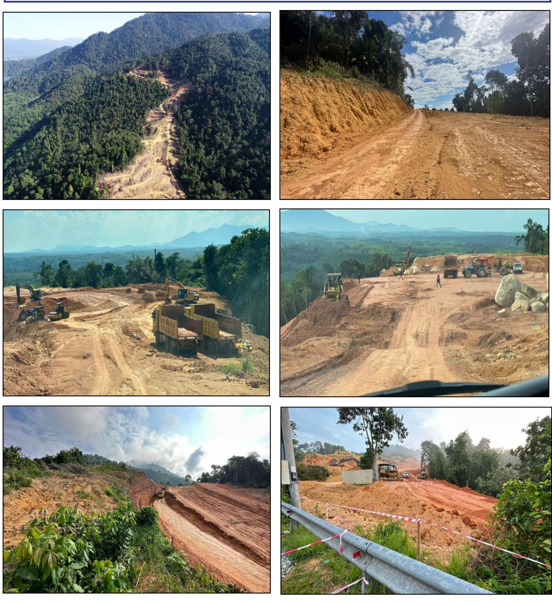

Client Project Value

: Jabatan Kerja Raya (JKR)  : RM 146,000,000.00

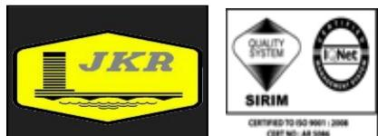

# Cadangan Pembangunan Kompleks Masjid Di Atas PT 49967 Dan Sebahagian Plot 1, Taman Desa Sentosa, Teras Jernang, 43650 Bangi, Dengkil, Selangor Darul Ehsan Untuk Tetuan Majlis Agama Islam Selangor

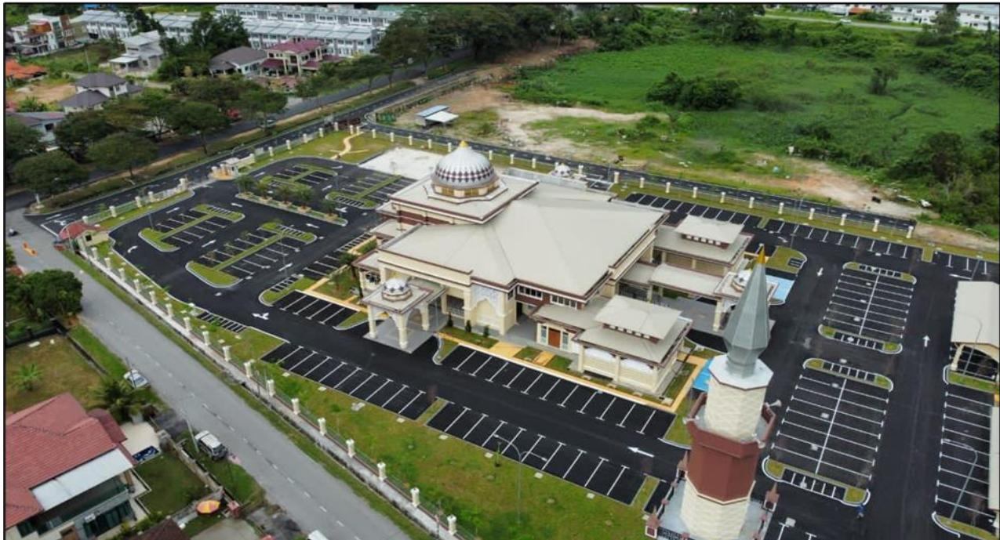

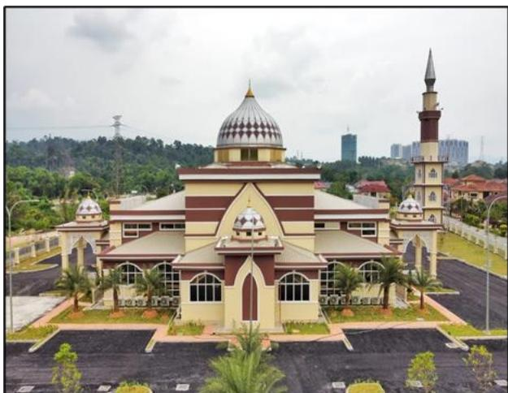

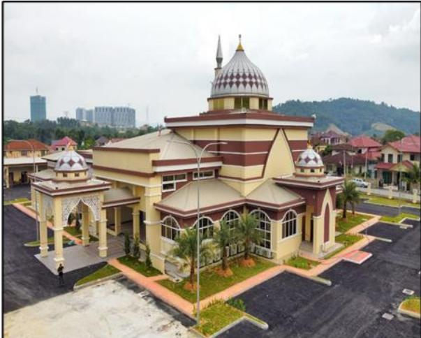

Client Project Value Year of completion

: Majlis Agama Islam Selangor (MAIS) : RM 9,306,991.81 : 2022

# Cadangan Pembinaan Sebahagian Terowong Keluar Dan Masuk Menghubungkan Pembangunan Tun Razak Exchange Dengan Jalan Tun Razak Kuala Lumpur (Reka & Bina)

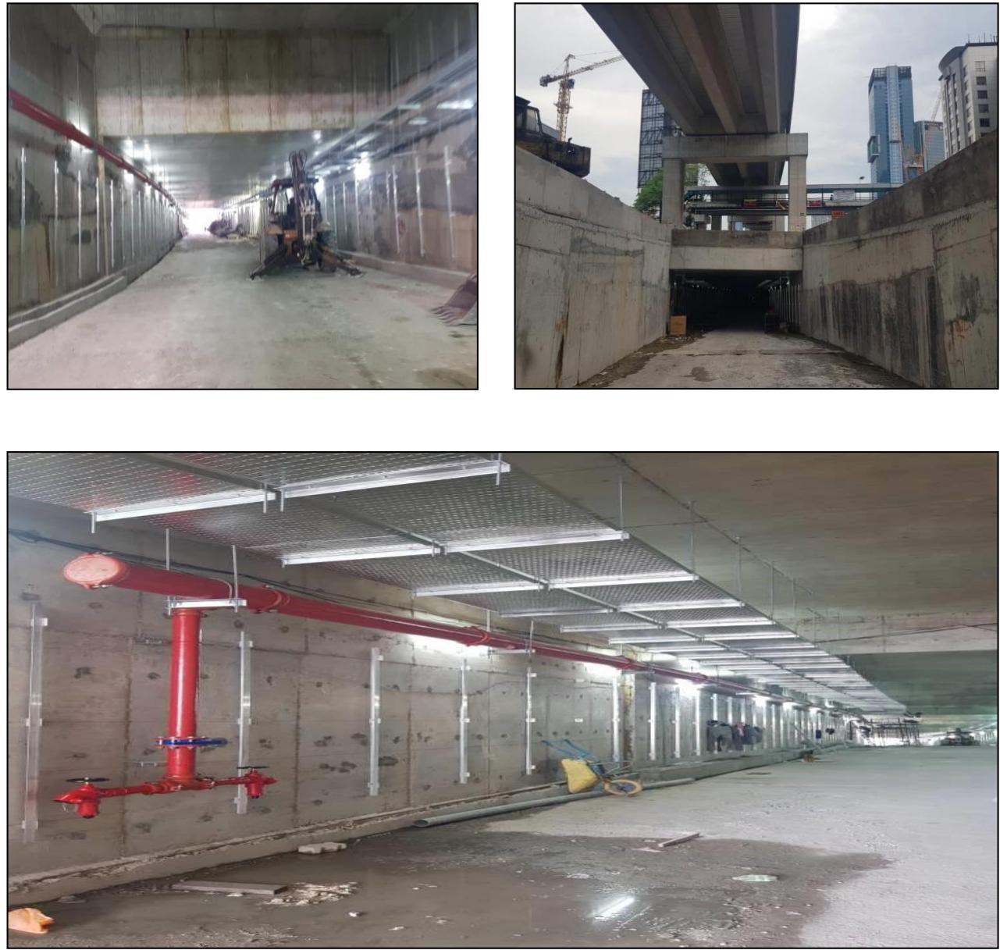

Client Project Value Year of completion

: Dewan Bandaraya Kuala Lumpur (DBKL) : RM110,596,064.90 : 2022

Skim Bekalan Air Kerian, PerakPakej 3 – Membekal, Memasang dan Mentauliah Paip Air MentahDari Muka Sauk Bagan Serai Ke Loji Rawatan Air Sungai RawaDan Paip Air Terawat Dari Loji Rawatan Air Sungai Rawa KeKolam Air Sediada Sungai Bogak Bergarispusat Nominal 900mmSerta Kerja- Kerja Berkaitan (Works)

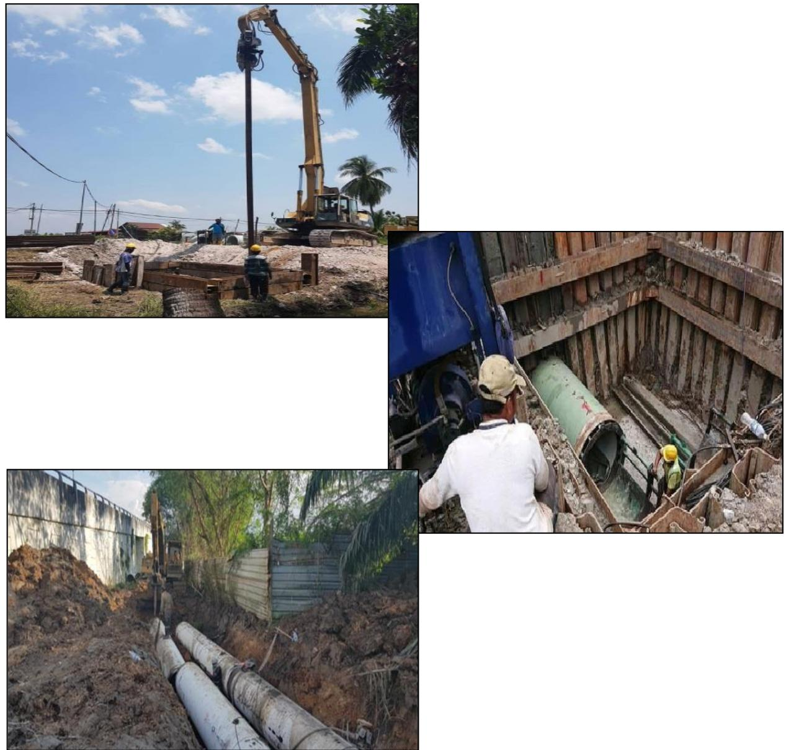

ClientProject ValueYear of completion

: Pengurusan Aset Air Berhad (PAAB) : RM 21,299,533.50 : 2019

Cadangan Pembinaan Loji Rawatan Air Kumbahan BerpusatDengan Kapasiti 150,000 PE dan Kerja- Kerja BerkaitanDengannya Di Lot 20216 dan PTB 20476, Johor Bahru, JohorDarul Takzim Secara Reka & Bina

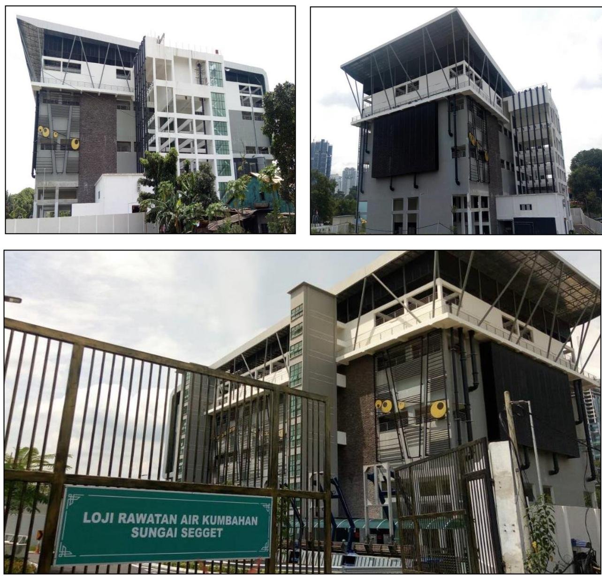

Client: Pihak Berkuasa Wilayah PembangunanISKANDAR (IRDA)Project Value: RM 95,244,708.44Year of completion: 2016

Cadangan Membina Jambatan Sg. Gombak Dari Jalan Raja Laut / Jalan Dang Wangi Ke Jalan Kuching, Kuala Lumpur (2013/A068)

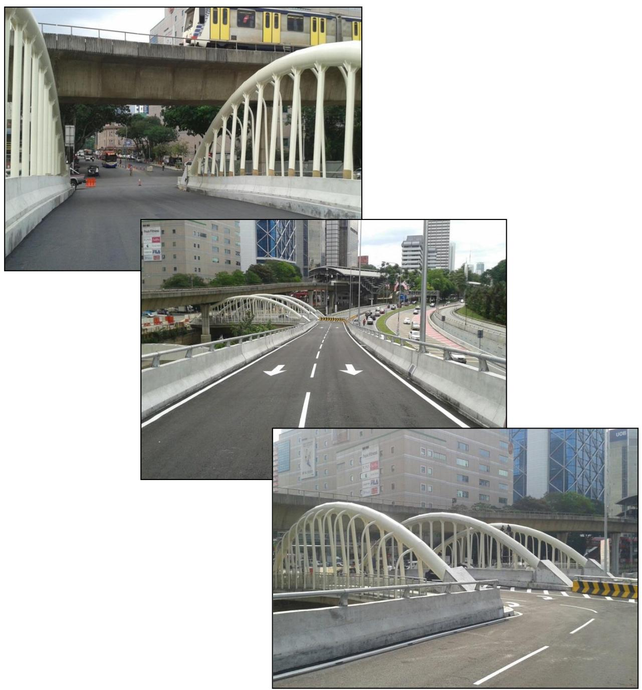

Client Project Value Year of completion

: Dewan Bandaraya Kuala Lumpur : RM 31,872,541.20 : 2017

Cadangan Meroboh Bangunan Sedia Ada Dan Membina Semula Bangunan Kolej Sains Dan Teknologi (Parcel B) Yang Mengandungi Bangunan Menara 10 Tingkat, Dewan Kuliah Dan Seminar Dan Kerja- Kerja Yang berkaitan Di Atas Sebahagian Lot 4582 (UTM), Jalan Semarak, Mukim Setapak, KL – (Malaysian- Japan International Institue of Technology MJIII, UTM City Campus)

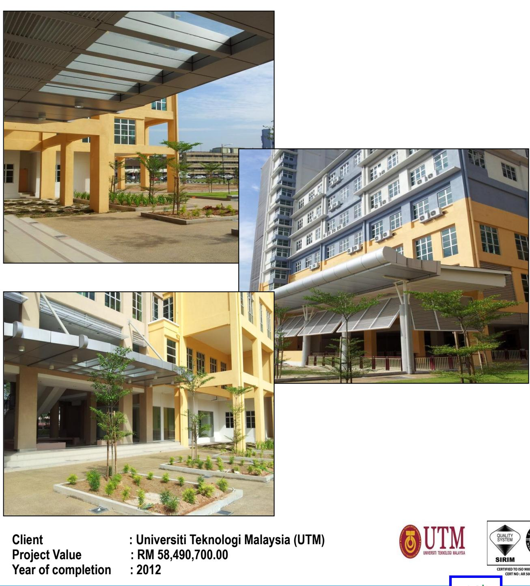