# HUNAN 湖南建工集团有限公司 HUNAN CONSTRUCTION ENGINEERING GROUP CO.,LTD CONSTRUCTION ENGINEERING GROUP

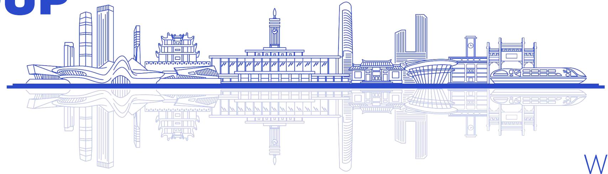

# CONSTRUCTION INVESTMENT

ENTERPRISE”

一流

创新

诚正

奉献

# 目录

# TABLE OF CONTENTS

01 公司简介ABOUT US

02 医院工程业绩PERFORMANCE IN HOSPITAL PROJECT

03 联系我们FIND US

# 01 公司简介ABOUT US

# 湖南建工集团有限公司HNCEG

成立于1952，大型千亿级国有企业集团。

Founded in 1952, Large state- owned enterprise

200 亿元 20 billion  集团注册资本金 Registered Capital

2000 200 billion RMB  亿元以上  Annual Construction  年生产（施工）能力  Capacity

30 多个国家、地区 30 Countries and Areas  海外市场  Oversea Business

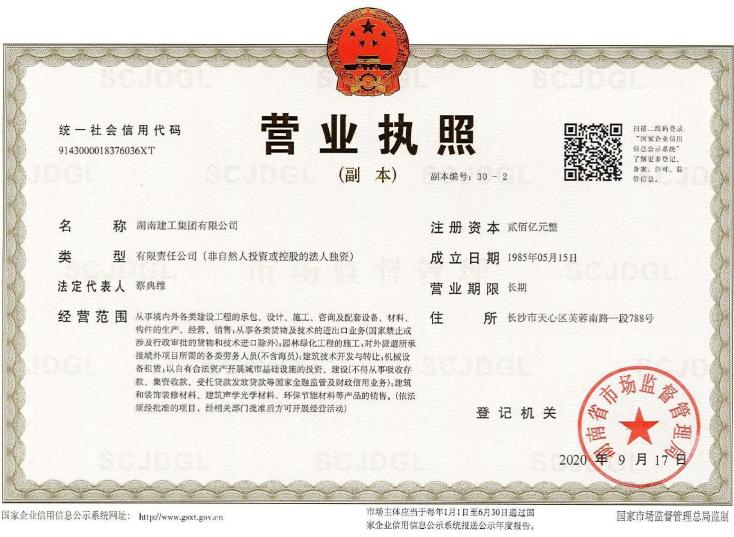

营业执照BUSSINESS LICENSE

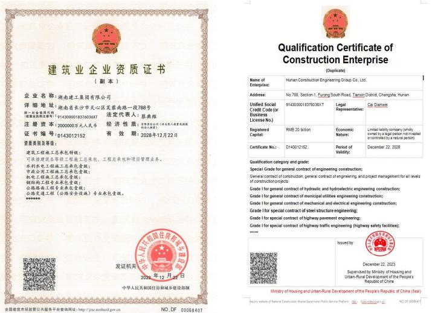  
公司建筑施工资质QUALIFICATION CERTIFICATE FOR CONSTRUCTION ENTERPRISE

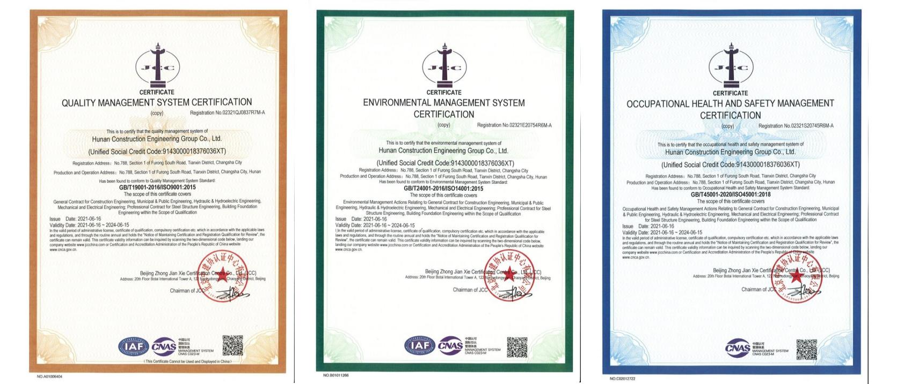

质量管理体系认证证书QUALITY MANAGEMENT SYSTEM CERTIFICATION

职业健康安全管理体系认证证书环境管理体系认证证书OCCUPATION HEALTH AND SAFETY ENVIRONMENTAL MANAGEMENT SYSTEM CERTIFICATIONMANAGEMENT CERTIFICATION

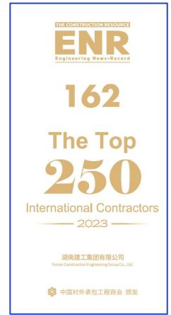  
全球最大250家国际承包商Top250 Global Contractors

鲁班奖Luban Award  
  
National Construction AAA Credit Enterprise

  
全国建筑业AAA级信用企业

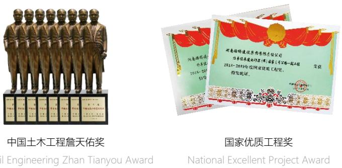

湖南建工在国际业务上取得了骄人的成绩，连续入选ENR国际承包商250强，并先后获得中国建筑工程鲁班奖、中国钢结构金奖、中国援建成套优秀工程、中国国际工程BIM竞赛一等奖、蒙古立功贡献荣誉勋章、塞内加尔国家狮子骑士勋章、以及多米尼加国家杰出贡献奖章。

HCEG has achieved remarkable results in international business, which has been consecutively enlisted in ENR's Top 250 International Contractors and has successively won the China Construction Engineering Luban Award, the China Steel Structure Gold Award, the Excellent project of China- aided Complete set, the First Prize in China International Engineering BIM Competition, the Order of Honor for Meritorious Contribution to Mongolia, the Knight of the National Lion Order of Senegal, and the Medal of National Outstanding Contribution of Dominica.

房建工程 House Building

道路工程 Road

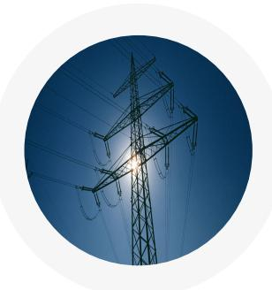

电力工程 Power

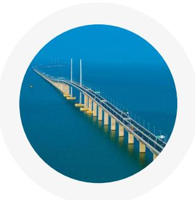

桥梁工程 Bridge

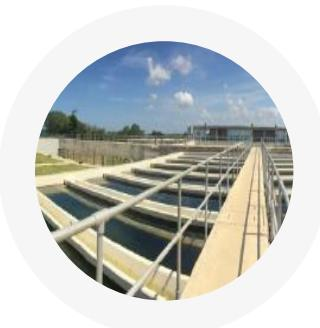

市政工程 Municipal Engineer

水利工程 Hydro

环保工程 Environmental Protection

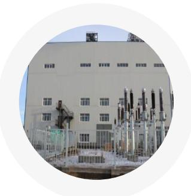

设备安装 Equipment Installation

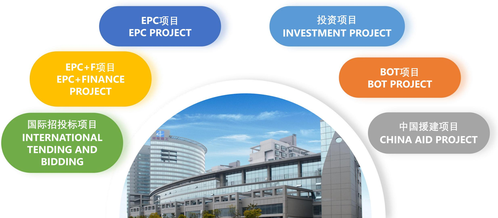

# 业务范围 Business Footprint

境外  $30+$  个分公司或办事处 Over 30 offshore branches or offices

业务涉及全球多个国家，例如布隆迪、孟加拉国、塞内加尔、布基纳法索、坦桑尼亚、阿尔及利亚、多米尼克、新西兰、马尔代夫、斯里兰卡、柬埔寨、马来西亚、蒙古、阿曼、塞尔维亚、菲律宾，肯尼亚等

Our Business involve countries all over the world such as Burundi, Bangladesh, Senegal, Burkina Faso, Tanzania, Algeria, Dominica, New Zealand, Maldives, Sri Lanka, Cambodia, Malaysia, Mongolia, Oman, Serbia, Philippines and Kenya etc.

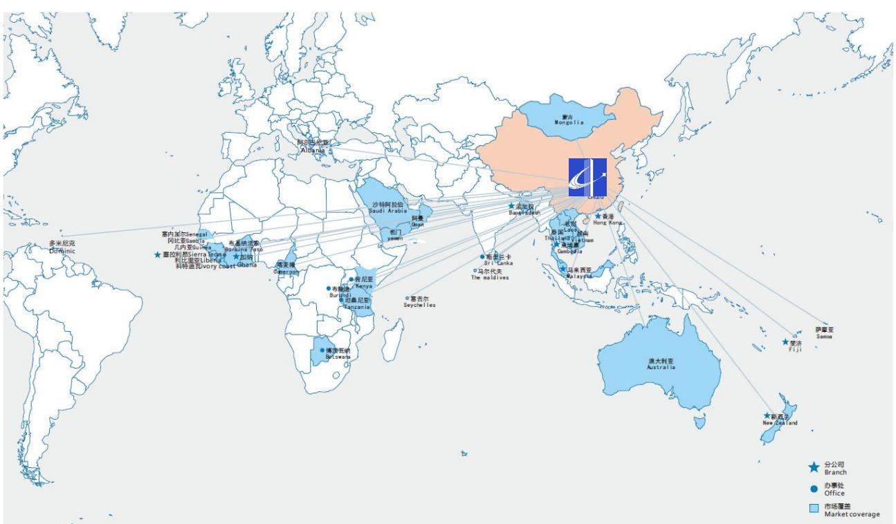

# 02 医院业绩 PERFORMANCE IN HOSPITALS

<table><tr><td>序号
No</td><td>项目名称
Project Name</td><td>业主单位
Employer</td><td>建筑面积
Construction Area(m²)</td><td>项目时间
Duration</td><td>合同金额
Contract Value</td><td>项目简介
Brief Introduction</td></tr><tr><td>1</td><td>益阳市公共卫生防控救治中心项目设计施工总承包
Public Health Prevention, Control and Treatment Center Project of Yiyang City</td><td>益阳市鱼形湖医养服务有限公司
Yiyang City fish-shaped lake medical service Co., LTD</td><td>256500</td><td>2022-2023</td><td>$195,433,060</td><td>公共医疗卫生区总建筑面积17.25万平方米，后勤保障区总建筑面积8.4万平方米。
The total construction area of the public medical and health area is 172,500 square meters, and the total construction area of the logistics support area is 84,000 square meters.</td></tr><tr><td>2</td><td>中南大学湘雅二医院第二医院门急诊楼工程
The Second Xiangya Hospital of Central South University Second Hospital Outpatient and Emergency Building Project</td><td>中南大学湘雅二医院
The Second Xiangya Hospital of Central South University</td><td>99000</td><td>2021-2022</td><td>$92,486,339</td><td>地上10层，地下3层，主要功能区为门诊、急诊、日间手术、医疗技术室。
There are 10 floors above ground and 3 floors underground, with the main functions areas of outpatient, emergency, day surgery and medical and technical rooms.</td></tr><tr><td>3</td><td>湖南旺旺医院医疗大楼二期
Medical Building Phase II Project of Hunan Wangwang Hospital</td><td>湖南旺旺医院投资管理有限公司
Hunan Want Want Hospital Investment management Co. LTD</td><td>138490</td><td>2013-2015</td><td>$82,650,273</td><td>设计能力达到3000人次/天，预计新增床位960张。
the design capacity reaches 3,000 outpatients/day, and it is expected that 960 new beds will be added.</td></tr></table>

医院业绩PERFORMANCE INHOSPITAL PROJECTS

<table><tr><td>序号
No</td><td>项目名称
Project Name</td><td>业主单位
Employer</td><td>建筑面积
Construction Area(m²)</td><td>项目时间
Duration</td><td>合同金额
Contract Value</td><td>项目简介
Brief Introduction</td></tr><tr><td>4</td><td>贵黔国际总医院（贵州妇女儿童国际医院）一期项目
Gui Qian International General Hospital (Guizhou Women&#x27;s and Children&#x27;s International Hospital) Phase I Project</td><td>贵州妇女儿童国际医院有限公司
Guizhou Women and Children International Hospital Co., LTD</td><td>192000</td><td>2017-2019</td><td>$68,306,011</td><td>一期建设包括住院部、门诊部、急诊部、医技部、后勤保障部、行政办公大楼和地下停车场。
The first phase of construction includes inpatient department, outpatient clinic, emergency clinic, medical technology, logistics support department, administrative office building and underground parking garage.</td></tr><tr><td>5</td><td>援多米尼克医院维修扩建项目
The China-aided Repair and Expansion Project of Princess Margaret Hospital in Dominica</td><td>商务部经合局
Agency for International Economic co-eration, Ministry of Commerce</td><td>16500</td><td>2015-2022</td><td>$32,392,077</td><td>新建门诊楼、急诊楼、病区楼、候诊大厅、行政教学楼、专家宿舍楼、太平间、冷库等，扩建公共设施楼并进行粉刷。
New outpatient building, emergency building, ward building, waiting hall, administrative teaching building, expert dormitory building, mortuary, cold storage, etc., expand the public facilities building and paint</td></tr><tr><td>6</td><td>北京积水潭中山骨科医院一期工程施工
Beijing Jishuitan Zhongshan Orthopedic Hospital phase I construction</td><td>中山市人民政府南区办事处（广东）
Zhongshan City People&#x27;s Government Southern District Office (Guangdong)</td><td>33672</td><td>2011-2012</td><td>$27,322,404</td><td>框架结构，地上5层，局部地下2层，建筑物高度30m，标准层层高4m
Frame structure, 5 floors above ground, local underground 2 floors, building height 30m, the standard layer height 4m</td></tr></table>

医院业绩

<table><tr><td>序号
No</td><td>项目名称
Project Name</td><td>业主单位
Employer</td><td>建筑面积
Construction Area(m²)</td><td>项目时间
Duration</td><td>合同金额
Contract Value</td><td>项目简介
Brief Introduction</td></tr><tr><td>7</td><td>中南大学湘雅第二医院精卫综合楼建设
项目
Xiangya Second Hospital of Central South University, Jingwei comprehensive building construction project</td><td>中南大学湘雅二医院
The Second Xiangya Hospital of Central South University</td><td>46216</td><td>2012-2017</td><td>$22,256,811</td><td>地上38,449 m2，地下7,767 m
238,449 m2 above ground, 7,767 m2 underground</td></tr><tr><td>8</td><td>娄底市中心医院新综合楼建设工程
Loudi City Central Hospital new comprehensive building construction project</td><td>娄底市中心医院
Loudi Central Hospital</td><td>35595</td><td>2014-2016</td><td>$15,522,281</td><td>22层框架-剪力墙结构
22-level frame-shear wall structure</td></tr><tr><td>9</td><td>佛冈县人民医院内科综合大楼建设项目
Internal Medicine Complex Construction Project of Fogang County People&#x27;s Hospital</td><td>佛冈县代建项目管理中心
Fogang County agent construction project management center</td><td>25231</td><td>2018-2021</td><td>$15,509,495</td><td>建筑面积3600平方米，建筑面积25231.4平方米
the floor area is 3600 square meters; construction area is 25231.4 square meters</td></tr><tr><td>10</td><td>宜章县人民医院急诊综合楼（含县急救中心）和内科大楼工程（EPC）总承包
Yizhang County People&#x27;s Hospital emergency complex building (including county emergency center) and internal medicine building project (EPC) general contract</td><td>宜章县人民医院
Yizhang County People&#x27;s Hospital</td><td>24045</td><td>2017-2019</td><td>$14,626,289</td><td>框架-剪力墙结构
Frame-shear wall structure</td></tr></table>

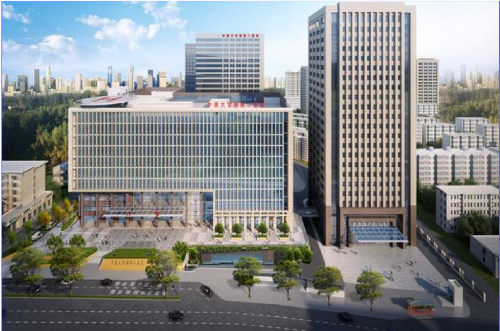

01 The Second Xiangya Hospital of Central South University Second Hospital Outpatient and Emergency Building Project 01中南大学湘雅二医院门急诊楼项目

Project Introduction: The total construction area of the building is 99,000 square meters, with a cost of 677 million CNY. There are 10 floors above ground and 3 floors underground, with the main functions areas of outpatient, emergency, day surgery and medical and technical rooms.

项目简介：大楼总建筑面积9.9万平方米，造价6.77亿元，地上10层，地下3层，主要功能设置为门诊、急诊、日间手术和医技用房等。

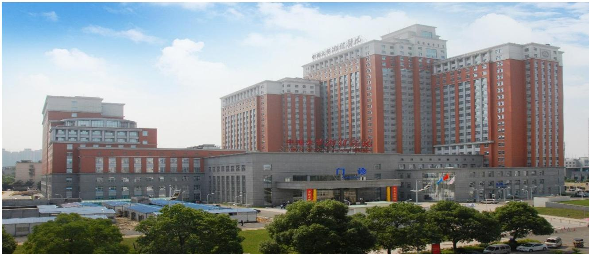

02 The Second Inpatient Building of the Second Xiangya Hospital of Central South University  02 中南大学湘雅二医院第二住院大楼

Won three Luban Awards in 2006  获2006年度3项鲁班奖

03 Medical Building of New Area of Xiangya Hospital of Central South University  03 中南大学湘雅医院新医疗区医疗大楼

Won three Luban Awards in 2010  获2010年度3项鲁班奖

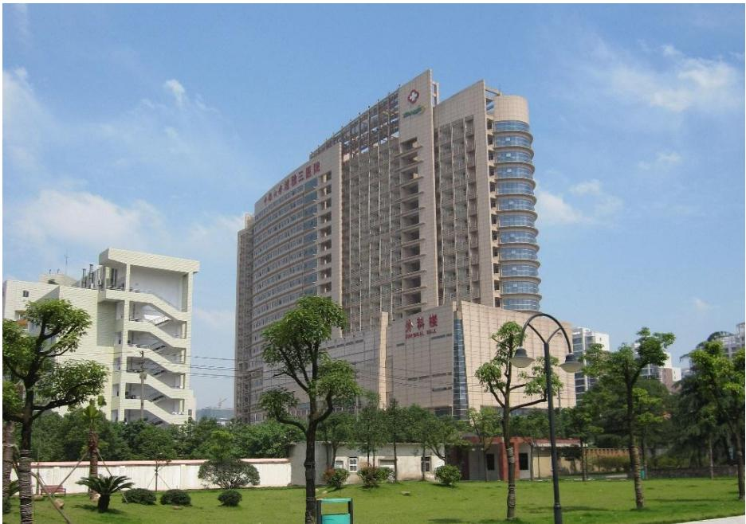

04 The Surgical Ward Building of the Third Xiangya Hospital of Central South University  04 中南大学湘雅三医院外科病房楼

Won three Luban Awards in 2012- 2013  获2012- 2013年度3项鲁班奖

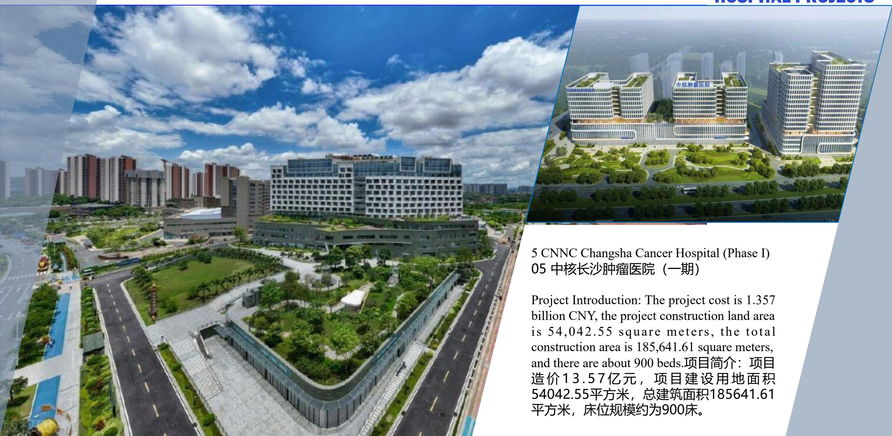

06攸州中心医院二期

项目简介：总规划占地面积约10万平方米，总建筑面积约19万平方米，总投资约12亿元。

06 Youzhou Central Hospital (Phase II)

Project Profile: The total planning area is about 100,000 square meters, the total construction area is about 190,000 square meters, and the total investment is about 1.2 billion CNY.

07 Public Health Clinical Center Project of Xiangxi Prefecture

07 湘西州公共卫生临床中心项目

Project Introduction: The awarded contract value of the project was 390 million CNY. The project is located in Jishou City, Xiangxi Prefecture, with a total construction area of about 51,000 square meters.

项目简介：项目中标金额3.9亿元。项目位于湘西州吉首市，总建筑面积约5.1万㎡。

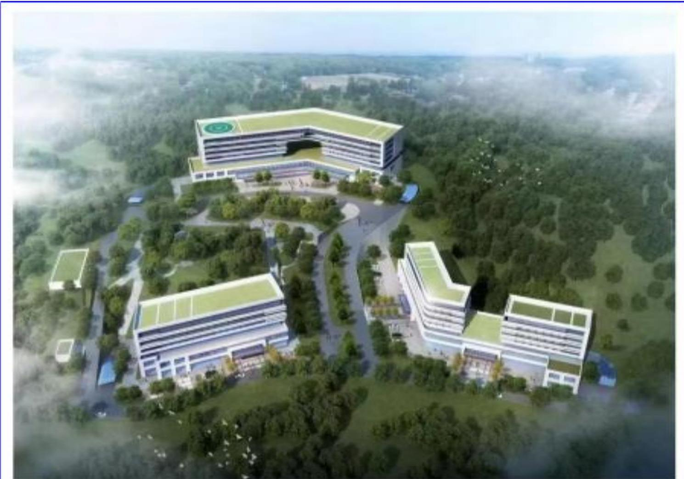

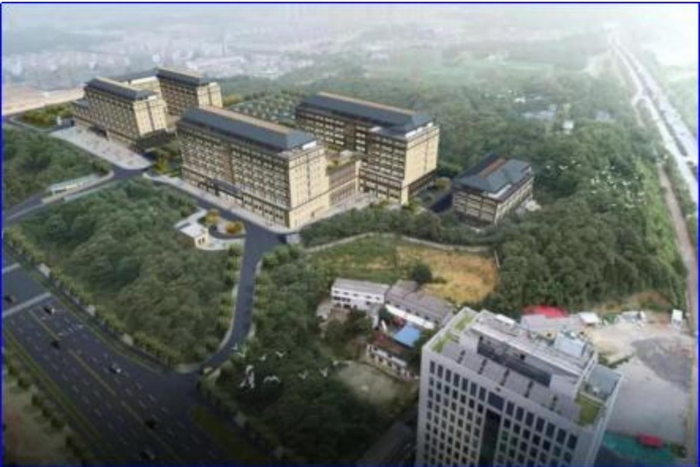

08 Public Health Treatment Center Original Site Renovation and Expansion Project of Changsha City08 长沙市公共卫生救治中心原址改扩建项目

Project Introduction: The total investment of the project is 1.22 billion CNY, and the total construction area is about 146,000 square meters.项目简介：项目总投资12.2亿元，总建筑面积约14.6万平米。

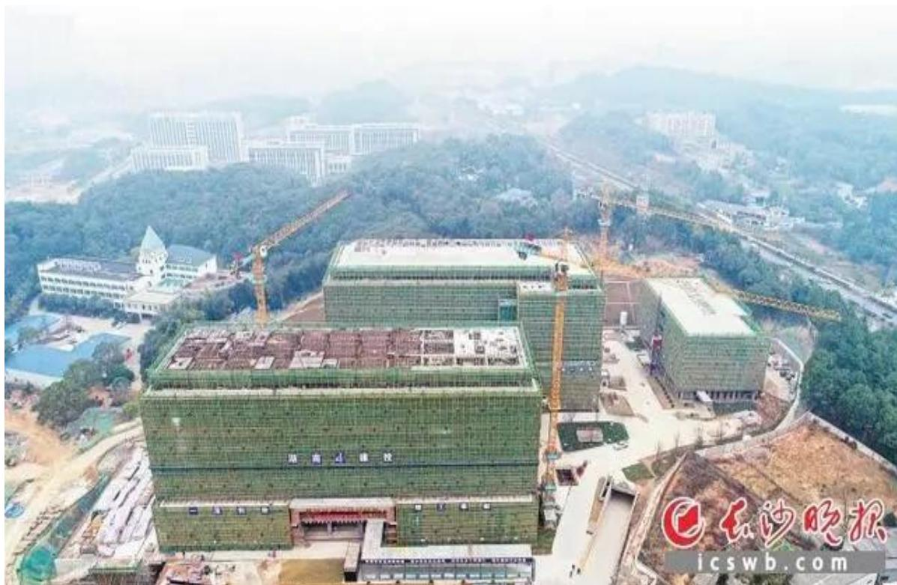

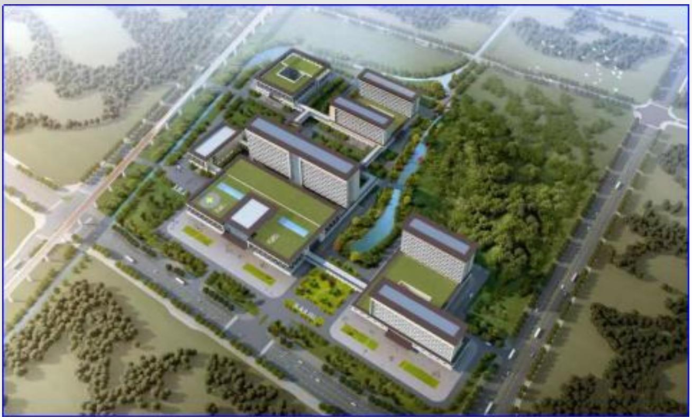

09 Public Health Prevention, Control and Treatment Center Project of Yiyang City

09 益阳市公共卫生防控救治中心项目

Project Introduction: The total construction area of the project is 256,000 square meters, and the construction cost is 1.43 billion CNY.

项目简介：项目总建筑面积为25.6万平米，建安造价14.3亿元。

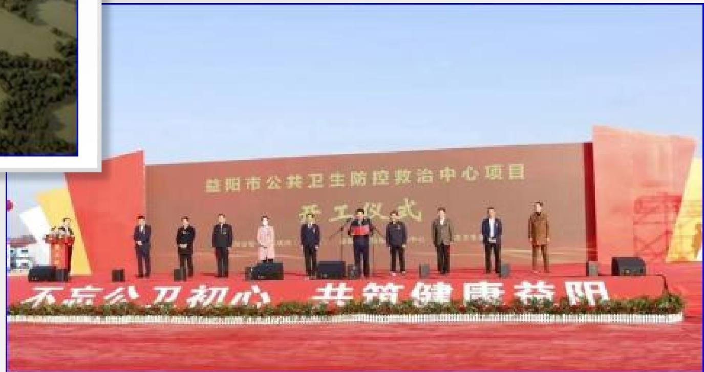

10 Medical Building Phase II Project of Hunan Wangwang Hospital  10 湖南旺旺医院医疗大楼二期

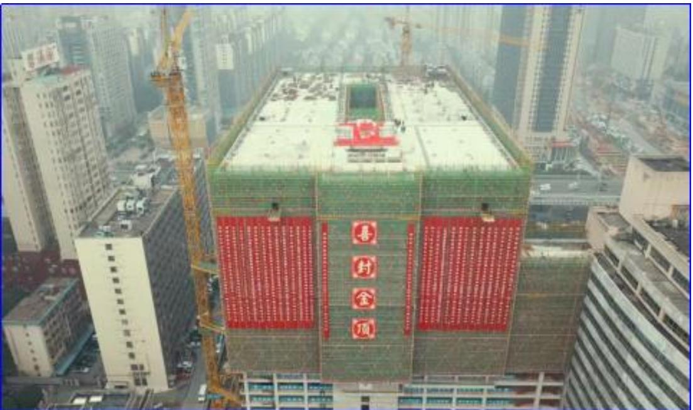

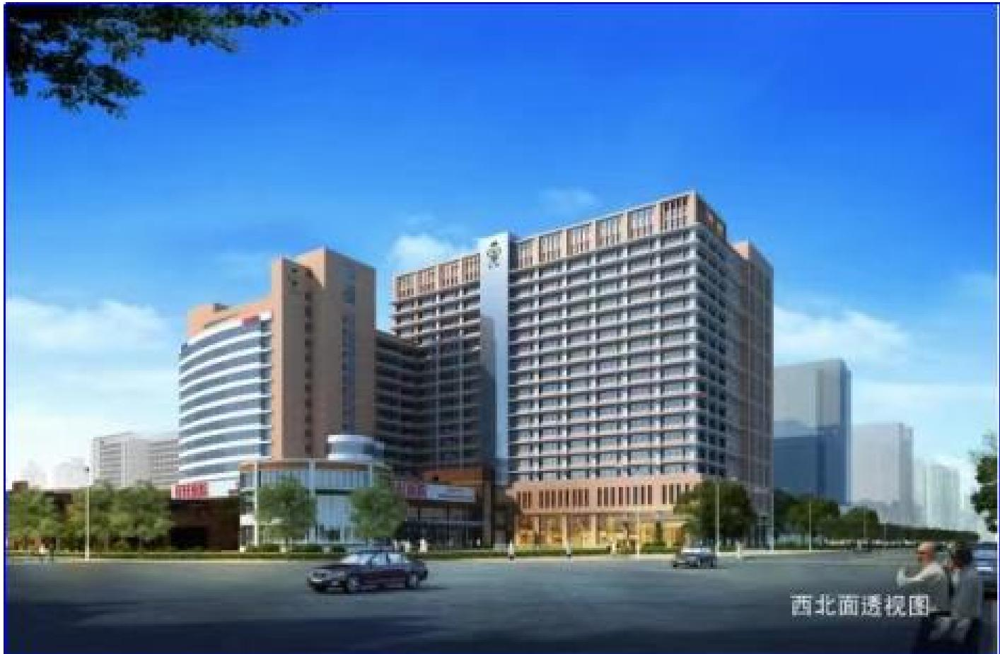

Project Introduction: The total construction area is 169,000 square meters, the project cost is 605 million CNY, the design capacity reaches 3,000 outpatients/day, and it is expected that 960 new beds will be added.  项目简介：总建筑面积为16.9万平米，项目造价6.05亿元，设计规模达到门诊人数3000人次/日，预计新增床位960床。

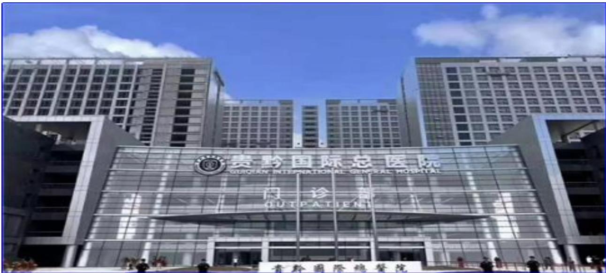

Project Introduction: The total construction area is 192,000 square meters, the project cost is 500 million CNY, the basement construction area is 60,000 square meters (three floors), the podium is 84,000 square meters (five floors), the tower is 48,000 square meters (19 floors). The first phase of construction includes inpatient department, outpatient clinic, emergency clinic, medical technology, logistics support department, administrative office building and underground parking garage.

项目简介：总建筑面积192000平方米，工程造价5亿元，地下室建筑面积60000平（三层），裙楼84000平（五层），塔楼48000平（19层），一期建设内容有住院部、门诊、急诊、医技、后勤保障部、行政办公楼及地下停车库。

11 Gui Qian International General Hospital (Guizhou Women's and Children's International Hospital) Phase I Project  11 贵黔国际总医院（贵州妇女儿童国际医院）一期

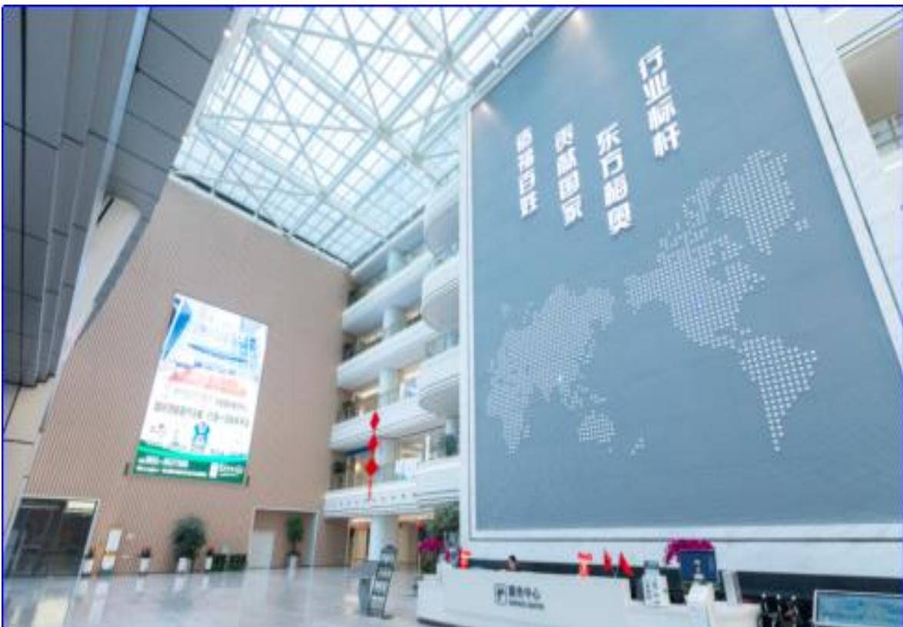

# 12 Lianyuan People's Hospital Project in Loudi City  12 娄底市涟源市人民医院项目

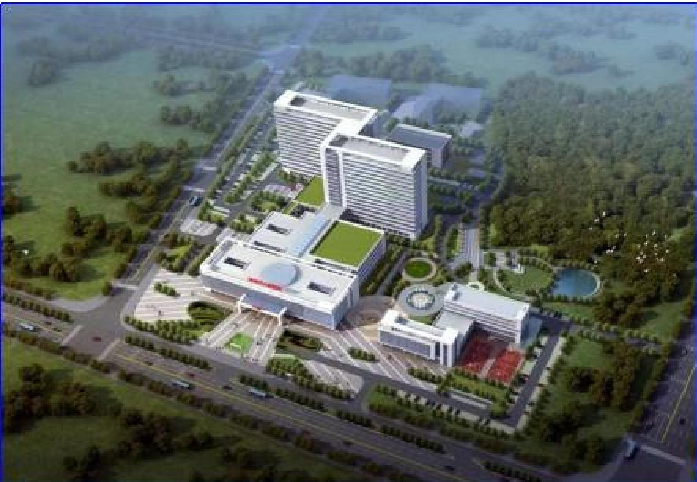

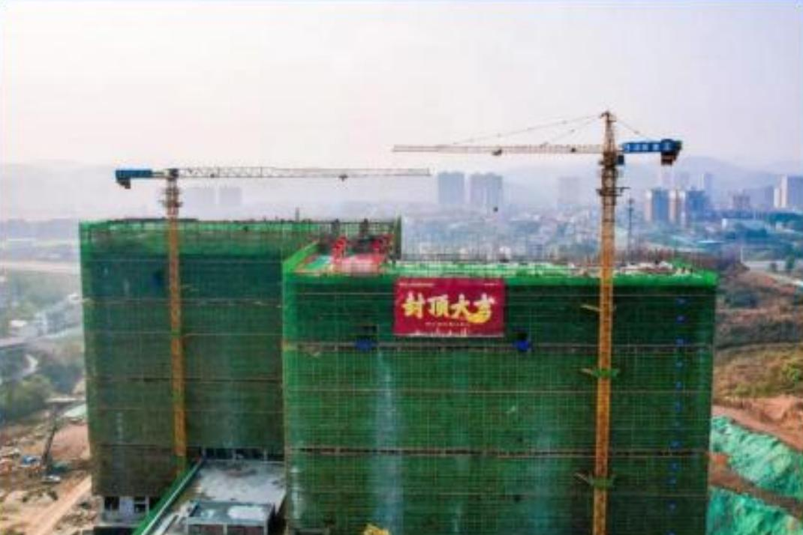

Project Introduction: The total construction area of the project is 138,275m² and the cost is 680 million CNY, including outpatient complex, inpatient building, infection building, logistics management teaching complex and common large basement.

项目简介：项目总建筑面积138275m²，造价金额6.8亿，包括门诊综合楼、住院楼、感染楼、后勤管理教学综合楼及共用大地下室。

# 联系我们FIND US

OFFICIAL WEBSITEen.hncig.cn

E- MAIL

marketing@hciqlobal.cn

# ADDRESS

No.788 South Furong Road, Tianxin District, Changsha City, Hunan Province, China.

# 湖南建工集团有限公司HUNAN CONSTRUCTION ENGINEERING GROUP CO.,LTD